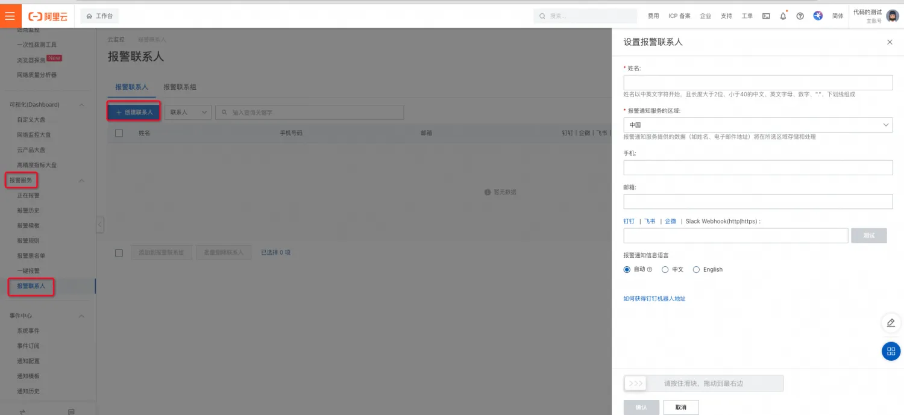
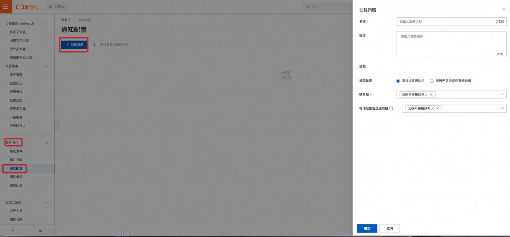
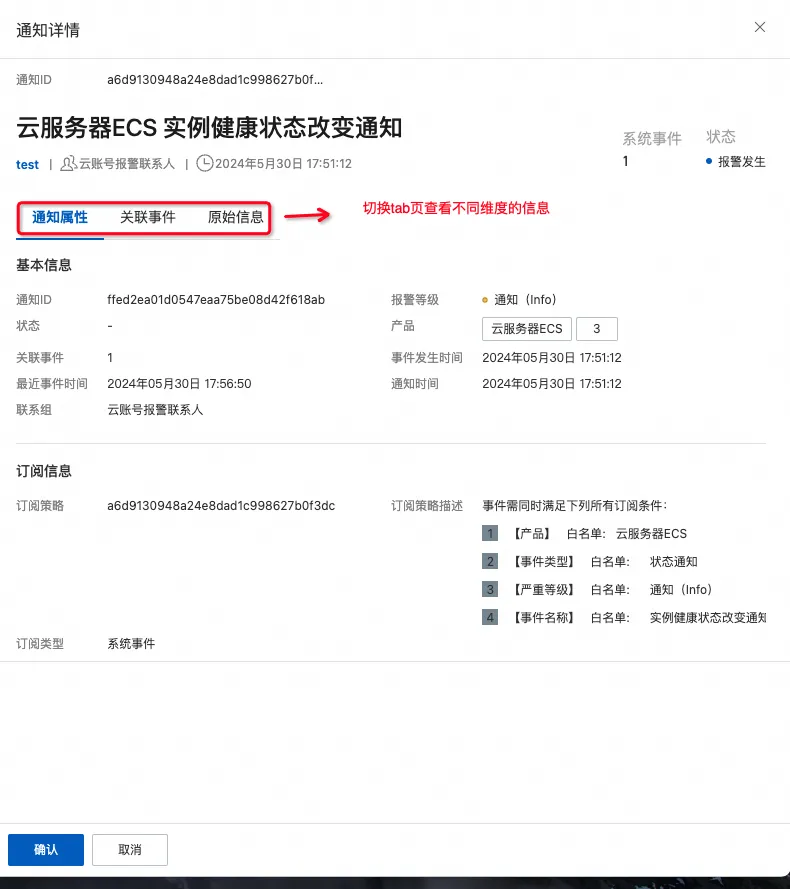

### 功能介绍。
#### 简介
实例健康状态表示实例操作系统的运行状态，通过实例健康状态，您可以快速确定ECS实例是否真正可用（例如是否可以通过SSH、RDP等访问）。本文主要为健康状态产品的功能介绍，以及如何通过ECS控制台或API查看实例健康状态。

#### 功能描述
实例健康状态关注的是实例操作系统的运行状态，包括操作系统是否正常运行，实例的网络是否连通，CPU或磁盘等性能是否受到影响等。例如，实例的生命周期状态为Running，并不意味着实例的操作系统已经运行起来了；只有当实例健康状态为OK时，实例的操作系统才真正完成启动用户态可用，才可以通过SSH或RDP进行访问。可以根据实例健康状态来识别实例是否存在故障，以便及时处理相应问题。

#### 实例健康状态值与定义
实例健康状态与实例生命周期状态之间的区别和对应的场景说明，如下表所示。

| **实例健康状态** | **实例生命周期状态** | **中文描述** | **实例真正状态说明** | **建议修复方案** |
| --- | --- | :--- | --- | --- |
| Initializing | Starting | 操作系统正在启动 | 实例正处于初始化阶段。 | 等待实例启动。 |
| Initializing | Running | | 实例操作系统正在启动中。 | 等待实例启动。 |
| Impaired | Running | 操作系统运行存在异常 | <ul><li>实例操作系统正在运行中，但是实例可能受到底层宿主机、存储、网络等限制，导致性能受到影响或降级。</li> <li> 实例操作系统正在运行中，但是遭到OOM出现了蓝屏、夯住（Hang）等问题。</li></ul> | <ul><li>通过启动/重启实例，响应对应实例因操作系统错误需重启事件。</li> <li> 上报故障，等待阿里云处理。</li></ul> |
| OK | Running | 正常 | 实例操作系统正在运行中，且实例未受任何外部因素影响。 | 无 |
| InsufficientData | Stopping/Stopped | 数据不足 | 实例处于关机中或已关机状态。 | 启动实例。 |
| NotApplicable | Deleted | 不适用 | 实例当前生命周期状态无效。 | 无 |


#### 实例健康状态示例
+ Initializing


+ Impaired


+ OK


+ InsufficientData：实例已关机，不显示健康状态。


+ NotApplicable：实例已删除，控制台无对应的实例记录。

### 健康状态使用
#### ECS控制台
1. 登录[ECS管理控制台](https://ecs.console.aliyun.com/home)。
2. 按下图标注步骤依次点击。


3. 在**实例列表设置**对话框里，单击未显示区域中**健康状态**右侧的图标，然后单击继续。


4. 找到目标实例，在健康状态列，查看实例健康状态。


#### OpenApi与SDK使用说明
1. OpenApi-SDK 相关配置（以Java调用为例）
    - pom文件

      ```xml
      <dependencies>
        <dependency>
          <groupId>com.alibaba</groupId>
          <artifactId>fastjson</artifactId>
          <version>1.2.83</version>
        </dependency>
        <dependency>
          <groupId>com.aliyun</groupId>
          <artifactId>aliyun-java-sdk-core</artifactId>
          <version>4.6.1</version>
        </dependency>
        <dependency>
          <groupId>com.aliyun</groupId>
          <artifactId>aliyun-java-sdk-ecs</artifactId>
          <version>5.11.7</version>
        </dependency>
      </dependencies>
      ```

    - OpenClient实现

      ```java
      public class OpenClient {
      
          private IAcsClient client;
      
          public void initClient() {
              DefaultProfile profile = DefaultProfile.getProfile(
                      "your region",          // The region ID
                      "your ak",      // The AccessKey ID of the RAM account
                      "your sk"); // The AccessKey Secret of the RAM account
              client = new DefaultAcsClient(profile);
          }
      
          public <R extends AcsResponse> R getResponse(RpcAcsRequest<R> request) {
              try {
                  return this.client.getAcsResponse(request);
              } catch (ServerException e) {
                  e.printStackTrace();
                  return null;
              } catch (ClientException e) {
                  e.printStackTrace();
                  return null;
              }
          }
      
      }
      ```

2. [DescribeInstancesFullStatus](https://help.aliyun.com/zh/ecs/developer-reference/api-describeinstancesfullstatus#doc-api-Ecs-DescribeInstancesFullStatus)（查看实例状态以及实例健康状态）
    1. 描述：查询一台或多台ECS实例的全状态信息。
    2. 主要请求参数

       | 名称 | 类型 | 必填 | 描述 | 示例值 |
       | --- | --- | --- | --- | --- |
       | regionId | string | 是 | 实例所属的地域ID | cn-hangzhou |
       | InstanceId | list<string> | 否 | 默认查询指定地域下的所有实例 | ["i-bp67acfmxazb4p****", "i-bp67acfmxazb4p****", … "i-bp67acfmxazb4p****"] |
       | pageNumber | integer | 否 | 默认值：1起始值：1 | 1 |
       | pageSize | integer | 否 | 默认值：10最大值：100 | 10 |
       | status | string | 否 | 指定实例的生命周期状态。取值范围：<ul><li>Starting：启动中。</li> <li> Running：运行中。</li> <li> Stopped：已停止</li></ul> | Runing |
       | healthStatus | string | 否 | 指定实例的健康状态。取值范围：<ul><li>OK：正常。</li> <li> Impaired：服务损坏。</li> <li> Initializing：初始化中。</li> <li> InsufficientData：数据不足。</li> <li> NotApplicable：不适用。以上参数取值均区分大小写。</li></ul> | OK |

    3. 主要返回参数

       | 名称 | 类型 | 描述 | 示例值 |
       | --- | --- | --- | --- |
       | totalCount | integer | 查询到的实例总数 | 1 |
       | InstanceFullStatusSet | instanceFullStatus[] | 实例全状态数组。 |  |

       instanceFullStatus主要参数

       | 名称 | 类型 | 描述 | 示例值 |
       | --- | --- | --- | --- |
       | instanceId | string | 查询到的实例总数 | 1 |
       | status | object |  |  |
       | healthStatus | object |  |  |

       status/healthStatus参数

       | 名称 | 类型 | 描述 | 示例值 |
       | --- | --- | --- | --- |
       | name | string | 实例生命周期/健康状态名称 | OK |
       | code | integer | 实例生命周期/健康状态代码 | 1 |

    4. api调用示例

       ```java
        // 查看实例健康状态
           public void describeInstancesFullStatus() {
               DescribeInstancesFullStatusRequest request = new DescribeInstancesFullStatusRequest();
               List<String> instanceIds = new ArrayList<String>();
               instanceIds.add("i-bp13olycxni4rhwh****");
               // 添加指定的实例
               request.setInstanceIds(instanceIds);
               request.setPageSize(100);
               // 添加指定实例生命周期状态
               // request.setStatus("Stopped");
       
               // 添加指定实例健康状态
               // request.setHealthStatus("Healthy");
               DescribeInstancesFullStatusResponse response = getResponse(request);
               for (DescribeInstancesFullStatusResponse.InstanceFullStatusType instanceFullStatusType : response.getInstanceFullStatusSet()) {
                   System.out.printf("instanceId: %s, healthStatus:%s, status: %s%n", instanceFullStatusType.getInstanceId(), instanceFullStatusType.getHealthStatus().getName(), instanceFullStatusType.getStatus().getName());
               }
           }
       ```

    5. [OpenAPI Explorer](https://api.aliyun.com/api/Ecs/2014-05-26/DescribeInstancesFullStatus?spm=a2c4g.11186623.0.0.27554199hjgGQj&sdkStyle=old)调试示例

       

#### 阿里云CLI
1. [官网介绍](https://help.aliyun.com/zh/cli/what-is-alibaba-cloud-cli?spm=a2c4g.11186623.4.6.2d9043dcXaI09o&scm=20140722.H_110244._.ID_110244-OR_rec-V_1)
2. 命令参数介绍：参数参考对应的OpenApi，cols展示的列名，需要与 JSON 数据中的字段相对应。rows指定过滤字段所在的[JMESPath](http://jmespath.org/)路径。

   ```bash
   aliyun <product> <ApiName> [--parameter1 value1 --parameter2 value2 ...] --output cols=col1,col2 rows=rows.row[]
   ```

3. 使用示例
    - 查看特定实例的健康状态。

      ```bash
      aliyun ecs DescribeInstances --RegionId TheRegionId --output cols=InstanceId,InstanceName rows=Instances.Instance[]
      ------------------------------------------
      |  InstanceId             | InstanceName  |
      |  ----------             | ------------  |
      |  i-bp13olycxni4rhwh**** | lf_test       |
      ------------------------------------------
      
      aliyun ecs DescribeInstancesFullStatus --RegionId TheRegionId --InstanceId.1 i-bp13olycxni4rhwh**** --output cols=HealthStatus rows=InstanceFullStatusSet.InstanceFullStatusType[]
      -------------------------
      |  HealthStatus         |
      |  ------------         |
      |  map[Code:0 Name:Ok]  |
      -------------------------
      ```

    - 查看指定地域下所有实例的健康状态。

      ```shell
      aliyun ecs DescribeInstancesFullStatus --RegionId TheRegionId --output cols=HealthStatus,InstanceId rows=InstanceFullStatusSet.InstanceFullStatusType[]
      +--------------------------------------------------------------+
      |  HealthStatus                      | InstanceId              |
      |  ------------                      | ----------              |
      |  map[Code:0 Name:Ok]               | i-bp19trejji1vzvjr1qps  |
      |  map[Code:0 Name:Ok]               | i-bp19trejji1vzvjr1qq0  |
      |  map[Code:1 Name:InsufficientData] | i-bp19trejji1vzvjr1qpy  |
      |  map[Code:0 Name:Ok]               | i-bp19y1z08hlzzldsdod2  |
      |  map[Code:0 Name:Ok]               | i-bp18hf5w2tc6o4irxm7l  |
      +--------------------------------------------------------------+
      ```

### 云监控订阅实例健康状态通知
[云监控](https://help.aliyun.com/zh/cms/?spm=5176.28426678.J_HeJR_wZokYt378dwP-lLl.1.2bc35181U8HYk9&scm=20140722.S_help@@%E6%96%87%E6%A1%A3@@28572.S_BB1@bl+RQW@ag0+BB2@ag0+hot+os0.ID_28572-RL_%E4%BA%91%E7%9B%91%E6%8E%A7-LOC_search~UND~helpdoc~UND~item-OR_ser-V_3-P0_0)（CloudMonitor）是一项针对阿里云资源和互联网应用进行监控的服务。云监控服务可用于收集获取阿里云资源的监控指标，探测互联网服务可用性，以及针对指标设置警报。

#### 创建订阅策略
若您的账户已经创建了报警联系人，且已经加入到报警联系组中，请跳过第二步。（点击[链接](https://cloudmonitor.console.aliyun.com/alert/contact)查看您的报警联系人）

若您的账户已经存在通知配置策略，请跳过第三步。（点击[链接](https://cloudmonitor.console.aliyun.com/notify-strategy/upgrade)查看您的通知配置策略）

1. 登录[云监控控制台](https://cloudmonitornext.console.aliyun.com/)。
2. 依次点击**报警服务 > 报警联系人 > 创建联系人****。**

    
    
    
    
    

3. 依次点击**事件中心 > 通知配置 > 创建策略**。

    

4. 依次点击**事件中心 > 事件订阅 > 创建订阅策略**。

    

    报警订阅和通知按下图配置，其余步骤保持默认即可。

    
    
    

    创建成功后，页面如下图所示

    

5. 调试事件订阅。

    

    单击**确定**。系统提示**操作成功**，云监控自动根据订阅策略中的通知方式给报警联系人发送一条报警测试通知。

    

#### 健康状态改变系统事件查询


#### 通知历史查询


