### 功能描述
#### 简介
实例健康诊断功能是一种自助诊断方式，可以对实例的系统状态、网络状态、磁盘状态等进行全方位的诊断，帮助您了解实例健康情况，及时发现并解决常见的问题。

#### 基本概念
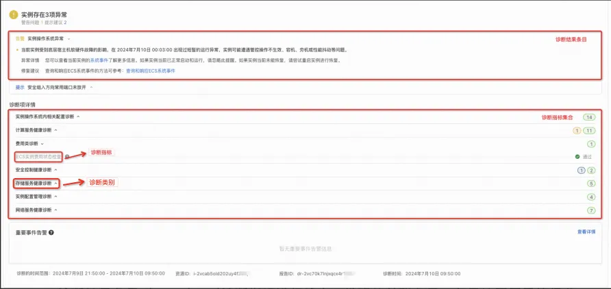

+ 诊断指标（DiagnosticMetric）：实例或账号状态进行检查的单位，如CPU利用率。
+ 诊断结果条目（DiagnosticIssue）：对诊断指标进行检查，发现的关联条目，条目按照严重等级分为Info、Warn、Critical。每个诊断指标可能关联多个诊断结果条目，如果没有关联诊断结果条目，说明对该诊断指标的检查没有发现问题，但并不意味着该诊断指标实际中不存在问题。
+ 诊断指标分类（DiagnosticCategory）：一组诊断指标的集合，表示同一个场景、问题、组件等问题范围。
+ 诊断指标集合（DiagnosticMetricSet）：一组诊断指标的集合，可以一次性对诊断指标里的所有指标进行诊断。

#### 诊断指标分类
实例健康诊断功能支持以下诊断，按照功能和模块，我们对所有的诊断指标进行了分类，当前的分类如下：

| 分类标识码 | 分类名称 | 说明 |
| :--- | :--- | :--- |
| ECSService.ServiceHealth | 计算服务健康诊断 | 对云服务器物理机资源和虚拟化层进行检查。 |
| ECSService.InstanceNetwork | 网络服务健康诊断 | 检查实例内部网络组件状态，以及外部网络环境异常等情况。 |
| ECSService.InstanceStorage | 存储服务健康诊断 | 检查实例磁盘的运行状态是否存在异常。 |
| ECSService.InstanceConfigure | 实例配置管理诊断 | 检查实例在启动过程中或运行中，是否被某个操作阻塞（block）导致实例无法启动或者运行异常。 |
| ECSService.SecurityGroup | 安全控制健康诊断 | 检查实例关联的所有安全组入方向常见端口的放行状态。 |
| ECSService.AccountBalance | 费用类诊断 | 检查实例本身和实例关联组件（例如公网IP流量、EIP流量）是否欠费。 |
| ECSService.GuestOS | 实例操作系统内相关配置诊断（Linux） | 检查实例操作系统内的系统文件、关键进程、常用业务端口占用状态、防火墙状态等是否正常。 |
| ECSService.GuestOS | 实例操作系统内相关配置诊断（Windows） | 检查实例操作系统内的常用业务端口占用状态、防火墙状态等是否正常。 |
| ECSService.ActionTrace | 用户行为回溯 | 对ECS实例状态类、实例费用类、安全组相关等操作行为审计、追溯。 |

#### 计算服务健康诊断
| 诊断指标ID（metricId） | 诊断指标说明 | 诊断结果条目ID（issueId） | 诊断指标条目说明 | 建议操作 |
| :--- | :--- | :--- | :--- | :--- |
| Instance.ControllerError | 检查该实例的后台管控系统是否正常工作。 | Instance.ECSService.MngServiceException | 后台管控系统未正常工作，可能会导致实例运行异常。 | 您可以尝试通过[重启实例](https://help.aliyun.com/zh/ecs/user-guide/restart-instances#concept-yxw-dwm-xdb)进行恢复。 |
| Instance.CPUException | 检查共享型实例底层是否存在CPU争抢。 | Instance.ECSService.CPUBindFailure | 存在CPU争抢，可能导致该实例无法获得CPU或出现其他异常。 | 您可以尝试通过[重启实例](https://help.aliyun.com/zh/ecs/user-guide/restart-instances#concept-yxw-dwm-xdb)进行恢复。 |
| Instance.CPUSplitLock | 实例遇到Intel CPU的Split Lock问题。 | Instance.ECSService.CPUSplitLock | 实例遇到Intel CPU的Split Lock问题。 | 请您检查ECS上应用程序是否存在导致该问题的异常代码并进行优化。 |
| Instance.GuestOSCrash | 实例的操作系统Crash。 | Instance.ECSService.GuestOSCrashed | 操作系统Crash。 | 请您检查ECS上应用程序是否存在导致该问题的异常代码并进行优化。 |
| Instance.HostDownAlert | 检查该实例所在的底层物理机是否有故障。 | Instance.ECSService.HostDown | 底层物理机存在故障，可能会影响实例的运行状态或性能。 | 您可以尝试通过[重启实例](https://help.aliyun.com/zh/ecs/user-guide/restart-instances#concept-yxw-dwm-xdb)进行恢复。 |
| Instance.PerformanceAffected | 检查实例是否存在因底层软硬件问题导致的性能受损。 | Instance.ECSService.PerformanceAffected | 实例存在性能受损，请您检查该实例的历史系统事件或者系统日志进行确认，具体操作，请参见[查看历史系统事件](https://help.aliyun.com/zh/ecs/user-guide/view-historical-system-events#task-2071113)和[查看实例的系统日志和屏幕截图](https://help.aliyun.com/zh/ecs/user-guide/view-system-logs-and-screenshots#UserGuideLogScreenshot)。 | 您可以尝试通过[重启实例](https://help.aliyun.com/zh/ecs/user-guide/restart-instances#concept-yxw-dwm-xdb)进行恢复。 |
| Instance.PerfRestrict | 检查突发性能实例的CPU积分余额是否足够支付维持高性能所需的积分。 | Instance.ECSService.BurstPerformanceRestricted | 余额积分不够，该突发性能实例在业务高峰时只能使用基准性能，而无法启动突发性能。 | 检查该实例是否满足您的业务需求，如果不满足，建议对实例进行配置升级。具体操作，请参见[包年包月实例升配规格](https://help.aliyun.com/zh/ecs/user-guide/upgrade-the-instance-types-of-subscription-instances#concept-jl1-2bf-5db)或[按量付费实例变配规格](https://help.aliyun.com/zh/ecs/user-guide/change-the-instance-type-of-a-pay-as-you-go-instance#concept-fzw-gbf-5db)。 |
| Instance.ResourceNotEnough | 检查该实例所需要的CPU、内存等物理资源是否充足。 | Instance.ECSService.ResourceOutOfStock | 在需要重新为实例分配资源时，例如从节省停机模式启动实例，如果因为库存不足使得物理资源不足，将导致实例无法启动。 | 您可以等待几分钟后重新尝试开机，或者在其他地域或可用区尝试重新创建实例。 |
| Instance.SystemException | 检查该实例的操作系统（Guest OS）内部是否存在内核Panic、OOM异常或内部宕机等故障。 | Instance.ECSService.GuestOSException | 操作系统内部异常，可能是由于实例配置不当或用户空间的程序配置不当导致。 | 您可以尝试通过[重启实例](https://help.aliyun.com/zh/ecs/user-guide/restart-instances#concept-yxw-dwm-xdb)进行恢复。 |
| Instance.VirtException | 检查该实例底层虚拟化层核心服务是否出现异常。 | Instance.ECSService.VirtualizationException | 出现此类异常可能会导致实例崩溃或出现异常暂停。 | 您可以尝试通过[重启实例](https://help.aliyun.com/zh/ecs/user-guide/restart-instances#concept-yxw-dwm-xdb)进行恢复。 |
| Instance.RecentUtilHigh | 检查历史负载是否超过80%。 | Instance.UtilizationHigh.IntranetBandwidth | 您选择的诊断时间范围内实例的内网带宽负载达到过上限的80%，内网带宽负载过高意味着您的实例正在进行大量的内网流量传输。 | 目前阿里云无法确定具体的进程信息，请您结合业务进一步分析，详细监控信息请登录[云监控控制台](https://cloudmonitornext.console.aliyun.com/)查看。 |
| Instance.RecentUtilHigh | 检查历史负载是否超过80%。 | Instance.UtilizationHigh.DiskIOPS | 您选择的诊断时间范围内实例的IOPS负载达到过上限的80%，IOPS负载高意味着您的实例正在进行频繁的IO读写。 | 目前阿里云无法确定具体的进程信息，请您结合业务进一步分析，详细监控信息请登录[云监控控制台](https://cloudmonitornext.console.aliyun.com/)查看。 |
| Instance.RecentUtilHigh | 检查历史负载是否超过80%。 | Instance.UtilizationHigh.DiskBPS | 您选择的诊断时间范围内实例的BPS负载达到过上限的80%，BPS负载过高意味着您的实例在进行大量的数据传输。 | 目前阿里云无法确定具体的进程信息，请您结合业务进一步分析，详细监控信息请登录[云监控控制台](https://cloudmonitornext.console.aliyun.com/)查看。 |
| Instance.RecentUtilHigh | 检查历史负载是否超过80%。 | Instance.UtilizationHigh.CPU | 您选择的诊断时间范围内，实例的CPU负载达到过80%，CPU负载高意味着您的实例正在进行高频的计算任务。 | 详细监控信息请登录[云监控控制台](https://cloudmonitornext.console.aliyun.com/)查看。 |
| Instance.KMSInvalid | 检查KMS密钥是否正常。 | Instance.KMSInvalid.SecretInvalid | 当前实例使用了密钥管理服务KMS（Key Management Service）提供的密钥服务对系统盘或数据盘进行了加密，但目前因密钥失效导致实例启动失败。 | 您可以登录[密钥管理服务KMS控制台](https://kms.console.aliyun.com/?spm=a2c4g.11186623.0.0.449874bbuzkSoq)查看该实例云盘所使用的密钥的状态，如果出现欠费，请及时续费后再次尝试启动本实例。如果实例当前已正常启动和运行，请忽略此提醒。 |

#### 网络服务健康诊断
| 诊断指标ID（metricId） | 诊断指标说明 | 诊断结果条目ID（issueId） | 诊断指标条目说明 | 建议操作 |
| :--- | :--- | :--- | :--- | :--- |
| Instance.ArpPingError | 通过向网卡发送ARP（地址解析协议）请求来验证实例基础网络配置是否正常。 | Instance.ECSService.ARPPingIssue | 实例网卡链路层出现异常。 | 如果请求失败，则很有可能是实例未正常启动或网络配置有问题，您可以尝试通过[重启实例](https://help.aliyun.com/zh/ecs/user-guide/restart-instances#concept-yxw-dwm-xdb)进行恢复。 |
| Instance.DDoSStatus | 检查该实例的IP地址是否受到了DDoS攻击。 | Instance.Security.SufferDDoSAttacks | 在条目附加信息中会返回如下样例数据：<p> `{ "Status": "DDoSDefense", "StartTime": "2022-07-07T02:25:20Z" }` </p> <ul><li> ${Status}表示发生的事件，分为DDoSDefense和DDoSHole，表示遭到了DDoS攻击进入防卫或者黑洞。</li> <li> ${StartTime} 表示事件发生时间。</li></ul> | <p>阿里云免费提供的DDoS原生防护服务可以帮您完成一定程度的攻击流量清洗，缓解DDoS攻击造成的不可用，但如果攻击流量已超出您实例的防护能力，仍会导致实例进入不可用状态，无法正常访问。更多DDoS攻击详情，请参见[DDoS攻击介绍](https://help.aliyun.com/zh/anti-ddos/product-overview/what-is-a-ddos-attack#concept-28401-zh)。</p><p>您可以视情况购买其他DDoS防护产品抵御DDoS攻击，更多信息，请参见[阿里云DDoS防护产品概述](https://help.aliyun.com/zh/anti-ddos/overview#concept-72017-zh)。<p>阿里云DDoS预防最佳方案，请参见[DDoS攻击缓解最佳实践](https://help.aliyun.com/zh/anti-ddos/product-overview/best-practices-for-mitigating-ddos-attacks#concept-65932-zh)。</p> |
| Instance.NetworkBoundLimit | 检查该实例的内外网带宽总量。 | Instance.Network.IOLimit | 带宽总量已超过实例规格对应的网络基础带宽上限，导致网络性能成为业务瓶颈。 | 将实例升级至网络带宽能力更高的实例规格。具体操作，请参见[修改实例规格](https://help.aliyun.com/zh/ecs/user-guide/overview-of-instance-configuration-changes#ChangeType)。 |
| Instance.NetworkBurstLimit | 检查该实例的突发网络带宽达到上限。 | Instance.Network.BurstBoundLimit | 突发网络带宽已超过实例规格对应的网络突发带宽上限，导致网络性能成为业务瓶颈。 | 将实例升级至网络带宽能力更高的实例规格。具体操作，请参见[修改实例规格](https://help.aliyun.com/zh/ecs/user-guide/overview-of-instance-configuration-changes#ChangeType)。 |
| Instance.NetworkLoadFailure | 检查该实例的网卡是否能正常加载。 | Instance.Network.ENILoadFailure | 如果网卡无法正常加载，将影响实例的网络连通性，例如实例无法远程连接。 | 您可以尝试通过[重启实例](https://help.aliyun.com/zh/ecs/user-guide/restart-instances#concept-yxw-dwm-xdb)进行恢复。 |
| Instance.NetworkSessionError | 检查该实例的网卡是否能正常建立会话。 | Instance.Network.SessionException | 如果网卡无法建立会话或已建立的会话超过限制，将影响实例的网络连通性或网络吞吐，例如导致实例无法远程连接，或网速过慢。 | 您可以尝试通过[重启实例](https://help.aliyun.com/zh/ecs/user-guide/restart-instances#concept-yxw-dwm-xdb)进行恢复。 |
| Instance.PacketDrop | 检查该实例的网卡入方向或出方向是否存在丢包现象。 | Instance.Network.PacketDrop | 如果存在丢包，将影响实例的网络连通性或网络吞吐，例如导致实例无法远程连接，或网速过慢。 | 您可以尝试通过[重启实例](https://help.aliyun.com/zh/ecs/user-guide/restart-instances#concept-yxw-dwm-xdb)进行恢复。 |
| Instance.NetworkConfigConsistency | 检查实例网络指标是否正常。 | Instance.NetworkConfig.Inconsistent | 系统监测到该实例当前生效的网络配置与底层服务配置存在不一致，可能导致实例的网络性能受影响。 | <ul><li> 如果实例当前已正常运行，请忽略此提醒。</li> <li> 如果实例的丢包问题依然存在，请根据业务需要选择合适的时间尝试[重启实例](https://help.aliyun.com/zh/ecs/user-guide/restart-instances#concept-yxw-dwm-xdb)进行恢复。</li></ul> |
| Instance.NetworkLinkException | 检查云系统内部链路是否存在丢包。 | Instance.Network.LinkException | 该实例在检测时间内遇到了底层网络链路丢包问题，可能导致实例性能受损，目前该问题已恢复。 | <ul><li> 如果实例当前已正常运行，请忽略此提醒。</li> <li> 如果实例的丢包问题依然存在，请根据业务需要选择合适的时间尝试[重启实例](https://help.aliyun.com/zh/ecs/user-guide/restart-instances#concept-yxw-dwm-xdb)进行恢复。</li></ul> |

#### 存储服务健康诊断
| 诊断指标ID（metricId） | 诊断指标说明 | 诊断结果条目ID（issueId） | 诊断指标条目说明 | 建议操作 |
| :--- | :--- | :--- | :--- | :--- |
| Instance.DiskLimit | 检查该实例系统盘的读写IO是否存在延迟，以及读写的IOPS是否超过了该云盘的IOPS上限。 | Instance.Disk.IOLimit | 云盘读写IOPS超过上限，读写将被限制。查看云盘指标的操作，请参见[查看云盘监控信息](https://help.aliyun.com/zh/ecs/user-guide/view-the-monitoring-data-of-a-disk#concept-hvt-zkj-ydb)。 | 为避免该情况再次发生，请您降低磁盘的读写频率或升级为更高性能的云盘类型。各类云盘的读写性能指标，请参见[块存储性能](https://help.aliyun.com/zh/ecs/user-guide/block-storage-performance#concept-ytm-vwj-ydb)。 |
| Instance.DiskLoadFailure | 检查该实例在启动时云盘是否能正常挂载。 | Instance.Disk.EBSLoadFailure | 挂载失败，实例无法正常启动。 | 请停止实例后再次启动实例，或重新挂载云盘，进行恢复。挂载云盘的操作，请参见[挂载数据盘](https://help.aliyun.com/zh/ecs/user-guide/attach-a-data-disk#concept-llz-b4c-ydb)。 |
| Instance.IOHang | 检查该实例的系统盘是否存在IO hang的情况（即磁盘内的文件系统因读写IO延迟过高导致系统不稳定或宕机）。 | Instance.Disk.IOHang | 系统盘出现IO hang，云盘无法进行读写操作。 | 建议您查看云盘的性能指标，具体操作，请参见查看查看云盘监控信息。如果您使用的是Alibaba Cloud Linux 2操作系统，检测IO hang的操作，请参见[检测文件系统和块层的IO hang](https://help.aliyun.com/zh/alinux/user-guide/detect-i-or-o-hangs-of-file-systems-and-block-layers#task-2420551)。 |
| Instance.ResizeFsFailure | 检查该实例的系统盘在扩容后，云盘上的文件系统是否也调整成功。 | Instance.Disk.ResizeFailure | 文件系统未成功调整，新扩容的磁盘无法使用。 | 请重新发起扩容操作。不同操作系统的扩容方法与限制，请参见[扩容概述](https://help.aliyun.com/zh/ecs/user-guide/overview-19#concept-e1g-44g-ydb)。 |
| Instance.DiskFull | 检查历史时间段内磁盘空间使用率是否达到100%。 | Instance.Disk.Full | 该实例的磁盘于某一时间段内出现了磁盘空间使用率达到100%的情况，可能导致实例无法正常使用。 | 根据需要选择以下合适的方案进行操作，确保系统的正常运行。<ul><li> 如果实例当前处于运行中，请通过VNC方式访问实例，查看实例的磁盘使用率，并根据业务需要，删除磁盘中不必要的目录或文件，或对磁盘空间使用率高的磁盘进行扩容即可。更多信息，请参见[连接方式概述](https://help.aliyun.com/zh/ecs/user-guide/connection-methods)和[云盘扩容指引](https://help.aliyun.com/zh/ecs/user-guide/overview-19)。</li> <li> 如果实例已无法启动，请根据修复实例磁盘满的方法进行操作。具体操作，请参见[解决Linux实例磁盘空间不足](https://help.aliyun.com/zh/ecs/use-cases/resolve-the-issue-of-insufficient-disk-space-on-a-linux-instance)或[解决Windows实例磁盘空间不足](https://help.aliyun.com/zh/ecs/use-cases/handle-low-disk-space-on-windows-instances)。</li></ul> |

#### 实例配置管理诊断
| 诊断指标ID（metricId） | 诊断指标说明 | 诊断结果条目ID（issueId） | 诊断指标条目说明 | 建议操作 |
| :--- | :--- | :--- | :--- | :--- |
| Instance.BootFailure | 检查该实例的boot操作是否能正常执行加载。 | Instance.ECSService.BootIssue | 实例无法正常启动。 | 您可以尝试通过[重启实例](https://help.aliyun.com/zh/ecs/user-guide/restart-instances#concept-yxw-dwm-xdb)进行恢复。 |
| Instance.ImageLoadFailure | 检查该实例在启动时所使用的镜像是否能正常加载。 | Instance.ECSService.ImageIssue | 镜像可能因为系统原因、镜像问题等加载失败。 | 您可以尝试通过[重启实例](https://help.aliyun.com/zh/ecs/user-guide/restart-instances#concept-yxw-dwm-xdb)进行恢复。 |
| Instance.OperationFailure | 检查您对该实例最近执行的管理操作，例如开机、关机、升配等是否执行成功。 | Instance.ECSService.OperationError | 存在操作执行失败的异常。 | 如果执行失败，您需要重新发起该操作。 |
| Instance.BootScreenshot | 操作系统因系统本身原因无法正常启动。 | Instance.BootScreenshot.Exception | 该实例因操作系统内配置异常、异常关机等问题导致操作系统无法正常启动。 | 您可以通过VNC登录启动异常的实例进行修复，更多信息，请参见[实例启动异常常见错误与对应解决方案](https://help.aliyun.com/zh/ecs/support/abnormal-instance-startup-common-errors-with-the-corresponding-solutions)。 |


#### 安全控制健康诊断
| 诊断指标ID（metricId） | 诊断指标说明 | 诊断结果条目ID（issueId） | 诊断指标条目说明 | 建议操作 |
| :--- | :--- | :--- | :--- | :--- |
| Instance.SGIngress | 检查实例网卡安全组规则入方向常用端口是否放开。 | Instance.Network.SSHPortRuleDeny | 事件信息示例如下，表示Linux入方向SSH端口（22）未放行。 <p>`{ "Policy": "drop", "Port": "22", "Service": "SSH", "Effect": "INSTANCE-SG-SSH-DISABLED", "Protocol": "TCP", "Direction": "ingress" } `</p>  | 如果您需要通过SSH访问该实例，请为该实例安全组配置入方向允许SSH访问的规则。具体操作，请参见[添加安全组规则](https://help.aliyun.com/zh/ecs/user-guide/add-a-security-group-rule#concept-sm5-2wz-xdb)。 |
| Instance.SGIngress | 检查实例网卡安全组规则入方向常用端口是否放开。| Instance.SgRule.PingPortDeny | 事件信息示例如下，表示实例不允许PING。 <p>`{ "Policy": "drop", "Port": "-1", "Service": "PING", "Effect": "INSTANCE-SG-PING-DISABLED", "Protocol": "ICMP", "Direction": "ingress" } `</p>  | 如果您需要通过PING该实例，请为该实例安全组配置入方向允许PING的规则。具体操作，请参见[添加安全组规则](https://help.aliyun.com/zh/ecs/user-guide/add-a-security-group-rule#concept-sm5-2wz-xdb)。 |
| Instance.SGIngress | 检查实例网卡安全组规则入方向常用端口是否放开。| Instance.SgRule.WinRemotePortDeny | 表示实例不允许远程桌面。 <p>` { "Policy": "drop", "Port": "3389", "Service": "WIN-REMOTE-DESKTOP", "Protocol": "TCP", "Direction": "ingress" } `</p>  | 如果您需要通过远程桌面访问该实例，请为该实例安全组配置入方向允许远程桌面相关的规则。具体操作，请参见[添加安全组规则](https://help.aliyun.com/zh/ecs/user-guide/add-a-security-group-rule#concept-sm5-2wz-xdb)。 |
| Instance.SecurityRisk | 检查实例是否存在安全风险。 | Instance.Security.Risk | 该实例目前存在安全风险，可能导致实例无法正常使用。 | 更多安全风险，您可以登录[云安全中心](https://yundun.console.aliyun.com/?spm=5176.12818093.ProductAndResource--ali--widget-product-recent.dre2.488716d0fGtehm&p=sas#/securityAlarm/cn-hangzhou)查看。 |

#### 费用类诊断
| 诊断指标ID（metricId） | 诊断指标说明 | 诊断结果条目ID（issueId） | 诊断指标条目说明 | 建议操作 |
| :--- | :--- | :--- | :--- | :--- |
| Instance.ExpenseException | 检查ECS实例的计费状态是否存在异常。 | Account.Balance.ExpenseException | 该实例部分组件目前的费用状态异常（包括包月到期或者账号欠费），导致实例无法远程登录或正常使用。费用状态异常的组件如下，请根据业务需要，尽快对实例进行续费或者充值后，重新开机实例后再登录实例。{$InstanceId}/{$Ip} 目前处于{status}状态。示例如下：<p>` { "InstanceId":"i-bp1amip45xxxxxxxx", "Status": "AccountNotEnough/AccountNotEnough/Expired/NotExpired" } `</p>  或者：<p>` { "Ip":"123.x.x.x", "Status": "AccountEnough/AccountNotEnough/Expired/NotExpired" } `</p>  返回结果属性说明如下：<ul><li> AccountEnough: 不欠费。</li> <li> AccountNotEnough: 欠费。</li> <li> Expired: 包年包月到期。</li> <li> NotExpired: 没有到期。</li></ul> | 关于ECS计费说明、欠费和续费操作可参考[计费概述](https://help.aliyun.com/zh/ecs/product-overview/billing-overview)。 |

#### 实例操作系统内相关配置诊断（Linux）
| 诊断指标ID（metricId） | 诊断指标说明 | 诊断结果条目ID（issueId） | 诊断指标条目说明 | 建议操作 |
| :--- | :--- | :--- | :--- | :--- |
| GuestOS.CPUUtil | 检查CPU使用率是否过高。 | GuestOS.CPU.HighUtilization | 该实例总CPU的总使用率已超过80%。CPU使用率排名前5的进程如下，请检查这些进程是否正常。 <p>` { "ProcessCPUUsageTop5": [{ "Pid": "1234", "CommandName": "/usr/bin/cpu_load.py", "AverageCPU": 80 }] } `</p>  返回结果属性说明如下：<ul><li> ${ProcessCPUUsageTop5} ：系统内CPU使用率Top5的进程列表。</li> <li> ${Pid}：进程ID。</li> <li> ${CommandName}：进程名称。</li> <li> ${AverageCPU}：CPU平均使用率。</li></ul> | 查询CPU资源使用情况的操作，请参见[Linux系统CPU负载查询方法](https://help.aliyun.com/document_detail/41225.html)。 |
| GuestOS.CPUUtil | 检查CPU使用率是否过高。| GuestOS.CoreCPU.HighUtilization | 该实例一个或多个CPU的使用率为已超过85%。单个CPU使用率超过85%的信息如下，请检查如下进程是否正常。 <p>` { "CPUCoreUsage": [{ "Processor": 1, "AverageCPU": 80 }] } `</p>  返回结果属性说明如下：<ul><li> ${CPUCoreUsage}：CPU使用率超过85%的核心列表。</li> <li> ${Processor}：CPU核心编号 </li> <li> ${AverageCPU}：CPU核心使用率。</ul> | 查询CPU资源使用情况的操作，请参见[Linux系统CPU负载查询方法](https://help.aliyun.com/document_detail/41225.html)。 |
| GuestOS.MemUtil | 检查实例内存使用率是否过高 | GuestOS.Memory.HighUtilization | 该实例当前内存的总使用率超过80%。内存使用率排名前5的进程示例如下： <p>` { "TotalPercent": 95, "TopUtilizationProcesses": [{ "Pid": "1223", "CommandName": "/usr/bin/mem.py", "PhysicalMemoryPercent": 50 }] } `</p>  返回结果属性说明如下：<ul><li> ${TotalPercent}：内存整体使用率。</li><li> ${TopUtilizationProcesses}：使用内存Top5的进程列表。</li> <li> ${Pid}：进程ID</li> <li> ${CommandName}：进程名称。</li> <li> ${PhysicalMemoryPercent}：当前进程内存使用率。</li></ul> | 请根据需要关闭不需要的服务或进程，如果是您正常的业务导致，建议您对ECS配置进行升级。查询CPU资源使用情况的操作，请参见[Linux系统CPU负载查询方法](https://help.aliyun.com/document_detail/41225.html)。 |
| GuestOS.DiskUtil | 检查实例系统盘使用率是否过高 | GuestOS.SystemDisk.InsufficientSpace | 该实例当前部分磁盘对应文件系统的使用率或inode使用率已经超过了80%，可能导致在这些分区上无法创建新的文件。使用率过高的磁盘信息示例如下： <p>` [ { "FilesystemName": "ext4", "FilesystemType": "ext4", "MountPoint": "/root", "SpaceUsedPercent": 10, "InodeUsedPercent": 50 } ] `</p>  返回结果属性说明如下：<ul><li> ${FilesystemName}：文件系统名称。</li> <li> ${FilesystemType}：文件系统类型。</li> <li> ${SpaceUsedPercent}：磁盘使用率。</li> <li> ${InodeUsedPercent}：Inode使用率。</li></ul> | 请根据需要选择对磁盘进行扩容，具体操作，请参见[在线扩容云盘（Linux&Windows）](https://help.aliyun.com/zh/ecs/user-guide/step-1-resize-a-disk-to-extend-its-capacity#concept-syg-jxz-2hb)或[离线扩容云盘（Linux&Windows）](https://help.aliyun.com/zh/ecs/expand-system-disk-capacity#concept-kj1-mqg-ydb)。解决Inode容量满的方法可，请参见[Linux实例磁盘空间满和Inode满的问题排查方法](https://help.aliyun.com/document_detail/42531.html)。 |
| GuestOS.SystemConfig | 检查系统关键配置 | GuestOS.AuditConfig.AutoShutdown | 该实例Audit服务的配置文件中存在高风险的参数配置，当存放Audit服务审计日志的文件系统空间不足时会导致操作系统被自动关机，且重新启动后由于Audit服务会继续写入审计日志很可能导致操作系统不断被关机。 <p>` { "ActionValue": "halt", "ConfigPath": "/etc/audit/auditd.conf", "ActionKey": "space_left_action" } `</p>  <ul><li> ${ConfigPath}：Audit服务对应的配置文件。</li> <li> ${ActionKey} = ${ActionValue}：高风险的参数配置，该配置会导致文件系统空间不足时操作系统会不时被自动关机。</li></ul> | 请根据业务需要修改Audit服务对应配置文件中配置项，具体操作，请参见[如何修改auditd服务配置避免因磁盘空间不足导致实例自动关机](https://help.aliyun.com/zh/ecs/support/how-to-modify-the-auditd-service-configuration-to-avoid-instances-automatically-shutdown-caused-by-insufficient-disk-space)。 |
| GuestOS.SystemConfig | 检查系统关键配置 | GuestOS.LimitsFile.UnreasonableConfig | 该实例系统文件/etc/security/limits.conf中部分配置大于系统默认值，可能导致实例无法远程登录。可能的异常配置属性如下： <p>` [ { "LimitDomain": "unused", "SysctlValue": 1048576, "LimitItem": "nofile", "LimitType": "hard", "LimitValue": 1048577 } ] `</p>  返回结果属性说明如下：<ul><li> ${LimitItem}：系统文件路径。</li> <li> ${LimitDomain} ：Domain。</li> <li> ${LimitValue}：Value。</li> <li> ${LimitType} ：Type。</li> <li> ${SysctlValue}：系统配置值（nr_open）。</li></ul> | 调整limits.conf文件的配置，具体操作，请参见[调整Linux实例中limits系统参数的方法](https://help.aliyun.com/knowledge_detail/175515.html)。 |
| GuestOS.SystemConfig | 检查系统关键配置 | GuestOS.HugePageSize.UnreasonableConfig | 该实例系统文件/etc/sysctl.conf配置的大页内存数量不当，可能导致实例无法远程登录。 <p>` { "SysctlNrhugepages": 10, "Hugepagesize": 100, "TotalMemory": 1024000 } `</p>  <ul><li> ${SysctlNrhugepages}：当前设置的大页内存数量（KB）。</li> <li> ${Hugepagesize}：每页内存的大小（KB）。</li> <li> ${TotalMemory}}：实例的总内存大小（KB）。</li></ul> | 请根据需要调整大页内存数量。具体操作，请参见[调整Linux实例大页内存的方法](https://help.aliyun.com/knowledge_detail/174957.html)。 |
| GuestOS.SystemConfig | 检查系统关键配置 | GuestOS.SELinuxService.Enabled | 该实例当前SELinux服务开启，可能导致SSH远程连接实例时无法登录。 | 请根据业务需要，选择临时或永久关闭SELinux服务解决SSH连接异常问题。具体操作，请参见[Linux实例中由于SELinux服务开启导致SSH远程连接异常](https://help.aliyun.com/knowledge_detail/41481.html)。 |
| GuestOS.SystemConfig | 检查系统关键配置 | GuestOS.NvmeIOTimeout.UnreasonableConfig | 该实例系统文件中NVMe磁盘配置的IO读写超时配置的时间过小，可能导致NVMe磁盘在IO超时后变成只读挂载，进而导致后续写入操作失败。 <p>` { "File": "/proc/sys/nvme_core/io_timeout", "CurrentSetting": 100 } `</p>  返回结果属性说明如下：<ul><li> ${File}：配置文件。</li> <li> ${CurrentSetting}：IO超时值。</li></ul> | 请根据需要将该配置调整为4294967295。具体操作，请参见[Linux实例中NVMe磁盘IO超时配置不当导致磁盘不可用](https://help.aliyun.com/document_detail/425551.html)。 |
| GuestOS.SystemConfig | 检查系统关键配置 | GuestOS.SysctlUnknownNmiPanic.Enabled | 该实例内核中不可屏蔽中断配置不当，会导致实例遇到不可屏蔽中断时会出现非预期的内核panic，并导致实例重启。 <p>` { "File": "/proc/sys/kernel/unknown_nmi_panic", "CurrentSetting": 100 } `</p>  返回结果属性说明如下：<ul><li> ${File}：配置文件 </li> <li> ${CurrentSetting}：配置值 </li></ul> | 请根据需要将该配置调整为0。具体操作，请参见[Linux实例中内核参数kernel.unknown_nmi_panic不当导致实例重启](https://help.aliyun.com/document_detail/425552.html)。 |
| GuestOS.SystemConfig | 检查系统关键配置 | GuestOS.NetworkInterfaceMultiQueue.Disabled | 该实例某个或多个网卡未开启网卡多队列特性，可能对网络性能造成影响。 <p>` [ { "InterfaceName": "eth1", "Status": "disable" } ] `</p>  返回结果属性说明如下：<ul><li> ${InterfaceName}：网卡名称。</li> <li> ${Status}：网卡多队列状态。</li></ul> | 请根据需要将该配置调整为开启状态，开启网卡多队列的方法，请参见[配置网卡多队列](https://help.aliyun.com/zh/ecs/user-guide/configure-irq-affinity-for-nic-multi-queue#concept-xwg-mjw-ydb)。 |
| GuestOS.SystemConfig | 检查系统关键配置 | GuestOS.SysctlIPv4TCPSACK.Disabled | 该实例网络tcp_sack未开启，可能会影响实例的网络性能。 <p>` [ { "File": "/proc/sys/net/ipv4/tcp_sack", "Value": 0 } ] `</p>  返回结果属性说明如下：<ul><li> ${File}：配置文件。</li> <li> ${Value}：配置值。</li></ul> | 请根据需要将该配置调整为1，开启tcp_sack的方法，请参见[Linux实例开启TCP SACK的方法](https://help.aliyun.com/knowledge_detail/174562.html)。 |
| GuestOS.SystemConfig | 检查系统关键配置 | GuestOS.SysctlIPv4TCPTWRecycle.Enabled | 该实例NAT相关的内核参数配置存在异常，导致用户无法通过SSH连接实例，还会导致该实例上的HTTP服务访问出现异常。 <p>` [ { "File": "/proc/sys/net/ipv4/tcp_tw_recycle", "Value": 1 } ] `</p>  返回结果属性说明如下：<ul><li> ${File}：配置文件路径。</li> <li> ${Value}：当前的配置值。</li></ul> | 请根据需要将该配置调整为0，修复NAT环境内核参数的方法，请参见[Linux系统内核配置问题导致NAT环境访问实例出现异常](https://help.aliyun.com/knowledge_detail/41297.html?spm=a2c4g.11186623.2.27.7ffc4c074twXnd)。 |
| GuestOS.SystemConfig | 检查系统关键配置 | GuestOS.SysctlIPv4TCPTWReuse.Disabled | 该实例的内核参数配置未开启TIME-WAIT sockets重用能力，即不允许将TIME-WAIT状态的socket用于新的TCP连接，可能会影响实例的单机网络发送请求性能。 <p>` { "CurrentSetting": 0 } `</p>  ${CurrentSetting}：内核参数net.ipv4.tcp_tw_reuse当前的值。 | 请根据业务需要，将net.ipv4.tcp_tw_reuse对应值调整为1，即开启TIME_WAIT socket重用能力，提升实例的网络发送请求性能。具体操作，请参见[Linux实例常用内核网络参数介绍与常见问题处理](https://help.aliyun.com/document_detail/41334.html#TxtER)。 |
| GuestOS.SystemConfig | 检查系统关键配置 | GuestOS.SysctlNetfilterNfMaxConnections.Unreasonable | 该实例过去一段时间的历史系统日志中存在错误日志，该问题是由于内核模块nf_conntrack （负责跟踪网络连接条目以配合NAT地址转换功能）所使用的哈希表空间已满所致，可能导致实例出现间歇性网络丢包。 <p>` { "Timeout": 432000, "KernelMessages": [ { "source": "dmesg command", "message": "[14124341.747244] nf_conntrack: table full, dropping packet" }, { "source": "/var/log/messages", "message": "Nov 15 23:51:16 iZm5efna3fievtdlq82p1mZ kernel: nf_conntrack: table full, dropping packet" } ], "ConnectionMax": 65536 } `</p>  <ul><li> ${Timeout}：net.netfilter.nf_conntrack_tcp_timeout_established的值。</li> <li> ${ConnectionMax}：net.netfilter.nf_conntrack_max的值。</li> <li> ${KernelMessages.source}：历史系统日志。</li> <li> ${KernelMessages.message}：错误日志内容。</li></ul> | 请根据业务需要和系统情况，调整实例内核配置文件中上面两个参数对应值的大小，避免该问题。具具体操作，请参见[Linux实例常用内核网络参数介绍与常见问题处理](https://help.aliyun.com/document_detail/41334.html#h3-linux-nat-ecs-)。 |
| GuestOS.SystemConfig | 检查系统关键配置 | GuestOS.PidMax.TooSmall | 该实例系统内当前已运行的进程数超过最大进程数（kernel.pid_max）的三分之二，可能导致系统后续无法创建新的进程。 <p>` { "PidMax": 900, "ProcessCount": 615 } `</p>  </li> ${PidMax}：该参数对应的值kernel.pid_max。</li> <ul><li> ${ProcessCount}：目前系统中已有的进程数量。</li></ul> | 请根据业务需要，调高kernel.pid_max对应的值。具体操作，请参见[在Linux系统内启动某个服务时提示task: Cannot allocate memory该如何处理？](https://help.aliyun.com/zh/ecs/support/start-a-service-in-the-linux-system-prompt-task-always-the-allocate-memory-what-should-i-do)。 |
| GuestOS.SystemConfig | 检查系统关键配置 | GuestOS.SysctlTcpMaxTwBuckets.Unreasonable | 该实例过去一段时间的历史系统日志中存在错误日志，该问题是由于实例存在过多TIME_WAIT连接所致，可能导致实例上的连接被意外关闭或者实例无法响应新的连接，进而影响实例的访问或实例上业务的响应。 <p>` { "TwBuckets": 262144, "KernelMessages": [ { "source": "dmesg command",  "message": "[336877.139205] TCP: time wait bucket table overflow" }, { "source": "/var/log/messages", "message": "Nov  1 14:08:32 iZbp13lj7h3lh086kdl7kpZ TCP: time wait bucket table overflow" } ] } `</p>  <ul><li> ${KernelMessages.source}：历史系统日志。</li> <li> ${KernelMessages.message}：错误日志内容。</li> <li> ${TwBuckets}：内核配置参数 net.ipv4.tcp_max_tw_buckets。</li></ul> | 该问题通常是由于内核配置参数net.ipv4.tcp_max_tw_buckets配置不当所致，请根据业务需要，调整实例内核配置中该参数对应值的大小，加速连接的关闭，避免该问题。具体操作，请参见[Linux实例常用内核网络参数介绍与常见问题处理](https://help.aliyun.com/document_detail/41334.html#TxtER)。 |
| GuestOS.SystemUserPwd | 系统账号和密码设置检查 | GuestOS.SystemUser.MissingInfo | 该实例的系统账号不存在，可能会导致实例无法登录。 <p>` [ { "MissingUsername": "postfix", "Source": "/etc/passwd" } ] `</p>  返回结果属性说明如下：<ul><li> ${Source}：配置文件路径。</li> <li> ${MissingUsername}：系统账号。</li></ul> | 请根据需要将补充该账号的信息，检查系统用户不存在的方法，请参见[Linux实例中关键的系统用户不存在](https://help.aliyun.com/knowledge_detail/175511.html)。 |
| GuestOS.SystemUserPwd | 系统账号和密码设置检查 | GuestOS.SystemUserFile.NotUnixFormat | 该实例系统账号对应文件的文件格式错误，可能会导致实例无法登录。 <p>` [ { "File": "/etc/passwd" } ] `</p>  返回结果属性说明如下：${File}：非法文件路径。 | 请根据需要修改该文件的文件格式。修改系统文件格式的方法，请参见[Linux实例中修改文件为Unix格式的方法](https://help.aliyun.com/knowledge_detail/175516.html)。 |
| GuestOS.SystemUserPwd | 系统账号和密码设置检查 | GuestOS.SystemUserFile.InvalidExtensionAttribute | 该实例系统账号对应文件的扩展属性配置不当，可能导致实例的部分功能无法正常工作，比如通过控制台修改root账号的密码不生效等。 <p>` [ { "CorrectAttribute": "e", "File": "/etc/passwd", "CurrentAttribute": "ie" } ] `</p>  返回结果属性说明如下：<ul><li> ${File}：文件路径。</li> <li> ${CurrentAttribute}：当前配置值。</li> <li> ${CorrectAttribute}：正确配置值。</li></ul> | 请根据需要修改该文件的文件格式。修改系统文件格式的方法，请参见[Linux实例中修改文件为Unix格式的方法](https://help.aliyun.com/knowledge_detail/175516.html)。 |
| GuestOS.FileSystems | 文件系统状态检查 | GuestOS.Filesystems.UUIDConflicts | 该实例存在相同UUID的文件系统，可能导致实例启动时自动挂载非预期的文件系统，进而导致实例无法正常启动。拥有相同UUID的文件系统信息如下： <p>` [ { "CorrectAttribute": "e", "File": "/etc/passwd", "CurrentAttribute": "ie" } ] `</p>  返回结果属性说明如下：<ul><li> ${FirstDevice}：冲突设备1。</li> <li> ${SecondDevice}：冲突设备2。</li> <li> ${UUID}：冲突的UUID。</li></ul> | 请您根据需要修改文件系统的UUID，避免重复。修改文件系统UUID的方法，请参见[修改云盘的UUID](https://help.aliyun.com/zh/ecs/use-cases/modify-the-uuid-of-a-disk#task-2023818)。 |
| GuestOS.FileSystems | 文件系统状态检查 | GuestOS.FstabFile.InvalidFormatExists | 该实例/etc/fstab文件中存在格式错误，可能会导致实例无法启动。详细信息如下： <p>` [ { "Line": 10, "File": "/dev/vdb1" } ] `</p>  返回结果属性说明如下：<ul><li> ${File}：文件路径。</li> <li> ${Line}：格式错误行号。</li></ul> | 请根据需要进行修正/etc/fstab文件。修改/etc/fstab文件格式的方法，请参见[Linux实例的“/etc/fstab”配置文件存在格式错误](https://help.aliyun.com/knowledge_detail/174564.html)。 |
| GuestOS.FileSystems | 文件系统状态检查 | GuestOS.FstabFile.InvalidDevice | 该实例的/etc/fstab文件中配置的某个设备不存在，可能会导致实例无法启动。 <p>` [ { "MountPoint": "/mnt", "Device": "UUID=48609326-10e3-40c2-93b3-3f0d9798d7a9" } ] `</p>  返回结果属性说明如下：<ul><li> ${Device}：不存在的设备UUID。</li> <li> ${MountPoint}：设备挂载点。</li></ul> | 请根据需要移除/etc/fstab中不存在的设备。修改/etc/fstab文件格式的方法，请参见[Linux实例的“/etc/fstab”配置文件存在格式错误](https://help.aliyun.com/knowledge_detail/174564.html) |
| GuestOS.FileSystems | 文件系统状态检查 | GuestOS.FstabFile.LossMountDevice | 该实例存在未在/etc/fstab中配置自动挂载的磁盘，可能会导致实例无法启动。 <p>` [ { "Device": "z", "MountAttribute": "-rw" } ] `</p>  返回结果属性说明如下：<ul><li> ${Device}：未配置自动挂载的设备。</li> <li> ${MountAttribute}：建议挂载属性。</li></ul> | 修改磁盘建议的挂载属性，具体操作，请参见[Linux实例中存在未正确挂载的磁盘](https://help.aliyun.com/knowledge_detail/174961.html?spm=a2c4g.11186623.2.13.7ffc4c074twXnd)。 |
| GuestOS.FileSystems | 文件系统状态检查 |GuestOS.FileSystems.PartitionUnaligned | 该实例的磁盘存在未按照推荐的2048扇区进行分区对齐的情况，当云盘扩容后，可能会因分区未对齐导致Linux内部自动执行分区扩容的操作失败，最终导致文件系统的可用空间未增加。 <p>` [ { "DeviceStart": 512, "Unit": "kB", "DeviceName": "/dev/vdb" } ] `</p>  <ul><li> ${DeviceName}：磁盘设备名称。</li> <li> ${DeviceStart}：该设备的第一个分区的开始位置。</li> <li> ${Unit}：单位。</li></ul> | 请根据业务情况，修复磁盘分区未对齐的问题。具体操作，请参见[云盘扩容后使用growpart扩展GPT分区失败该如何处理？](https://help.aliyun.com/zh/ecs/support/cloud-disk-expansion-after-using-growpart-extension-gpt-partition-failure-what-should-i-do)。 |
| GuestOS.FileSystems | 文件系统状态检查 | GuestOS.FstabFile.IncorrectType | 该实例在/etc/fstab文件中配置的设备文件系统与设备实际的文件系统不一致，可能会导致实例无法启动或设备挂载失败。 <p>` { "ConfigFileSystem": "extext", "Device": "UUID=b9a7ad07-b910-4ba6-9582-e88bf440479c", "RealFileSystem": "ext4" } `</p>  <ul><li> ${Device}：设备。</li> <li> ${RealFileSystem}：实际的文件系统。</li> <li> ${ConfigFileSystem}：配置的文件系统。</li></ul> | 请更改/etc/fstab中配置的文件系统，使其与设备实际的文件系统保持一致。具体操作，请参见[启动实例时提示Give root password for maintenance或Press xxx to continue该如何处理？](https://help.aliyun.com/zh/ecs/how-do-i-fix-a-format-error-of-the-or-etc-or-fstab-configuration-file-of-a-linux-instance)。 |
| GuestOS.FileSystems | 文件系统状态检查 | GuestOS.Mountpoint.Multiple | 该实例/etc/fstab文件中存在同一个文件系统挂载到多个挂载点的配置记录，可能导致文件系统读写冲突。 <p>` [ { "Device" : { "filesystemFeatures" : [ "has_journal", "ext_attr", "resize_inode", "dir_index", "filetype", "needs_recovery", "extent", "64bit", "flex_bg", "sparse_super", "large_file", "huge_file", "uninit_bg", "dir_nlink", "extra_isize" ], "name" : "/dev/vdb1", "type" : "ext4", "uuid" : "b055d7bb-2801-40d2-9ddb-1b6fd9b208bc" }, "ConfigPath" : "/etc/fstab", "Entries" : [ { "mountPoint" : "/usr/local/attachment", "options" : "defaults", "name" : "/dev/vdb1", "passNumberOnParallelFsck" : 0, "type" : "ext4", "dumpFrequency" : 0 }, { "mountPoint" : "/home/sunmooc", "options" : "defaults", "name" : "/dev/vdb1", "passNumberOnParallelFsck" : 0, "type" : "ext4", "dumpFrequency" : 0 } ] } ] `</p>  <ul><li> {ConfigPath}：文件路径。</li> <li> {Device.name}：设备名称。</li> <li> {Entries.mountPoint}：挂载点。</li></ul> | 请根据业务需求，修改/etc/fstab文件配置，使得文件系统与挂载点一一对应。具体操作，请参见[启动实例时提示Give root password for maintenance或Press xxx to continue该如何处理？](https://help.aliyun.com/zh/ecs/how-do-i-fix-a-format-error-of-the-or-etc-or-fstab-configuration-file-of-a-linux-instance)。 |
| GuestOS.NetworkStatus | 网络配置和状态检查 | GuestOS.Network.InvalidNetmask | 该实例的IPv4地址或对应的子网掩码配置不当，导致该IP地址配置无效，影响实例无法正常连接和访问。 <p>` [ { "IP": "10.0.0.1" } ] `</p>  返回结果属性说明如下：${IP}：未配置子网掩码的IP。 | 请根据需要进行修改子网掩码，具体操作，请参见[如何在Linux实例中设置静态IP地址](https://help.aliyun.com/document_detail/149853.html?spm=5176.21213303.J_6704733920.9.4fe93eda31QmB5&scm=20140722.S_help%40%40%E7%9F%A5%E8%AF%86%E7%82%B9%40%40149853.S_0%2Bos0.ID_149853-RL_%E9%9D%99%E6%80%81IP-LOC_main-OR_ser-V_2-P0_1)。 |
| GuestOS.NetworkStatus | 网络配置和状态检查 | GuestOS.Network.InvalidDefaultRoute | 该实例系统内未配置默认路由，可能导致实例无法正常连接。 <p>` { "Status": "unconfigured" } `</p>  返回结果属性说明如下：${Status}：默认路由配置状态。 | 请根据业务需要，修改网卡配置或者系统路由配置，补充所需的路由规则。具体操作，请参见[Linux实例缺少默认路由配置导致无法访问](https://help.aliyun.com/document_detail/425535.html)。 |
| GuestOS.NetworkStatus | 网络配置和状态检查 | GuestOS.DHCPService.Disabled | 该实例上网卡的DHCP服务进程处于关闭状态，可能导致实例的IP地址在租约到期之后，出现无法续租导致网络中断的问题。网卡{InterfaceName}的DHCP配置异常。 <p>` [ { "Status": "enable", "InterfaceName": "eth0" } ] `</p>  返回结果属性说明如下：<ul><li> ${Status}：网卡DHCP启用状态。</li> <li> ${InterfaceName}：网卡名称。</li></ul> | 请检查DHCP服务相关配置，具体操作，请参见[系统网络进程不存在](https://help.aliyun.com/knowledge_detail/175434.html)。 |
| GuestOS.NetworkStatus | 网络配置和状态检查 | GuestOS.Udev.MacAddressNotExist | 该实例内核使用的设备动态管理udev规则中，残留了MAC地址与网卡实际配置不一致的规则，可能导致实例网络无法正常使用或者网络设备命名不符合预期。 <p>` { "MacAddress": "00:00:00:01:01:02", "DeviceName": "eth${fakeMaxInterfaceNumber}" } `</p>  <ul><li> ${MacAddress}：udev中配置的MAC地址。</li> <li> ${DeviceName}：网卡设备名称。</li></ul> | 请根据业务需要，修改udev规则，清除与实际配置不一致的MAC地址和网卡设备名称。具体操作，请参见[多网卡场景下，Linux实例操作系统的网卡名称发生漂移如何解决？](https://help.aliyun.com/zh/ecs/support/multiple-network-card-scenarios-linux-operating-system-instance-name-card-to-drift-how-to-solve)。 |
| GuestOS.NetworkStatus | 网络配置和状态检查 | GuestOS.DHCPService.CustomPort | CentOS、RHEL 7的某些系统的ECS实例上自带的dhclient版本低于4.2.5-60，低于该版本的dhclient存在软件缺陷，会占用除标准端口67/68或546/547以外的其他端口。如果实例内的其他服务或进程也使用了该端口，可能出现端口冲突问题，从而导致您的业务或者服务进程启动失败或不可用。 <p>` [ { "OccupiedPort": 31045, "DhclientVersion": "isc-dhclient-4.2.5" }, { "OccupiedPort": 38964, "DhclientVersion": "isc-dhclient-4.2.5" } ] `</p>  <ul><li> ${OccupiedPort： 该实例DHClient服务正在使用非默认端口 </li> <li> ${DhclientVersion}：该实例DHClient服务的版本。</li></ul> | 请根据业务需要，尽快升级DHClient服务版本以修复此问题。具体操作，请参见[在CentOS或RHEL 7实例上，启动某个服务或进程时提示端口冲突错误](https://help.aliyun.com/zh/ecs/support/how-to-fix-the-known-system-software-defects-in-linux-system#dhclient)。 |
| GuestOS.NetworkStatus | 网络配置和状态检查 | GuestOS.NetworkConfig.InvalidInterface | 该实例的网络配置文件中指定了不存在的网卡设备，可能导致系统网络服务启动失败或运行异常。该问题是由于网卡配置文件中指定的网卡设备不存在导致。可能原因如下：<ul><li> 创建或者配置实例时，没有配置指定数量的弹性网卡。</li> <li> 卸载实例的辅助网卡后忘记删除对应配置文件。</li> <li> 制作自定义镜像时未删除对应配置文件。</li> <p>` [ { "ConfigFile": "/etc/sysconfig/network-scripts/ifcfg-eth101", "DeviceName": "eth101" } ] `</p>  <li> ${ConfigFile}：网卡配置文件。</li> <li> ${DeviceName}：指定的网卡设备。</li></ul> | 请根据业务需要，添加所需要的弹性网卡，或者删除不存在网卡对应的配置文件。具体操作，请参见[启动网络服务时提示Job for network.service failed because the control process exited with error code. 该如何处理？](https://help.aliyun.com/zh/ecs/support/prompt-when-start-network-service-job-for-the-network-the-service-failed-because-the-control-process-exited-with-the-error-code-what-should-i-do) |
| GuestOS.Firewall | 系统防火墙状态检查 | GuestOS.NetworkFirewall.Enabled | 该实例的防火墙（即iptables设置）目前处于开启状态，如果服务器开启了防火墙，并设置了屏蔽外界访问的规则，可能会导致远程访问实例失败。 | 请您根据业务需要，调整防火墙的配置。具体操作，请参见[开启或关闭Linux实例中的系统防火墙](https://help.aliyun.com/knowledge_detail/175507.html)。 |
| GuestOS.CloudInitService | Cloud-init服务状态检查 | GuestOS.CloudinitService.BadDriverStatus | 该实例的cloud-init驱动目前处于异常状态，可能导致实例在系统初始化阶段的相关系统配置无法正确执行，进而导致实例无法正常访问。 <p>` { "CloudinitEnabled": "enabled", "CloudInitSupport": "vpc", "GrowpartInstall": "installed", "CloudinitInstall": "installed" } `</p>  返回结果属性说明如下：<ul><li> ${CloudInitInstall}：CloudInit安装状态。</li> <li> ${CloudInitEnabled}：CloudInit启用状态。</li> <li> ${GrowpartInstall}：Growpart安装状态。</li> <li> ${CloudInitSupport}：CloudInit支持的网络类型。</li></ul> | 请根据需要检查并启动实例内的cloud-init服务进程。具体操作，请参见[安装cloud-init](https://help.aliyun.com/zh/ecs/user-guide/install-cloud-init#concept-e3k-vnm-xdb)。 |
| GuestOS.CloudInitService | Cloud-init服务状态检查 | GuestOS.CloudinitService.StartFailed | 该实例的cloud-init在启动时未能正常结束，可能导致实例系统化相关配置失败，从而无法访问实例。 | 您可以通过VNC登录实例，查看cloud-init系统日志，并根据需要[重启实例](https://help.aliyun.com/zh/ecs/user-guide/restart-instances#concept-yxw-dwm-xdb)。 |
| GuestOS.SSHServiceStatus | SSH服务状态检查 | GuestOS.SSH.ForbiddenRootLogin | 该实例SSH服务当前禁止root账号登录，导致实例root账号无法通过SSH访问。 <p>` { "File" : "/etc/ssh/sshd_config" } `</p>  返回结果属性说明如下：${File}：禁止root账号登录的配置文件。 | 修复root远程登录报错的问题。具体操作，请参见[使用root用户通过SSH登录Linux实例时报“Permission denied, please try again”的错误](https://help.aliyun.com/knowledge_detail/41487.html?spm=a2c4g.11186623.2.35.7ffc4c074twXnd)。 |
| GuestOS.SSHServiceStatus | SSH服务状态检查 | GuestOS.SSH.MissingCriticalFileOrDirectory | 该实例SSH服务对应的关键文件或目录缺失，会导致实例无法通过SSH访问。 <p>` { "Files": [ { "File": "/var/empty/*" } ] } `</p>  返回结果属性说明如下：${File}：缺失的关键文件或目录。 | 请根据需要重新配置SSH相关目录和文件。具体操作，请参见[检查Linux实例是否存在SSH服务所需的必备文件或目录](https://help.aliyun.com/knowledge_detail/175513.html?spm=a2c4g.11186623.2.20.7ffc4c074twXnd)。 |
| GuestOS.SSHServiceStatus | SSH服务状态检查 | GuestOS.SSH.IncorrectSSHFilePermission | 该实例SSH服务依赖的文件访问权限配置不当，会导致实例无法通过SSH访问。 <p>` { "Files": [ { "File": "/etc/ssh/ssh_host_ecdsa_key", "CurrentPermission": "0777" } ] } `</p>  返回结果属性说明如下：<ul><li> ${Files}：权限配置错误的文件列表。</li> <li> ${File}：权限配置错误的文件路径。</li> <li> ${CurrentPermission}：当前的文件权限配置。</li></ul> | 请根据需要重新配置SSH相关目录和文件。具体操作，请参见[检查Linux实例是否存在SSH服务所需的必备文件或目录](https://help.aliyun.com/knowledge_detail/175513.html?spm=a2c4g.11186623.2.20.7ffc4c074twXnd)。 |
| GuestOS.SSHServiceStatus | SSH服务状态检查 | GuestOS.SSH.ListeningPortMismatchWithConfig | 该实例sshd进程当前正在监听的地址和端口与配置的地址和端口不一致，可能导致SSH连接预期的地址和端口时失败。sshd进程当前正在监听的地址和端口，不在sshd的配置文件/etc/ssh/sshd_config内。 <p>` [ { "Address": "0.0.0.0", "Port": 2223 } ] `</p>  返回结果属性说明如下：<ul><li> ${Address}：监听的地址。</li> <li> ${Port}：监听的端口。</li></ul> | 请根据实际情况需要，调整sshd配置文件中的监听地址与端口后，重启sshd进程使其生效。具体操作，请参见[SSH的访问权限异常导致无法远程连接Linux实例](https://help.aliyun.com/knowledge_detail/175512.html?spm=a2c4g.11186623.2.19.7ffc4c074twXnd)。 |
| GuestOS.TimeSyncService | 时间同步服务状态检查 | GuestOS.TimeSyncService.Disabled | 该实例的时间同步服务目前未正常工作或配置不当，可能导致实例系统内的时间与实际标准时间出现偏差，进而影响实例内部分应用无法正常工作。 <p>` [ { "Status": "disabled", "ServiceName": "chronyd" } ] `</p>  返回结果属性说明如下：<ul><li> ${ServiceName}：服务名称。</li> <li> ${Status}：服务状态。</li></ul> | 请根据需要调整时间同步服务相关配置。具体操作，请参见[同步服务器本地时间](https://help.aliyun.com/document_detail/108415.html)。 |
| GuestOS.OSOOM | 检查系统是否发生过OOM | GuestOS.Memory.OOM | 该实例Guest OS内部曾经发生了OOM（Out of Memory）问题。系统最近一次发生OOM的时间和详情日志如下： <p>` [ { "Message": "Mar 25 15:54:50 iZm5ej4ue05oijaudem8shZuser.err: Out of memory testing" } ] `</p>  | 请您检查当前实例内存大小是否足以支撑实例上运行的业务，必要的情况下，请升级配置提升实例内存。分析OOM的根因并解决的方法，请参见[Linux实例存在OOM问题的处理方法](https://help.aliyun.com/knowledge_detail/174959.html)。 |

#### 实例操作系统内相关配置诊断（Windows）
| 诊断指标ID（metricId） | 诊断指标说明 | 诊断结果条目ID（issueId） | 诊断指标条目说明 | 建议操作 |
| :--- | :--- | :--- | :--- | :--- |
| GuestOS.WinCPUUtil | 检查CPU是否使用率过高 | GuestOS.CPU.HighUtilization | 该实例总CPU的总使用率已超过80%。CPU使用率排名前5的进程如下，请检查这些进程是否正常。 <p>` { "ProcessCPUUsageTop5": [ { "Pid": "1234", "CommandName": "/usr/bin/cpu_load.py", "AverageCPU": 80 } ] } `</p>  返回结果属性说明如下：<ul><li> ${ProcessCPUUsageTop5} ：系统内CPU使用率Top5的进程列表。</li> <li> ${Pid}：进程ID。</li> <li> ${CommandName}：进程名称。</li> <li> ${AverageCPU}: CPU平均使用率。</li></ul> | 请您检查CPU进程是否存在异常，如果是正常业务导致，建议对ECS配置进行升级。核查单个CPU使用率过高的方法，请参见[Windows实例中CPU使用率较高问题的排查及解决方法](https://help.aliyun.com/document_detail/41045.html?spm=a2c4g.11186623.2.13.673f4c07KGa0AM) |
| GuestOS.WinCPUUtil | 检查CPU是否使用率过高| GuestOS.WinCoreCPU.HighUtilization | 该实例一个或多个CPU的使用率为已超过85%。单个CPU使用率超过85%的信息如下，请检查如下进程是否正常。 <p>` { "CPUCoreUsage": [ { "Processor": 1, "AverageCPU": 80 } ] } `</p>  返回结果属性说明如下：<ul><li> ${CPUCoreUsage}：CPU使用率超过85%的核心列表。</li> <li> ${Processor}：CPU核心编号。</li> <li> ${AverageCPU}：CPU核心使用率。</li></ul> | 请检查如下进程是否正常，核查单个CPU使用率过高的方法，请参见[Windows实例中CPU使用率较高问题的排查及解决方法](https://help.aliyun.com/document_detail/41045.html?spm=a2c4g.11186623.2.13.673f4c07KGa0AM)。 |
| GuestOS.WinMemoryUtil | 检查内存使用率是否过高 | GuestOS.WinMemory.HighUtilization | 该实例当前内存的总使用率超过80%。内存使用率排名前5的进程如下： <p>` { "TopUtilizationProcesses": [ { "TotalMemory": 134389760, "Pid": "4560", "CommandName": "powershell" } ], "AverageMemory": 87.0 } `</p>  返回结果属性说明如下：<ul><li> ${CPUCoreUsage}：CPU使用率超过85%的核心列表。</li> <li> ${Processor}：CPU核心编号。</li> <li> ${AverageCPU}： CPU核心使用率。</li></ul> | 请根据需要关闭不需要的服务或进程，分析Windows内存使用率过高的方法，请参见[Windows系统内存分析工具介绍](https://help.aliyun.com/knowledge_detail/41079.html?spm=5176.21213303.J_6028563670.17.61203edalSxwWQ&scm=20140722.S_help%40%40%E7%9F%A5%E8%AF%86%E7%82%B9%40%4041079.S_hot.ID_41079-RL_%E5%86%85%E5%AD%98%E4%BD%BF%E7%94%A8-OR_s%2Bhelpproduct-V_1-P0_2) |
| GuestOS.WinMemoryUtil | 检查内存使用率是否过高 | GuestOS.WinMemory.LicenseCorrupted | 该实例的Windows许可证数据库被破坏或配置错误，导致Windows系统任务管理器上显示的为硬件保留的内存大小远大于可用内存，进而导致监控到的实例内存使用率过高。 <p>` { "MemoryForHardware": 19723407362 } `</p>  返回结果属性说明如下：${MemoryForHardware}：硬件内存大小（单位B）。 | 恢复Windows许可证数据库，然后重启实例，即可恢复正常。修复Windows系统许可证数据库被破坏或配置不当的方法，请参见[Windows实例为硬件保留内存过多导致实例卡顿如何处理](https://help.aliyun.com/zh/ecs/support/windows-instance-for-hardware-reserved-memory-too-much-cause-caton#task-2236849)。 |
| GuestOS.WinSysDiskUtil | 系统盘容量使用率过高 | GuestOS.WinFileSystem.InsufficientSpace | 该实例系统盘（C盘）当前的剩余空间过小，可能导致系统运行缓慢甚至实例无法启动。 <p>` [ { "FreeSize": 2860625, "FilesystemName": "C:" } ] `</p>  返回结果属性说明如下：<ul><li> ${FilesystemName}：实例系统盘盘符。</li> <li> ${FreeSize}：剩余空间（单位B）。</li></ul> | 请您根据需要对系统盘进行扩容，或对实例规格进行升级。具体操作，请参见[在线扩容云盘（Linux&Windows）](https://help.aliyun.com/zh/ecs/user-guide/step-1-resize-a-disk-to-extend-its-capacity#concept-syg-jxz-2hb)或[离线扩容云盘（Linux&Windows）](https://help.aliyun.com/zh/ecs/expand-system-disk-capacity#concept-kj1-mqg-ydb)。 |
| GuestOS.WinSystemConfig | 检查系统关键配置状态检查 | GuestOS.WinOSVersion.Low | 该实例Guest OS的操作系统版本过低，阿里云和微软已不再维护。 <p>` { "Version": "10.0.14393" } `</p>  返回结果属性说明如下：${Version}：操作系统版本。 | 请您根据需要重装系统，升级到更高版本的Windows系统。实例重装系统的方法，请参见[更换操作系统（公共镜像）](https://help.aliyun.com/zh/ecs/user-guide/replace-the-operating-system-of-an-instance-1#concept-n4k-x3j-ydb)或[更换操作系统（非公共镜像）](https://help.aliyun.com/zh/ecs/replace-system-disk-using-private-image#concept-vbb-ckj-ydb)。 |
| GuestOS.WinSystemConfig | 检查系统关键配置状态检查 | GuestOS.VirtIOVersion.Low | 该实例操作系统的VirtIO驱动版本过低，会导致实例磁盘无法在线扩容。设备{Device}当前使用的VirtIO版本为{Version}，该驱动版本不支持磁盘在线扩容。 <p>` [ { "Version": 58010, "Device": "Red Hat VirtIO Ethernet Adapter" } ] `</p>  返回结果属性说明如下：<ul><li> ${Device}：驱动名称</li> <li> ${Version}：版本 </li></ul> | 请根据需要选择是否升级VirtIO的版本。升级VirtIO版本的方法，请参见[Windows实例更新RedHat VirtIO驱动](https://help.aliyun.com/document_detail/113322.html)。 |
| GuestOS.WinSystemConfig | 检查系统关键配置状态检查 | GuestOS.WinCrashDump.Disabled | 该实例系统crash dump配置为关闭状态，当系统出现异常重启或蓝屏时，系统无法保存相关信息进行故障排查。 <p>` { "Status" : "disable" } `</p>  返回结果属性说明如下：${Status}：该实例系统crash dump配置状态。 | 请根据业务需要选择是否要开启crash dump配置。Windows开启crash dump方法可，请参见[Windows系统异常重启以及蓝屏的处理方法](https://help.aliyun.com/knowledge_detail/41048.html?spm=5176.21213303.J_6028563670.12.65303edatOVCC4&scm=20140722.S_help%40%40%E7%9F%A5%E8%AF%86%E7%82%B9%40%4041048.S_hot.ID_41048-OR_s%2Bmain-V_1-P0_1)。 |
| GuestOS.WinSystemConfig | 检查系统关键配置状态检查 | GuestOS.KMSService.MismatchedKey | 该实例采用密钥管理服务KMS进行Windows系统激活，但KMS客户机所使用的激活密钥与Windows版本不一致，导致Windows系统激活失败。 <p>` { "PartialProductKey" : "4M64B" } `</p>  返回结果属性说明如下：${PartialProductKey}：KMS Client Setup key的最后5位。 | 请根据Windows激活教程，选择与Windows系统版本匹配的密钥进行激活。使用KMS激活Windows系统的方法，请参见[Windows系统ECS实例激活失败](https://help.aliyun.com/document_detail/41050.html)。 |
| GuestOS.WinSystemConfig | 检查系统关键配置状态检查 | GuestOS.KMSService.Disconnected | 该实例当前无法正常连接到密钥管理服务（KMS）的激活服务器，导致实例激活失败。 <p>` { "KMSServerStatus": "KmsServerStable" } `</p>  返回结果属性说明如下：${KMSServerStatus}： KMS Server状态。 | 请检查实例内的防火墙配置或者第三方软件，是否拦截KMS激活服务器的访问，并根据需要修改相关配置。检查KMS激活服务器的方法，请参见[Windows系统ECS实例激活失败](https://help.aliyun.com/document_detail/41050.html)。 |
| GuestOS.WinSystemConfig | 检查系统关键配置状态检查 | GuestOS.SPPSVCService.Unhealthy | 该实例的软件保护平台服务（SPPSVC.exe）未正常启动或运行，会导致Windows系统无法激活和无法进入激活设置项。 <p>` { "SppsvcStatus": "Disabled" } `</p>  返回结果属性说明如下：${SppsvcStatus}：sppsvc服务状态。 | 请根据Windows激活教程，尝试重新启动SPPSVC.exe服务，并将SPPSVC负责状态修改为**自动（延迟启动）**，确保该服务下次自动启动。 |
| GuestOS.WinSystemConfig | 检查系统关键配置状态检查 | GuestOS.SystemPatch.Incorrect | 该实例安装了不正确的系统补丁，可能导致系统异常重启或夯机。实例当前错误的补丁如下： <p>` { "IncorrectHotfixName": "KB5009547" } `</p>  返回结果属性说明如下：${IncorrectHotfixName}：异常补丁名称。 | 请根据业务需要选择合适的时间卸载对应的错误补丁。卸载Windows补丁的方法，请参见[如何卸载Windows实例中的系统补丁](https://help.aliyun.com/document_detail/445405.html)。 |
| GuestOS.WinSystemConfig | 检查系统关键配置状态检查 | GuestOS.WinFiles.Missing | 该实例系统目录（C:\Windows\）中的部分关键系统文件缺失，可能导致实例登录后出现黑屏或运行异常。 <p>` { "MissingFile" : "C:\Windows\write.exe" } `</p>  ${MissingFile}：缺失的系统文件。 | 请根据业务需要，尽快恢复该系统文件。具体操作，请参见[远程登录Windows实例出现黑屏，无法进入桌面如何解决？](https://help.aliyun.com/zh/ecs/support/remote-login-windows-instance-appears-black-screen-can-t-enter-the-desktop-how-to-solve)。 |
| GuestOS.WinSystemConfig | 检查系统关键配置状态检查 | GuestOS.OperatingSystem.Unactivated | 该实例使用的Windows系统处于未激活状态，可能导致Windows的部分个性化服务无法正常使用。 | 请根据Windows激活教程，使用正确的密钥管理服务（KMS）激活该实例的Windows系统。具体操作，请参见[Windows系统ECS实例激活失败](https://help.aliyun.com/zh/ecs/failed-to-activate-the-windows-ecs-instance)。 |
| GuestOS.WinSystemInit | 系统初始化状态检查 | GuestOS.SysPrepService.Interrupted | 该实例因创建时过早重启实例导致系统准备服务（SysPrep）的初始化过程中断，操作系统的部分关键配置未能正确完成，可能导致实例无法正常启动。 <p>` { "ImageState": "IMAGE_STATE_COMPLETE1" } `</p>  返回结果属性说明如下：${ImageState}：镜像状态。 | 由于实例第一次创建时系统初始化未能正确完成，请您根据需要选择通过更换系统盘重装系统，或重新创建一个新实例来替代本实例。具体操作，请参见[更换操作系统（公共镜像）](https://help.aliyun.com/zh/ecs/user-guide/replace-the-operating-system-of-an-instance-1#concept-n4k-x3j-ydb)或[更换操作系统（非公共镜像）](https://help.aliyun.com/zh/ecs/replace-system-disk-using-private-image#concept-vbb-ckj-ydb)。 |
| GuestOS.WinSystemInit | 系统初始化状态检查 | GuestOS.SysPrepService.InitFailed | 该实例在第一次创建时的系统初始化流程未能正常结束，可能导致实例无法正常工作。报错信息如下： <p>` { "Events": "install_virtio_error " } `</p>  返回结果属性说明如下：${Events}：事件。 | 请您根据需要选择通过更换系统盘重装系统或重新创建一个新实例来替代本实例。具体操作，请参见[更换操作系统（公共镜像）](https://help.aliyun.com/zh/ecs/user-guide/replace-the-operating-system-of-an-instance-1#concept-n4k-x3j-ydb)或[更换操作系统（非公共镜像）](https://help.aliyun.com/zh/ecs/replace-system-disk-using-private-image#concept-vbb-ckj-ydb)。 |
| GuestOS.WinSystemUser | Administrator账号检查 | GuestOS.WinAdministrator.NotExist | 该实例系统账号Administrator不存在，可能会导致服务无法正常访问的情况。 <p>` { "Status": "disable" } `</p>  返回结果属性说明如下：${Status}：Administrator启用状态。 | 请根据业务需要开启Administrator账号。Windows系统创建账号的方法可，请参见[通过管理控制台增加或删除管理员](https://docs.microsoft.com/zh-cn/windows/application-management/app-v/appv-add-or-remove-an-administrator-with-the-management-console)。 |
| GuestOS.WinNetworkStatus | 网络配置和状态检查 | GuestOS.WinNetworkInterfaceDriver.Disabled | 该实例的网卡目前处于不可用状态，可能导致实例无法远程连接。网卡当前状态为关闭。 <p>` [ { "Status": "not OK", "Device": "Red Hat VirtIO Ethernet Adapter" } ] `</p>  返回结果属性说明如下：<ul><li> ${Device}：网卡驱动名称</li> <li> ${Status}：状态 </li></ul> | 请根据需要修复网卡的状态。检查并修复网卡状态的方法，请参见[Windows实例中系统网卡处于不可用状态](https://help.aliyun.com/knowledge_detail/174212.html)。 |
| GuestOS.WinNetworkStatus | 网络配置和状态检查 | GuestOS.WinRDPPort.Closed | 该实例系统内端口目前处于未开放状态，或者防火墙处于开启状态，导致无法使用远程桌面连接RDP服务来访问该实例。 <p>` [ { "Status": "disable", "Port": 3387 }, { "Status": "disable", "Port": 3388 } ] `</p>  返回结果属性说明如下：<ul><li> ${Port}：端口。</li> <li> ${Status}：状态。</li></ul> | 请根据需要调整该端口的开放状态。开启3389端口允许远程桌面连接的方法，请参见[Windows实例如何启动远程桌面连接RDP服务](https://help.aliyun.com/knowledge_detail/174587.html)。 |
| GuestOS.WinNetworkStatus | 网络配置和状态检查 | GuestOS.WinDHCPService.Disabled | 该实例网卡上的DHCP配置处于关闭状态，可能会导致服务无法访问的情况。 <p>` [ { "Status": "enable", "Device": "Red Hat VirtIO Ethernet Adapter" } ] `</p>  返回结果属性说明如下：<ul><li> ${Device}：设备名称。</li> <li> ${Status}：设备状态。</li></ul> | 请根据需要调整该端口的开放状态。开启Windows配置DHCP服务的方法，请参见[安装和配置DHCP服务器](https://docs.microsoft.com/zh-cn/troubleshoot/windows-server/networking/install-configure-dhcp-server-workgroup)。 |
| GuestOS.WinNetworkStatus | 网络配置和状态检查 | GuestOS.WinNetworkInterface.LackIPV4Address | 该实例的某个网卡未获取到IPv4地址，可能会导致服务无法访问的情况。 <p>` [ { "Name": "eth0" } ] `</p>  返回结果属性说明如下：${Name}：网卡名称。 | 请根据需要检查该实例的DHCP服务是否启用或检查实例的静态地址是否配置。开启Windows配置DHCP服务的方法，请参见[安装和配置DHCP服务器](https://docs.microsoft.com/zh-cn/troubleshoot/windows-server/networking/install-configure-dhcp-server-workgroup)。 |
| GuestOS.WinNetworkStatus | 网络配置和状态检查 | GuestOS.NetworkProxy.Enabled | 该实例配置了网络代理，可能会导致服务无法正常访问的情况。 <p>` [ { "Name": "ie" } ] `</p>  返回结果属性说明如下：${Name}：网卡上配置的代理。 | 请根据需要确定是否关闭这些网络代理。Windows系统关闭网络代理的具体操作，请参见[如何重置代理设置](https://docs.microsoft.com/zh-cn/troubleshoot/browsers/how-to-reset-proxy-settings)。 |
| GuestOS.WinNetworkStatus | 网络配置和状态检查 | GuestOS.WinPort.Conflict | 该实例的远程桌面协议（RDP）服务所使用的端口被其他进程占用，出现端口冲突，可能导致实例无法通过远程桌面进行访问。 <p>` { "ConflictPort": "3389", "ConflictServer": "svchost node" } `</p>  <ul><li> ${ConflictPort}：服务端口。</li> <li> ${ConflictServer}：占用端口的服务。</li></ul> | 请根据业务需要，通过VNC登录实例，并修改前面两个服务使用的端口，确保远程桌面服务能正常工作。具体操作，请参见[远程登录Windows实例发生端口冲突如何解决？](https://help.aliyun.com/zh/ecs/support/remote-login-windows-instance-port-conflict-how-to-solve)。 |
| GuestOS.WinDiskStatus | Windows磁盘状态检查 | GuestOS.SystemDisk.Corrupted | 该实例的系统盘（C盘）目前处于异常状态，可能会导致实例重启后无法启动，或实例驱动无法正常安装等。 <p>` {  "Result": "检测结果或者报错信息" } `</p>  返回结果属性说明如下：${Result}：系统盘检查的结果。 | 请您选择合适的时间，选择以下2种方式恢复系统盘。<ul><li>通过chkdsk命令检查所有磁盘的状态，发现并定位异常磁盘。然后通过sfc命令进行手动修复或替换。</li> <li> 方案二：通过系统盘的磁盘快照进行恢复。具体操作，请参见[Windows实例系统盘异常如何解决](https://help.aliyun.com/zh/ecs/support/how-to-solve-the-exceptions-windows-instance-system-disk#task-2236843)和[使用快照回滚云盘](https://help.aliyun.com/zh/ecs/user-guide/roll-back-a-disk-by-using-a-snapshot#concept-smh-y2l-xdb)。</li></ul> |
| GuestOS.WinDiskStatus | Windows磁盘状态检查 | GuestOS.VirtIODriver.DiskIDConflicts | 该实例因virtIO驱动版本过低导致出现重复的磁盘uniqueID，在做磁盘重置操作时可能会导致实例上磁盘数据丢失。拥有相同uniqueID的磁盘信息如下： <p>` {  "DiskUniqueIds": "磁盘uniqueid列表" } `</p>  返回结果属性说明如下：${DiskUniqueIds}：磁盘uniqueid列表。 | 请根据需要尽快升级virtIO驱动解决此问题。升级virtIO驱动的方法可的具体操作，请参见[Windows实例更新virtio驱动](https://help.aliyun.com/zh/ecs/user-guide/update-red-hat-virtio-drivers-of-windows-instances#concept-v4p-2xs-dhb)。 |
| GuestOS.WinFirewall | Windows防火墙状态检查 | GuestOS.WinFirewall.Enabled | 该实例的防火墙目前处于开启状态，可能会导致服务无法访问的情况。 <p>` [ { "Status": "enabled", "Name": "Public" } ] `</p>  返回结果属性说明如下：${Name}：防火墙名称。${Status}：状态。 | 请根据业务需要调整防火墙的相关策略配置。配置防火墙策略的具体操作，请参见[Windows Server实例防火墙策略的配置方法](https://help.aliyun.com/document_detail/40699.html?spm=a2c9r.12641779.0.0.4e12WmVoWmVo3y)。 |
| GuestOS.WinDriverStatus | Windows关键驱动状态检查 | GuestOS.DiskFilterDriver.Vestigital | 该实例的磁盘过滤驱动存在残留文件，可能导致实例无法识别新挂载的磁盘。 <p>` {  "UpperFilters": "Test" } `</p>  返回结果属性说明如下：<ul><li>${LowerFilters}：下层过滤驱动的名称。</li> <li> ${UpperFilters}：上层过滤驱动的名称。</li></ul> | 请根据业务需要，清除无效的磁盘过滤驱动，并重启实例即可。清除无效的磁盘过滤驱动的具体操作，请参见[如何检查Windows实例注册表中的磁盘驱动残留项](https://help.aliyun.com/zh/ecs/support/how-to-check-on-the-disk-drive-in-windows-registry-instance-residual-item#task-2236845)。 |
| GuestOS.WinDriverStatus | Windows关键驱动状态检查 | GuestOS.VirtIODriver.Low | 该实例的Virtio驱动版本为{VirtioVersion}，此版本太低可能影响实例出现蓝屏、网络丢包、磁盘数据丢失等风险。 <p>` {  "VirtioVersion": "virtio驱动版本",  "RecommendedVersion":"推荐版本" } `</p>  | 请根据业务需要，选择合适的时间需要尽快升级系统的VirtIO驱动版本。升级Windows系统VirtIO驱动版本的具体操作，请参见[Windows实例更新virtio驱动](https://help.aliyun.com/zh/ecs/user-guide/update-red-hat-virtio-drivers-of-windows-instances#concept-v4p-2xs-dhb)。 |
| GuestOS.WinDriverStatus | Windows关键驱动状态检查 | Instance.Type.Xen | 该实例的实例规格过老（基于Xen架构），可能导致实例的操作系统启动失败或设备管理器异常。 <p>` {  "Status" : "disable" } `</p>  返回结果属性说明如下：${Status}：Xen驱动残留，可能造成系统启动失败或者设备管理器异常。 | 请根据业务需要对实例进行变配，升级到新一代的实例规格。具体操作，请参见[包年包月实例升配规格](https://help.aliyun.com/zh/ecs/user-guide/upgrade-the-instance-types-of-subscription-instances#concept-jl1-2bf-5db)或[按量付费实例变配规格](https://help.aliyun.com/zh/ecs/user-guide/change-the-instance-type-of-a-pay-as-you-go-instance#concept-fzw-gbf-5db)。 |
| GuestOS.WinSystemProcess | Windows关键系统进程状态检查 | GuestOS.RDPService.Unavailable | 该实例的远程桌面连接服务（RDP）被禁用或被破坏，导致实例无法通过远程桌面进行访问。 | 请根据业务需要重启或重新安装远程桌面连接服务（RDP）。Windows重新安装远程桌面服务的方法，执行命令： <p>` net stop TermService net start TermService `</p>  |
| GuestOS.WinSystemProcess | Windows关键系统进程状态检查 | GuestOS.RDP.BlockedByFirewall | 该实例的远程桌面连接服务（RDP）的访问被防火墙拦截，可能导致实例无法通过RDP进行方案。 <p>` [ { "Rule": "v2.29\|Action=Block\|Active=TRUE\|Dir=In\|Protocol=6\|Profile=Public\|LPort=3389\|Name=RDPPORTLatest-TCP-In\|" } ] `</p>  返回结果属性说明如下：${Rule}：防火墙规则。 | 请根据业务需要，选择关闭防火墙，或者在防火墙规则中添加放行RDP（对应3389端口）的规则。Windows系统中放行RDP访问的具体操作，请参见 [Windows Server实例防火墙策略的配置方法](https://help.aliyun.com/document_detail/40699.html?spm=a2c9r.12641779.0.0.4e12WmVoWmVo3y)。 |
| GuestOS.WinSystemProcess | Windows关键系统进程状态检查 | GuestOS.WSUS.Disconnected | 该实例的服务器更新服务（WSUS）目前连接异常，可能导致实例操作系统的产品更新无法正常进行。 | 请根据业务需要重新配置服务器更新服务（WSUS）。具体操作，请参见微软官方文档[规划WSUS部署](https://docs.microsoft.com/zh-cn/windows-server/administration/windows-server-update-services/plan/plan-your-wsus-deployment)。 |
| GuestOS.WinSystemProcess | Windows关键系统进程状态检查 | GuestOS.Metaserver.Disconnected | 该实例的元数据服务（metaserver）目前无法正常连接或连接超时，可能导致实例的元数据无法正常访问。 | 请检查实例的防火墙配置是否拦截了IP地址100.100.100.200，如果该IP地址被拦截，请在防火墙设置中放行该IP地址后再访问元数据服务。关于实例元数据的更多信息，请参见[ECS实例元数据概述](https://help.aliyun.com/zh/ecs/overview-of-ecs-instance-metadata)。 |
| GuestOS.WinSystemProcess | Windows关键系统进程状态检查 | GuestOS.WinLicence.Expired | 该实例的多人远程桌面服务的许可证已到期，导致RDP服务无法正常使用，进而导致实例无法通过远程桌面进行访问。 | 请通过VNC登录实例，并根据业务需要，购买微软多人远程服务授权或者卸载远程桌面服务。修复Windows远程桌面许可证的方法，请参见[远程桌面服务认证到期导致远程登录Windows实例失败如何解决？](https://help.aliyun.com/zh/ecs/support/remote-desktop-service-certification-due-to-remote-login-windows-instance-how-to-resolve-the-failure)。 |
| GuestOS.WinThirdPartSoftware | 第三方软件安装状态检查 | GuestOS.Operation.InfluencedByAntivirusProcess | 该实例的安装了第三方杀毒软件，可能导致实例的某些管理操作（比如重置密码、无法远程连接等）无法正常工作，进而造成实例异常。已安装的杀毒软件名称如下： <p>` {  "AntivirusName": "QQPCRTP" } `</p>  返回结果属性说明如下：${AntivirusName}：杀毒软件名称。 | 请根据业务需要选择是否卸载对应软件。Windows卸载程序的具体操作，请参见[在Windows中卸载或删除应用和程序](https://support.microsoft.com/zh-cn/windows/%E5%9C%A8-windows-%E4%B8%AD%E5%8D%B8%E8%BD%BD%E6%88%96%E5%88%A0%E9%99%A4%E5%BA%94%E7%94%A8%E5%92%8C%E7%A8%8B%E5%BA%8F-4b55f974-2cc6-2d2b-d092-5905080eaf98#:~:text=%E4%BB%8E%E6%8E%A7%E5%88%B6%E9%9D%A2%E6%9D%BF%E4%B8%AD%E5%8D%B8%E8%BD%BD,%E5%B1%8F%E5%B9%95%E4%B8%8A%E7%9A%84%E6%8C%87%E7%A4%BA%E6%93%8D%E4%BD%9C%E3%80%82)。 |

#### 用户行为回溯
| 诊断指标ID（metricId） | 诊断指标说明 | 诊断结果条目ID（issueId） | 诊断指标条目说明 | 建议操作 |
| :--- | :--- | :--- | :--- | :--- |
| Instance.UnexpectedSgCreationOrDeletion | 通过角色扮演查询指定时间范围内创建、删除安全组的相关操作，若未创建过AliyunServiceRoleForECSSelfService角色，则系统会自动创建，更多信息，请参见[管理实例问题排查诊断服务的关联角色](https://help.aliyun.com/zh/ecs/user-guide/managing-the-associations-instance-problem-screening-diagnosis-service-role)。 | Instance.UnexpectedSgCreationOrDeletion.Log | 展示创建、删除安全组的相关操作。 <p>` [ { "accountId":"11111174379****", "requestId":"8EB3E59F-878C-5613-8EB3-FE59FDBA****", "eventSource":"ecs-unit-share.cn-hangzhou.aliyuncs.com", "eventTime":"2022-11-29 14:51:00", "eventName":"CreateSecurityGroup", "sourceIpAddress":"cloudmonitor.aliyuncs.com", "eventType":"ApiCall", "referencedResources":"[[i-bp17557glrxatoi4****]]", "userName":"AliyunServiceRoleForCloudMonitor:cloudmonitor" } ] `</p>  | 您可以通过操作审计查看更多详情，具体操作，请参见[通过操作审计控制台查询事件](https://help.aliyun.com/zh/actiontrail/user-guide/query-events-in-the-actiontrail-console)。 |
| Instance.UnexpectedSgMember | 通过角色扮演查询指定时间范围内实例加入、移出安全组的相关操作，若未创建过AliyunServiceRoleForECSSelfService角色，则系统会自动创建，更多信息，请参见[管理实例问题排查诊断服务的关联角色](https://help.aliyun.com/zh/ecs/user-guide/managing-the-associations-instance-problem-screening-diagnosis-service-role)。 | Instance.UnexpectedSgMember.Log | 展示实例加入、移出安全组的相关操作。 <p>` [ { "accountId":"11111174379****", "requestId":"8EB3E59F-878C-5613-8EB3-FE59FDBA****", "eventSource":"ecs-unit-share.cn-hangzhou.aliyuncs.com", "eventTime":"2022-11-29 14:51:00", "eventName":"JoinSecurityGroup", "sourceIpAddress":"cloudmonitor.aliyuncs.com", "eventType":"ApiCall", "referencedResources":"[[i-bp17557glrxatoi4****]]", "userName":"AliyunServiceRoleForCloudMonitor:cloudmonitor" } ] `</p>  | 您可以通过操作审计查看更多详情，具体操作，请参见[通过操作审计控制台查询事件](https://help.aliyun.com/zh/actiontrail/user-guide/query-events-in-the-actiontrail-console)。 |
| Instance.UnexpectedFee | 通过角色扮演查询指定时间范围内实例费用类的相关操作，若未创建过AliyunServiceRoleForECSSelfService角色，则系统会自动创建，更多信息，请参见[管理实例问题排查诊断服务的关联角色](https://help.aliyun.com/zh/ecs/user-guide/managing-the-associations-instance-problem-screening-diagnosis-service-role)。 | Instance.UnexpectedFee.Log | 展示实例费用类的相关操作。 <p>` [ { "accountId":"11111174379****", "requestId":"8EB3E59F-878C-5613-8EB3-FE59FDBA****", "eventSource":"ecs-unit-share.cn-hangzhou.aliyuncs.com", "eventTime":"2022-11-29 14:51:00", "eventName":"Runinstances", "sourceIpAddress":"cloudmonitor.aliyuncs.com", "eventType":"ApiCall", "referencedResources":"[[i-bp17557glrxatoi4****]]", "userName":"AliyunServiceRoleForCloudMonitor:cloudmonitor" } ] `</p>  | 您可以通过操作审计查看更多详情，具体操作，请参见[通过操作审计控制台查询事件](https://help.aliyun.com/zh/actiontrail/user-guide/query-events-in-the-actiontrail-console)。 |
| Instance.UnexpectedCreationOrRelease | 通过角色扮演查询指定时间范围内创建、删除实例的相关操作，若未创建过AliyunServiceRoleForECSSelfService角色，则系统会自动创建，更多信息，请参见[管理实例问题排查诊断服务的关联角色](https://help.aliyun.com/zh/ecs/user-guide/managing-the-associations-instance-problem-screening-diagnosis-service-role)。 | Instance.UnexpectedCreationOrRelease.Log | 展示创建、删除实例的相关操作。 <p>` [ { "accountId":"11111174379****", "requestId":"8EB3E59F-878C-5613-8EB3-FE59FDBA****", "eventSource":"ecs-unit-share.cn-hangzhou.aliyuncs.com", "eventTime":"2022-11-29 14:51:00", "eventName":"Runinstances", "sourceIpAddress":"cloudmonitor.aliyuncs.com", "eventType":"ApiCall", "referencedResources":"[[i-bp17557glrxatoi4****]]", "userName":"AliyunServiceRoleForCloudMonitor:cloudmonitor" } ] `</p>  | 您可以通过操作审计查看更多详情，具体操作，请参见[通过操作审计控制台查询事件](https://help.aliyun.com/zh/actiontrail/user-guide/query-events-in-the-actiontrail-console)。 |
| Instance.UnexpectedRunningStatus | 通过角色扮演查询指定时间范围内影响实例运行状态的相关操作，若未创建过AliyunServiceRoleForECSSelfService角色，则系统会自动创建，更多信息，请参见[管理实例问题排查诊断服务的关联角色](https://help.aliyun.com/zh/ecs/user-guide/managing-the-associations-instance-problem-screening-diagnosis-service-role)。 | Instance.UnexpectedRunningStatus.Log | 展示影响实例运行状态的相关操作。 <p>` [ { "accountId":"11111174379****", "requestId":"8EB3E59F-878C-5613-8EB3-FE59FDBA****", "eventSource":"ecs-unit-share.cn-hangzhou.aliyuncs.com", "eventTime":"2022-11-29 14:51:00", "eventName":"Runinstances", "sourceIpAddress":"cloudmonitor.aliyuncs.com", "eventType":"ApiCall", "referencedResources":"[[i-bp17557glrxatoi4****]]", "userName":"AliyunServiceRoleForCloudMonitor:cloudmonitor" } ] `</p>  | 您可以通过操作审计查看更多详情，具体操作，请参见[通过操作审计控制台查询事件](https://help.aliyun.com/zh/actiontrail/user-guide/query-events-in-the-actiontrail-console)。 |

### 健康诊断使用
#### ECS控制台
1. 登录[ECS管理控制台](https://ecs.console.aliyun.com/home)
2. 可以通过`**运维与监控**`->`**自助问题排查**` 入口发起实例健康诊断（也可以通过`**云服务器ECS**`` -> `**自助问题排查**`入口发起）。点击**查看历史**可以查看之前的诊断报告。

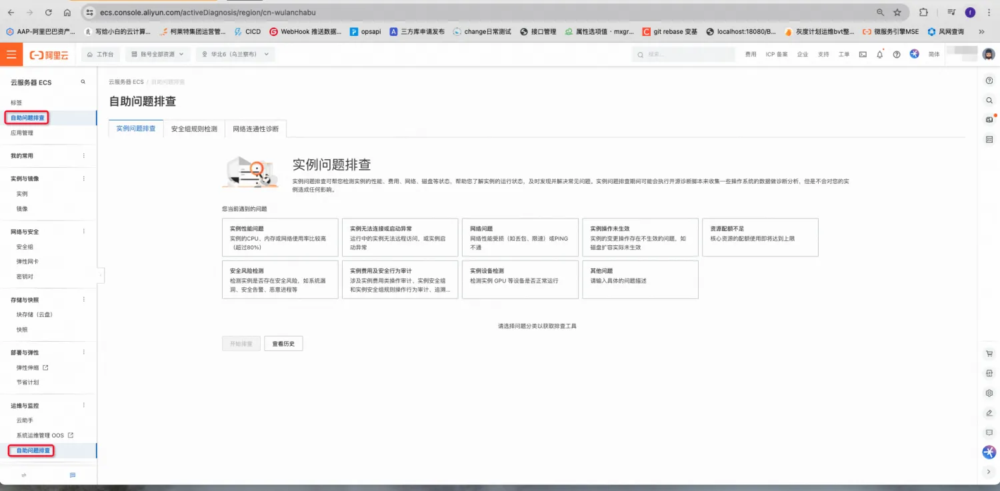

3. 发起并等待一段时间后会获得实例的健康诊断报告

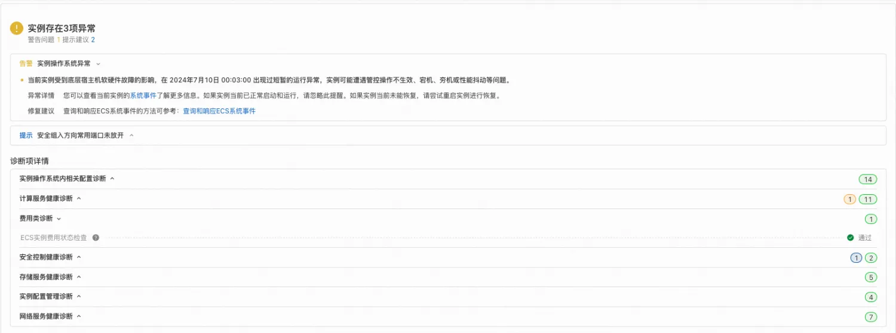

4. 诊断报告详解

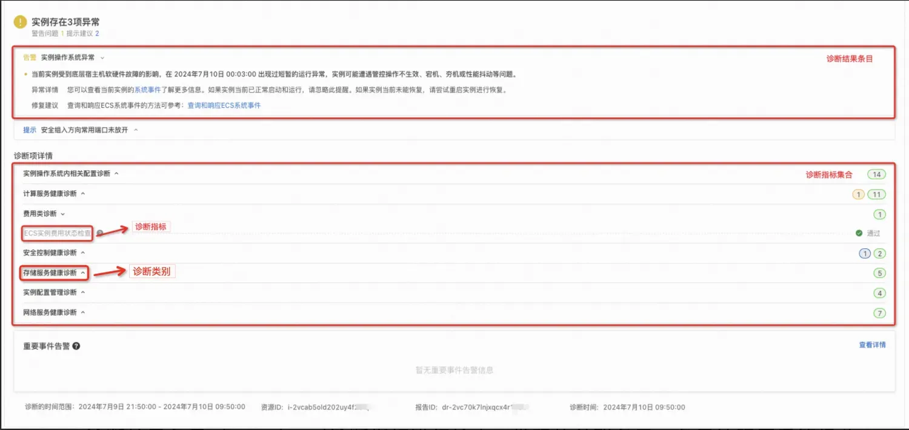

健康诊断报告由三个部分构成

a. 诊断异常部分。包含诊断结果条目IssueID、异常的解释、异常的建议修复方案、以及异常的详情。

b. 诊断项详情，包括所做的所有诊断指标MetricID、以及每个MetricID是通过还是异常。

c. 报告详细信息，包括资源ID、诊断报告ID、诊断时间、以及诊断范围。

#### RAM权限设置
1. 登录[RAM 访问控制](https://ram.console.aliyun.com/overview)
2. 创建用户

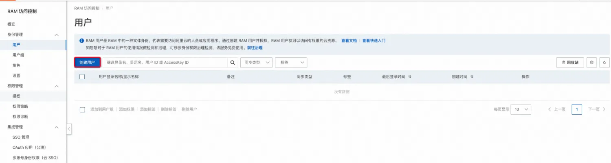

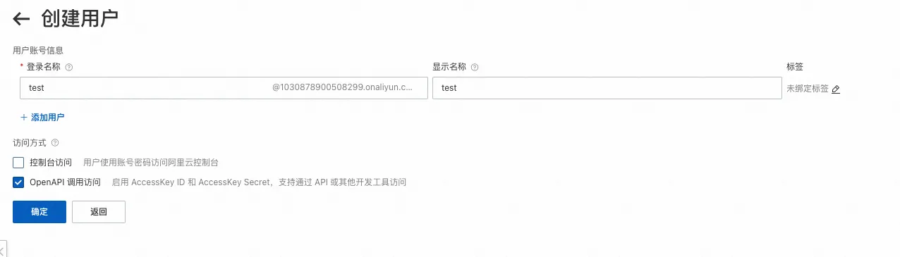

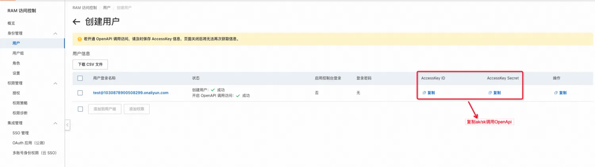

3. 授权
    - 主账号直接赋予子账号关于ECS的全部权限AliyunECSFullAccess。

        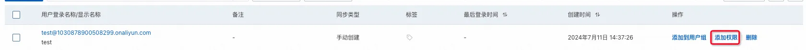
        
        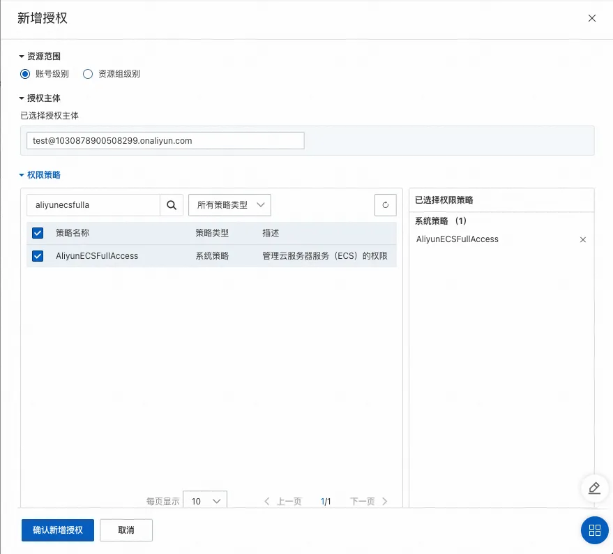

    - 自定义一个子权限集（类似AliyunECSFullAccess，但是只有诊断相关API的权限），然后赋予子账户。

        a. 创建权限策略
        
            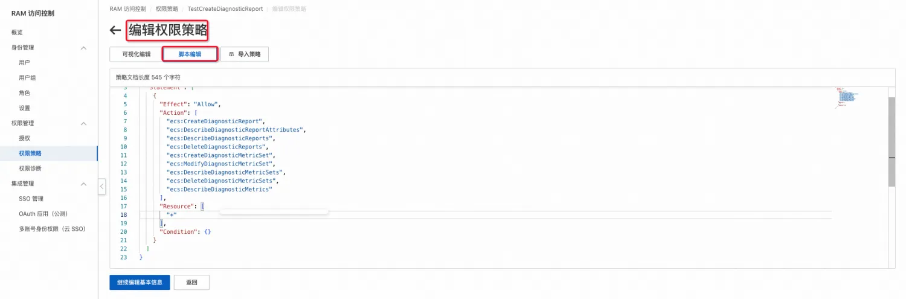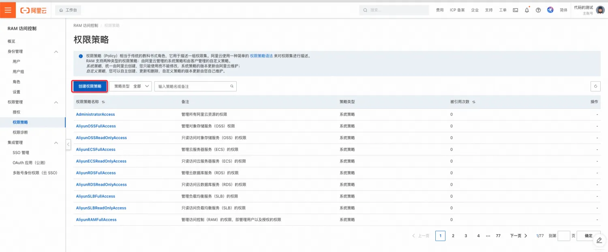

            其中编辑的权限脚本内容如下

            ```
            {
              "Version": "1",
              "Statement": [
                {
                  "Effect": "Allow",
                  "Action": [
                    "ecs:CreateDiagnosticReport",
                    "ecs:DescribeDiagnosticReportAttributes",
                    "ecs:DescribeDiagnosticReports",
                    "ecs:DeleteDiagnosticReports",
                    "ecs:CreateDiagnosticMetricSet",
                    "ecs:ModifyDiagnosticMetricSet",
                    "ecs:DescribeDiagnosticMetricSets",
                    "ecs:DeleteDiagnosticMetricSets",
                    "ecs:DescribeDiagnosticMetrics"
                  ],
                  "Resource": [
                    "*"
                  ],
                  "Condition": {}
                }
              ]
            }
            ```

        b. 将新增的权限赋予子账号
        
            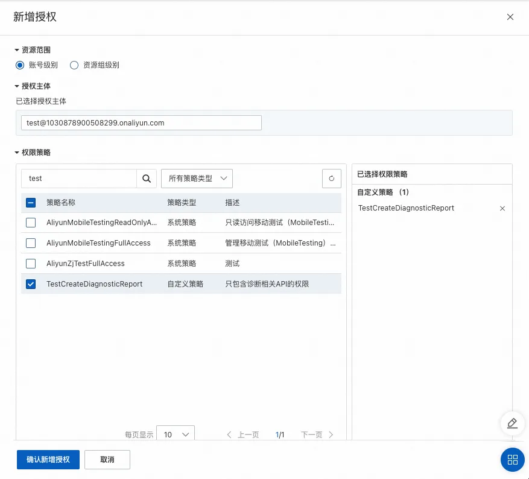

#### OpenApi与SDK使用说明
1. OpenApi与SDK相关配置（以Java调用为例）
    - pom文件

        ```
        <dependencies>
          <dependency>
            <groupId>com.alibaba</groupId>
            <artifactId>fastjson</artifactId>
            <version>1.2.83</version>
          </dependency>
          <dependency>
            <groupId>com.aliyun</groupId>
            <artifactId>aliyun-java-sdk-core</artifactId>
            <version>4.6.1</version>
          </dependency>
          <dependency>
            <groupId>com.aliyun</groupId>
            <artifactId>aliyun-java-sdk-ecs</artifactId>
            <version>5.11.7</version>
          </dependency>
        </dependencies>
        ```

    - OpenClient实现

        ```
        public class OpenClient {
        
            private IAcsClient client;
        
            public void initClient() {
                DefaultProfile profile = DefaultProfile.getProfile(
                        "your region",          // The region ID
                        "your ak",      // The AccessKey ID of the RAM account
                        "your sk"); // The AccessKey Secret of the RAM account
                client = new DefaultAcsClient(profile);
            }
        
            public <R extends AcsResponse> R getResponse(RpcAcsRequest<R> request) {
                try {
                    return this.client.getAcsResponse(request);
                } catch (ServerException e) {
                    e.printStackTrace();
                    return null;
                } catch (ClientException e) {
                    e.printStackTrace();
                    return null;
                }
            }
        
        }
        ```

2. [DescribeDiagnosticMetrics](https://help.aliyun.com/zh/ecs/developer-reference/api-describediagnosticmetrics?spm=a2c4g.11186623.0.0.37b51e44BVa4kj#doc-api-Ecs-DescribeDiagnosticMetrics)
    1. 描述：查询诊断指标列表
    2. 请求参数

       | 名称 | 类型 | 必填 | 描述 | 示例值 |
       | --- | --- | --- | --- | --- |
       | RegionId | string | 是 | 地域 ID | cn-hangzhou |
       | MetricIds | list<string> | 否 | 诊断指标列表。 | ['Instance.DiskLoadFailure'] |
       | ResourceType | string | 否 | 支持的资源类型。 | instance |
       | NextToken | string | 否 | 查询凭证（Token）。取值为上一次调用接口返回的NextToken参数值，初次调用接口时无需设置该参数。 | caeba0bbb2be03f84eb48b699f0a4883 |
       | MaxResults | integer | 否 | 单次返回的结果数量，默认值为10，最大值为100。 | 10 |

    3. 返回参数

       | 名称 | 类型 | 描述 | 示例值 |
       | --- | --- | --- | --- |
       | RequestId | string | 请求 ID。 | 473469C7-AA6F-4DC5-B3DB-A3DC0DE***** |
       | NextToken | string | 本次调用返回的查询凭证值。 | caeba0bbb2be03f84eb48b699f0a4883 |
       | Metrics | list<Metric> | 诊断指标。 | |

       Metric

       | 名称 | 类型 | 描述 | 示例值 |
       | --- | --- | --- | --- |
       | MetricId | string | 诊断指标 ID。 | GuestOS.WinFirewall |
       | MetricName | string | 诊断指标名称。 | CPU诊断 |
       | MetricCategory | string | 诊断指标分类。 | CPU |
       | Description | string | 诊断指标描述。 | CPU诊断 |
       | ResourceType | string | 诊断指标支持的资源。 | instance |
       | GuestMetric | boolean | 是否需要在 GuestOS 内执行脚本。 | true |
       | SupportedOperatingSystem | string | 取值范围为：<ul><li>Windows</li> <li> Linux</li> <li> All</li></ul> | All |

    4. api调用示例

       ```java
       // 查询诊断指标列表
           public void describeDiagnosticMetrics() {
               DescribeDiagnosticMetricsRequest request = new DescribeDiagnosticMetricsRequest();
               request.setMaxResults(100);
               DescribeDiagnosticMetricsResponse response = getResponse(request);
               for (DescribeDiagnosticMetricsResponse.Metric metric : response.getMetrics()) {
                   System.out.printf("metricName: %s, MetricId: %s, Description: %s, SupportedOperatingSystem: %s, MetricCategory: %s%n", metric.getMetricName(), metric.getMetricId(), metric.getDescription(), metric.getSupportedOperatingSystem(), metric.getMetricCategory());
               }
           }
       ```

    5. [OpenAPI Explorer](https://api.aliyun.com/api/Ecs/2014-05-26/DescribeDiagnosticMetrics)调试示例

   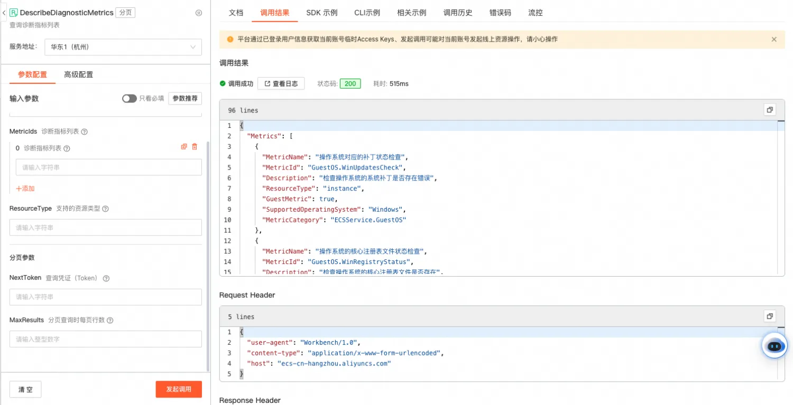

3. [CreateDiagnosticMetricSet](https://help.aliyun.com/zh/ecs/developer-reference/api-creatediagnosticmetricset?spm=a2c4g.11186623.0.0.721aae45M9K99y#doc-api-Ecs-CreateDiagnosticMetricSet)
    1. 描述：调用此接口可以自定义诊断指标集合
    2. 请求参数

       | 名称 | 类型 | 必填 | 描述 | 示例值 |
       | --- | --- | --- | --- | --- |
       | RegionId | string | 是 | 地域 ID。 | cn-hangzhou |
       | ResourceType | string | 是 | 诊断资源类型。默认值：instance。 | instance |
       | MetricSetName | string | 否 | 诊断指标集合的名称。 | 远程连接问题诊断 |
       | MetricIds | list<string> | 否 | 诊断指标列表。 | ['Instance.DiskLoadFailure'] |
       | Description | string | 否 | 诊断指标集合的描述信息。 | 远程连接问题诊断 |

    3. 返回参数

       | 名称 | 类型 | 描述 | 示例值 |
       | --- | --- | --- | --- |
       | RequestId | string | 请求 ID。 | 473469C7-AA6F-4DC5-B3DB-A3DC0DE***** |
       | MetricSetId | string | 诊断指标集合的唯一识别码。 | dms-o7ymuutup5l***** |

    4. api调用示例

       ```java
       public void createDiagnosticMetricSet() {
               CreateDiagnosticMetricSetRequest request = new CreateDiagnosticMetricSetRequest();
               request.setMetricSetName("test");
               request.setDescription("测试");
               request.setResourceType("instance");
       
               // 添加需要诊断的指标ID
               List<String> metricIds = new ArrayList<String>();
               metricIds.add("GuestOS.CloudInitService");
               request.setMetricIdss(metricIds);
       
               CreateDiagnosticMetricSetResponse response = getResponse(request);
               System.out.printf("requestId %s, metricSetId: %s", response.getRequestId(), response.getMetricSetId());
           }
       ```

    5. [OpenAPI Explorer](https://api.aliyun.com/api/Ecs/2014-05-26/CreateDiagnosticMetricSet)调试示例

       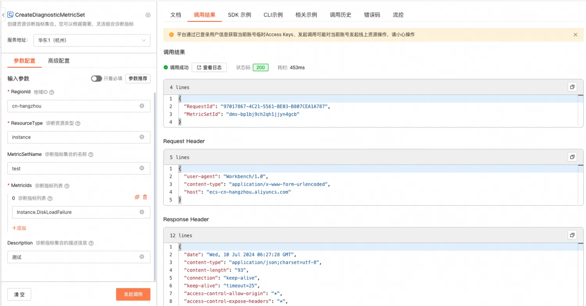

4. [DeleteDiagnosticMetricSets](https://help.aliyun.com/zh/ecs/developer-reference/api-deletediagnosticmetricsets?spm=a2c4g.11186623.0.0.721a179f75J2oQ#doc-api-Ecs-DeleteDiagnosticMetricSets)
    1. 描述：删除资源诊断指标集合
    2. 请求参数

       | 名称 | 类型 | 必填 | 描述 | 示例值 |
       | --- | --- | --- | --- | --- |
       | RegionId | string | 是 | 地域 ID。 | cn-hangzhou |
       | MetricSetIds | list<string> | 是 | 诊断指标集合 ID 列表。最多支持 10 个。 | ['dms-uf6i0tv2refv8wz*****'] |

    3. 返回参数

       | 名称 | 类型 | 描述 | 示例值 |
       | --- | --- | --- | --- |
       | RequestId | string | 请求 ID。 | 473469C7-AA6F-4DC5-B3DB-A3DC0DE***** |

    4. api调用示例

       ```java
       // 删除资源诊断指标集合
           public void deleteDiagnosticMetricSet() {
               DeleteDiagnosticMetricSetsRequest request = new DeleteDiagnosticMetricSetsRequest();
       
               // 添加需要删除的指标集合ID
               List<String> metricSetIds = new ArrayList<String>();
               metricSetIds.add("dms-bp1bj9ch2qh1jjyn4gcb");
               metricSetIds.add("dms-bp1bs2wotj0kg63tltjv");
       
               request.setMetricSetIdss(metricSetIds);
               DeleteDiagnosticMetricSetsResponse response = getResponse(request);
               System.out.printf("requestId %s", response.getRequestId());
           }
       ```

    5. [OpenAPI Explorer](https://api.aliyun.com/api/Ecs/2014-05-26/DeleteDiagnosticMetricSets)调试示例

       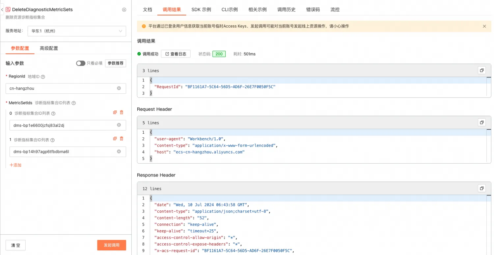

5. [ModifyDiagnosticMetricSet](https://help.aliyun.com/zh/ecs/developer-reference/api-modifydiagnosticmetricset?spm=a2c4g.11186623.0.0.721a179fOTitP8#doc-api-Ecs-ModifyDiagnosticMetricSet)
    1. 描述：修改资源诊断指标集合
    2. 请求参数

       | 名称 | 类型 | 必填 | 描述 | 示例值 |
       | --- | --- | --- | --- | --- |
       | RegionId | string | 是 | 地域 ID。 | cn-hangzhou |
       | MetricSetIds | list<string> | 是 | 诊断指标集合 ID 列表。最多支持 10 个。 | ['dms-uf6i0tv2refv8wz*****'] |
       | ResourceType | string | 否 | 诊断资源类型。 | instance |
       | MetricSetName | string | 否 | 诊断指标集合的名称。 | 远程连接问题诊断 |
       | MetricIds | list<string> | 否 | 诊断指标列表。 | ['Instance.DiskLoadFailure'] |
       | Description | string | 否 | 诊断指标集合的描述信息。 | 远程连接问题诊断 |

    3. 返回参数

       | 名称 | 类型 | 描述 | 示例值 |
       | --- | --- | --- | --- |
       | RequestId | string | 请求 ID。 | 473469C7-AA6F-4DC5-B3DB-A3DC0DE***** |

    4. api调用示例

       ```java
       public void modifyDiagnosticMetricSet() {
               ModifyDiagnosticMetricSetRequest request = new ModifyDiagnosticMetricSetRequest();
               request.setMetricSetId("dms-bp12upcwo81ua7iajvf4");
               request.setMetricSetName("test");
               request.setDescription("测试");
               request.setResourceType("instance");
               List<String> metricIds = new ArrayList<String>();
               metricIds.add("Instance.DiskLoadFailure");
               request.setMetricIdss(metricIds);
               ModifyDiagnosticMetricSetResponse response = getResponse(request);
               System.out.printf("requestId %s", response.getRequestId());
           }
       ```

    5. [OpenAPI Explorer](https://api.aliyun.com/api/Ecs/2014-05-26/ModifyDiagnosticMetricSet)调试示例

       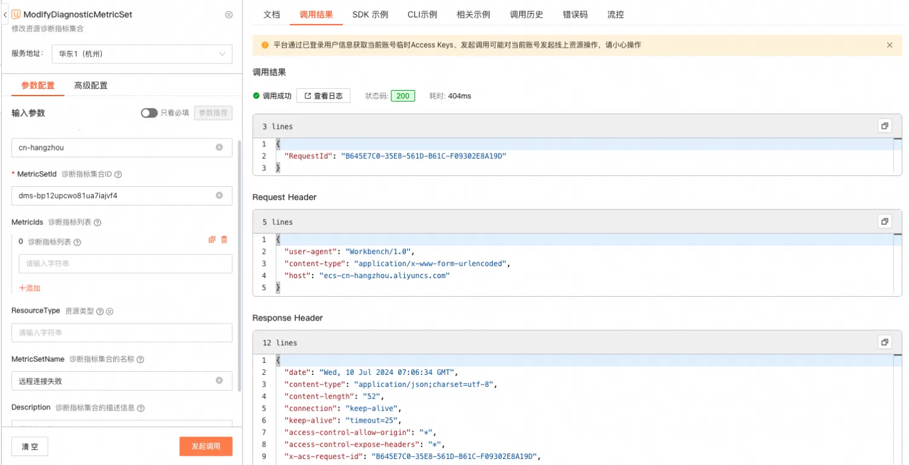

6. [DescribeDiagnosticMetricSets](https://help.aliyun.com/zh/ecs/developer-reference/api-describediagnosticmetricsets?spm=a2c4g.11186623.0.0.721a2393oWB5M6#doc-api-Ecs-DescribeDiagnosticMetricSets)
    1. 描述：查询资源诊断集合列表
    2. 请求参数

       | 名称 | 类型 | 必填 | 描述 | 示例值 |
       | --- | --- | --- | --- | --- |
       | RegionId | string | 是 | 地域 ID。 | cn-hangzhou |
       | MetricSetIds | list<string> | 否 | 诊断项集合列表。 | ['dms-uf6i0tv2refv8wz*****'] |
       | Type | string | 否 | 取值范围：<ul><li>User</li> <li> Common默认值为User，type值为User时，需要先调用**CreateDiagnosticMetricSet**创建诊断指标集合，不然会报错</li></ul> | User |
       | ResourceType | string | 否 | 资源类型。 | instance |
       | NextToken | string | 否 | 查询凭证（Token）。取值为上一次调用接口返回的NextToken参数值，初次调用接口时无需设置该参数。 | caeba0bbb2be03f84eb48b699f0a4883 |
       | MaxResults | integer | 否 | 单次返回的结果数量，默认值为10，最大值为100。 | 10 |

    3. 返回参数

       | 名称 | 类型 | 描述 | 示例值 |
       | --- | --- | --- | --- |
       | RequestId | string | 请求 ID。 | 473469C7-AA6F-4DC5-B3DB-A3DC0DE***** |
       | NextToken | string | 本次调用返回的查询凭证值。 | caeba0bbb2be03f84eb48b699f0a4883 |
       | MetricSets | list<MetricSet> | 诊断指标集合。 |  |

       MetricSet

       | 名称 | 类型 | 描述 | 示例值 |
       | --- | --- | --- | --- |
       | MetricSetId | string | 诊断指标集合 ID。 | dms-bp17p0qwtr72zmu***** |
       | MetricSetName | string | 诊断指标集合的名称。 | 远程连接问题诊断 |
       | Description | string | 诊断指标集合的描述信息。 | 远程连接问题诊断 |
       | Type | string | 诊断指标集合类型。取值范围：<ul><li>User：用户。</li> <li> Common：公共。</li></ul> | User |
       | ResourceType | string | 支持的资源类型。 | instance |
       | MetricIds | list<MetricId> | 诊断指标列表。 | ['Instance.DiskLoadFailure'] |

    4. api调用示例

       ```java
       // 查询资源诊断集合列表
           public void describeDiagnosticSets() {
               DescribeDiagnosticMetricSetsRequest request = new DescribeDiagnosticMetricSetsRequest();
       
               // 指定返回的结果数量
               request.setMaxResults(100);
       
               // 制定诊断项集合类型
               request.setType("Common");
       
               DescribeDiagnosticMetricSetsResponse response = getResponse(request);
               for (DescribeDiagnosticMetricSetsResponse.MetricSet metricSet : response.getMetricSets()) {
                   System.out.printf("metricSetId: %s, metricSetName: %s, description: %s, type: %s, resourceType: %s, metricIds: %s%n", metricSet.getMetricSetId(), metricSet.getMetricSetName(), metricSet.getDescription(), metricSet.getType(), metricSet.getResourceType(), metricSet.getMetricIds());
               }
           }
       ```

    5. [OpenAPI Explorer](https://api.aliyun.com/api/Ecs/2014-05-26/DescribeDiagnosticMetricSets)调试示例

       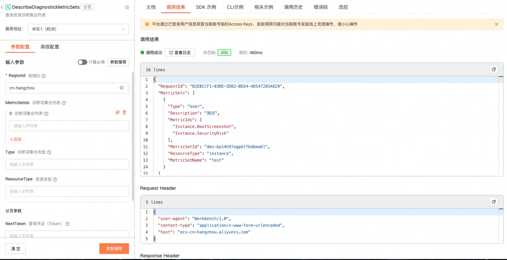

7. [CreateDiagnosticReport](https://help.aliyun.com/zh/ecs/developer-reference/api-creatediagnosticreport?spm=a2c4g.11186623.0.0.721a3a30Iy7igH#doc-api-Ecs-CreateDiagnosticReport)
    1. 描述：创建资源诊断报告
    2. 请求参数

       | 名称 | 必填 | 类型 | 描述 | 示例值 |
       | --- | --- | --- | --- | --- |
       | RegionId | string | 是 | 地域 ID。 | cn-hangzhou |
       | ResourceId | string | 是 | 资源 ID。 | i-uf6i0tv2refv8wz***** |
       | MetricSetId | string | 否 | 诊断指标集合 ID。如果为空，则会使用 ECS 实例的默认诊断指标集合 dms-instancedefault。 | dms-uf6i0tv2refv8wz***** |
       | StartTime | string | 否 | 开始时间。只对无需在 GuestOS 内执行云助手指令的诊断指标生效。 | 2022-07-11T12:00Z |
       | EndTime | string | 否 | 结束时间。只对无需在 GuestOS 内执行云助手指令的诊断指标生效。 | 2022-07-11T14:00Z |

    3. 返回参数

       | 名称 | 类型 | 描述 | 示例值 |
       | --- | --- | --- | --- |
       | RequestId | string | 请求 ID。 | 473469C7-AA6F-4DC5-B3DB-A3DC0DE***** |
       | ReportId | string | 诊断报告 ID，资源诊断报告的唯一标志。 | dr-uf6i0tv2refv8wz***** |

    4. api调用示例

       ```java
       // 创建资源诊断报告
           public void createDiagnosticReport() {
               CreateDiagnosticReportRequest request = new CreateDiagnosticReportRequest();
               request.setResourceId("i-bp1d1055fpao3jx4qfqa");
               request.setStartTime("2024-07-01T08:00:00Z");
               request.setEndTime("2022-07-01T08:30:00Z");
               CreateDiagnosticReportResponse response = getResponse(request);
               System.out.printf("requestId %s, reportId: %s", response.getRequestId(), response.getReportId());
           }
       ```

    5. [OpenAPI Explorer](https://api.aliyun.com/api/Ecs/2014-05-26/CreateDiagnosticReport)调试示例

       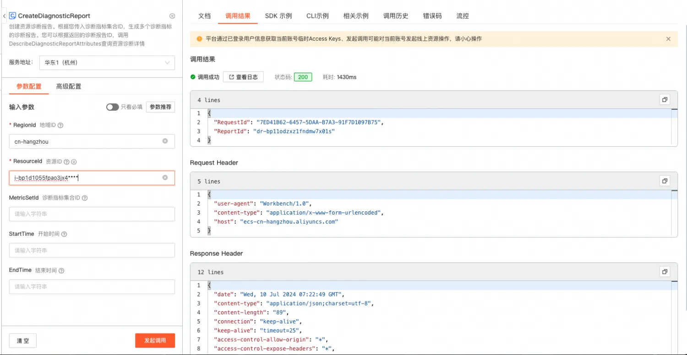

8. [DescribeDiagnosticReports](https://help.aliyun.com/zh/ecs/developer-reference/api-describediagnosticreports?spm=a2c4g.11186623.0.0.721a60baWivtAj#doc-api-Ecs-DescribeDiagnosticReports)
    1. 描述：查询资源诊断报告列表
    2. 请求参数

       | 名称 | 类型 | 必填 | 描述 | 示例值 |
       | --- | --- | --- | --- | --- |
       | RegionId | string | 是 | 地域 ID。 | cn-hangzhou |
       | ReportIds | list<string> | 否 | 诊断报告 ID 列表。最多支持100个ID。 | ['dr-uf6i0tv2refv8wz*****'] |
       | ResourceIds | list<string> | 否 | 资源ID列表，最多支持100个ID。 | ['i-uf6i0tv2refv8wz*****'] |
       | Status | string | 否 | 报告状态。取值范围：<ul><li>InProgress：诊断中。</li> <li> Failed：诊断失败。</li> <li> Finished：诊断完成。</li></ul> | Finished |
       | Severity | string | 否 | 严重等级。取值范围：<ul><li>Unknown：初始状态，表示未开始诊断或者诊断过程程序异常退出，无诊断结论。</li> <li> Normal：诊断正常，没有发现问题。</li> <li> Info：有关联信息，可能与异常相关。</li> <li> Warn：有关联信息，可能导致异常。</li> <li> Critical：有关键异常。</li></ul> | Normal |
       | NextToken | string | 否 | 查询凭证（Token）。取值为上一次调用接口返回的NextToken参数值，初次调用接口时无需设置该参数。 | caeba0bbb2be03f84eb48b699f0a4883 |
       | MaxResults | integer | 否 | 单次返回的结果数量，默认值为10，最大值为100。 | 10 |

    3. 返回参数

       | 名称 | 类型 | 描述 | 示例值 |
       | --- | --- | --- | --- |
       | RequestId | string | 请求 ID。 | 473469C7-AA6F-4DC5-B3DB-A3DC0DE***** |
       | NextToken | string | 本次调用返回的查询凭证值。 | caeba0bbb2be03f84eb48b699f0a4883 |
       | Reports | list<Report> | 诊断报告列表。 |  |

       Report

       | 名称 | 类型 | 描述 | 示例值 |
       | --- | --- | --- | --- |
       | ResourceId | string | 资源 ID。 | i-uf6i0tv2refv8wz***** |
       | ResourceType | string | 资源类型。 | instance |
       | MetricSetId | string | 诊断指标集合 ID。 | dms-bp17p0qwtr72zmu***** |
       | StartTime | string | 开始时间。 | 2022-07-11T12:00:00Z |
       | EndTime | string | 结束时间。 | 2022-07-11T14:00:00Z |
       | ReportId | string | 诊断报告 ID。 | dr-uf6i0tv2refv8wz***** |
       | Status | string | 诊断报告状态。 | Finished |
       | CreationTime | string | 诊断报告创建时间。 | 2022-07-11T12:00:00Z |
       | FinishedTime | string | 诊断报告结束时间。 | 2022-07-11T14:00:00Z |
       | Severity | string | 严重等级。取值范围：<ul><li>Unknown：初始状态，表示未开始诊断或者诊断过程程序异常退出，无诊断结论。</li> <li> Normal：诊断正常，没有发现问题。</li> <li> Info：有关联信息，可能与异常相关。</li> <li> Warn：有关联信息，可能导致异常。</li> <li> Critical：有关键异常。</li></ul> | Normal |
       | Issues | list<Issue> | 诊断问题列表 |  |

       Issue

       | 名称 | 类型 | 描述 | 示例值 |
       | --- | --- | --- | --- |
       | MetricId | string | 诊断指标 ID。 | GuestOS.WinFirewall |
       | MetricCategory | string | 诊断指标分类。 | ECSService.GuestOS |
       | IssueId | string | 诊断问题的唯一识别码。 | GuestOS.CPU.HighUtiliz***** |
       | Severity | string | 诊断指标严重等级。严重等级由轻到重如下：<ul><li>Info：有关联信息，可能与异常相关。</li> <li> Warn：有关联信息，可能导致异常。</li> <li> Critical：有关键异常。</li></ul> | Info |

    4. api调用示例

       ```java
       // 查询资源诊断报告列表
           public void describeDiagnosticReports() {
               DescribeDiagnosticReportsRequest request = new DescribeDiagnosticReportsRequest();
               request.setMaxResults(100);
               DescribeDiagnosticReportsResponse response = getResponse(request);
               for (DescribeDiagnosticReportsResponse.Report report : response.getReports()) {
                   System.out.printf("resourceId: %s, metricSetId: %s, startTime: %s, endTime: %s, reportId: %s, status: %s, creationTime: %s, finishedTime: %s, severity: %s, Issues: %s%n", report.getResourceId(), report.getMetricSetId(), report.getStartTime(), report.getEndTime(), report.getReportId(), report.getStatus(), report.getCreationTime(), report.getFinishedTime(), report.getSeverity(), JSON.toJSONString(report.getIssues()));
               }
           }
       ```

    5. [OpenAPI Explorer](https://api.aliyun.com/api/Ecs/2014-05-26/DescribeDiagnosticReports)调试示例

       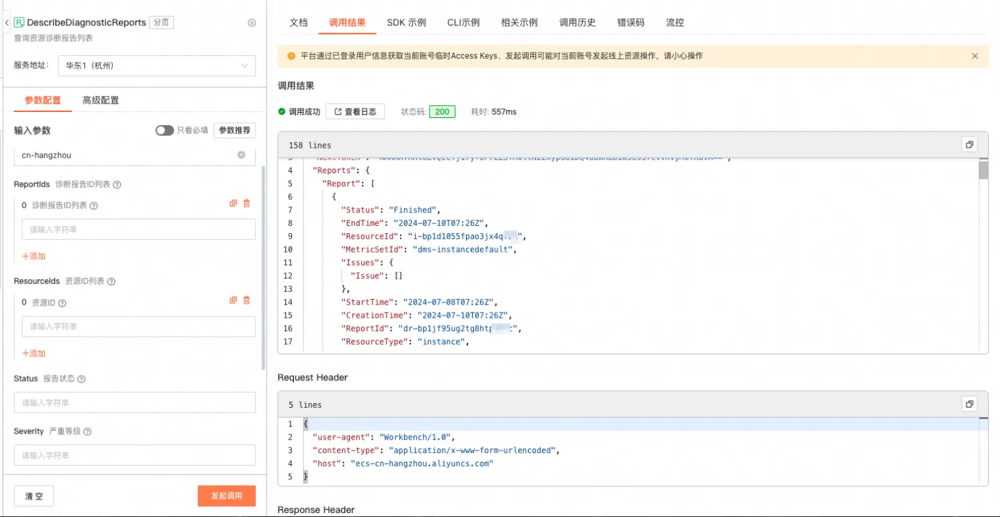

9. [DescribeDiagnosticReportAttributes](https://help.aliyun.com/zh/ecs/developer-reference/api-describediagnosticreportattributes?spm=a2c4g.11186623.0.0.721a7a996uNZ5g#doc-api-Ecs-DescribeDiagnosticReportAttributes)
    1. 描述：查询资源诊断详情
    2. 请求参数

       | 名称 | 类型 | 必填 | 描述 | 示例值 |
       | --- | --- | --- | --- | --- |
       | RegionId | string | 是 | 地域 ID。 | cn-hangzhou |
       | ReportId | string | 是 | 诊断报告 ID。 | dr-i-uf6i0tv2refv8wz***** |

    3. 返回参数

       | 名称 | 类型 | 描述 | 示例值 |
       | --- | --- | --- | --- |
       | RequestId | string | 请求 ID。 | 473469C7-AA6F-4DC5-B3DB-A3DC0DE3**** |
       | ResourceId | string | 资源 ID。 | i-uf6i0tv2refv8wz***** |
       | ResourceType | string | 资源类型。支持的类型为 instance。 | instance |
       | ReportId | string | 诊断报告 ID。资源诊断报告的唯一标志。 | dr-uf6i0tv2refv8wz***** |
       | Status | string | 诊断报告状态。可能值：<ul><li>InProgress：诊断中。</li> <li> Finished：诊断完成。</li> <li> Failed：诊断失败。</li></ul> | Finished    |
       | CreationTime | string | 诊断报告创建时间。 | 2022-07-11T12:00:00Z |
       | FinishedTime | string | 诊断报告完成时间。 | 2022-07-11T14:00:00Z |
       | StartTime | string | 开始时间。 | 2022-07-11T12:00:00Z |
       | EndTime | string | 结束时间。 | 2022-07-11T14:00:00Z |
       | Severity | string | 报告严重等级。所有指标中最严重的等级，严重等级由轻到重如下：<ul><li>Unknown：初始状态，表示未开始诊断或者诊断过程程序异常退出，无诊断结论。</li> <li> Normal：诊断正常，没有发现问题。</li> <li> Info：有关联信息，可能与异常相关。</li> <li> Warn：有关联信息，可能导致异常。</li> <li> Critical：有关键异常。</li></ul> | Normal |
       | MetricSetId | string | 诊断指标集合 ID。 | dms-bp17p0qwtr72zmu***** |
       | MetricResults | list<MetricResult> | 诊断集合中所有指标的诊断结果。 |  |

       MetricResult

       | 名称 | 类型 | 描述 | 示例值 |
       | --- | --- | --- | --- |
       | MetricId | string | 诊断指标 ID。 | GuestOS.WinFirewall |
       | MetricCategory | string | 诊断指标分类。 | CPU |
       | Severity | string | 诊断指标严重等级。可能值：<ul><li>Unknown：初始状态，表示未开始诊断或者诊断过程程序异常退出，无诊断结论。</li> <li> Normal：诊断正常，没有发现问题。</li> <li> Info：有关联信息，可能与异常相关。</li> <li> NotSupport：GuestOS 版本不支持诊断该项目。</li> <li> Warn：有关联信息，可能导致异常。</li> <li> Critical：有关键异常。</li></ul> | Normal |
       | Status | string | 指标诊断状态。可能值：<ul><li>InProgress：诊断中。</li> <li> Finished：诊断完成。</li> <li> Failed：诊断失败。</li></ul> | Finished |
       | Issues | list<Issue> | 诊断问题列表。 |  |

       Issue

       | 名称 | 类型 | 描述 | 示例值 |
       | --- | --- | --- | --- |
       | IssueId | string | 诊断问题的唯一识别码。 | GuestOS.CPU.HighUtiliz***** |
       | Severity | string | 诊断问题严重程度，严重等级由轻到重如下：<ul><li>Info：有关联信息，可能与异常相关。</li> <li> Warn：有关联信息，可能导致异常。</li> <li> Critical：有关键异常。</li></ul> | Info |
       | Additional | string | 诊断问题携带的额外数据，帮助理解问题更多信息，数据格式为 JSON 的字符串。 | {    "TotalPercent": 95, "TopUtilizationProcesses": [ { "Pid": "1223", "CommandName": "/usr/bin/mem.py", "PhysicalMemoryPercent": 50 } ] } |
       | OccurrenceTime | string | 问题发生的时间。 | 2022-07-11T14:00:00Z |

    4. api调用示例

       ```java
       // 查询资源诊断详情
           public void describeDiagnosticReportAttributes() {
               DescribeDiagnosticReportAttributesRequest request = new DescribeDiagnosticReportAttributesRequest();
               request.setReportId("dr-bp1jf95ug2tg8htp****");
               DescribeDiagnosticReportAttributesResponse response = getResponse(request);
               for (DescribeDiagnosticReportAttributesResponse.MetricResult metricResult : response.getMetricResults()) {
                   System.out.printf("metricId: %s,  metricCategory: %s, severity: %s, status: %s, issues: %s%n", metricResult.getMetricId(), metricResult.getMetricCategory(), metricResult.getSeverity(), metricResult.getStatus(), JSON.toJSONString(metricResult.getIssues()));
               }
           }
       ```

    5. [OpenAPI Explorer](https://api.aliyun.com/api/Ecs/2014-05-26/DescribeDiagnosticReportAttributes)调试示例

       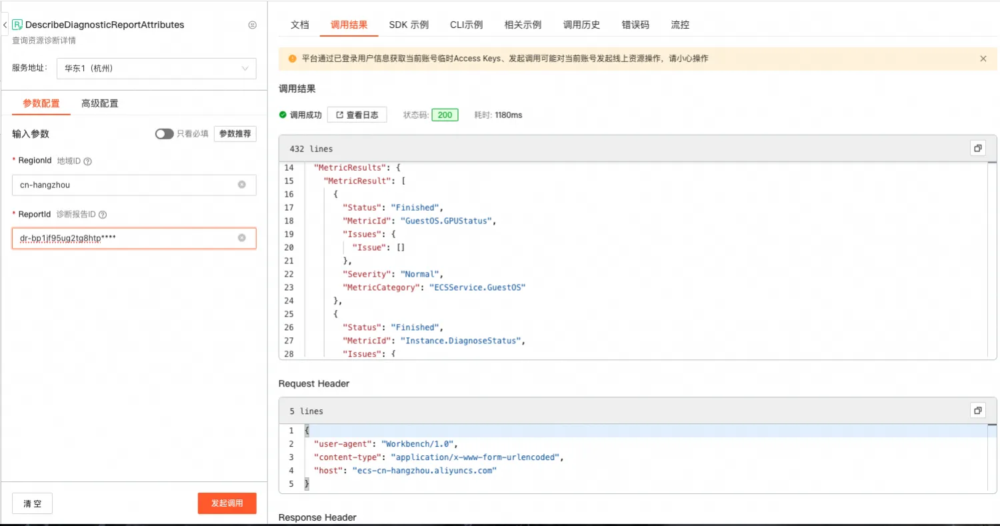

10. [DeleteDiagnosticReports](https://help.aliyun.com/zh/ecs/developer-reference/api-deletediagnosticreports?spm=a2c4g.11186623.0.0.721a6352sd785C#doc-api-Ecs-DeleteDiagnosticReports)
    1. 描述：删除资源诊断报告
    2. 请求参数

       | 名称 | 类型 | 必填 | 描述 | 示例值 |
       | --- | --- | --- | --- | --- |
       | RegionId | string | 是 | 地域 ID。 | cn-hangzhou |
       | ReportIds | list<string> | 是 | 诊断报告 ID 列表。最多支持 100 个 ID。 | ['dr-uf6i0tv2refv8wz*****'] |

    3. 返回参数

       | 名称 | 类型 | 描述 | 示例值 |
       | --- | --- | --- | --- |
       | RequestId | string | 请求 ID。 | 473469C7-AA6F-4DC5-B3DB-A3DC0DE***** |

    4. api调用示例

        ```java
        // 删除资源诊断报告
            public void deleteDiagnosticReports() {
                DeleteDiagnosticReportsRequest request = new DeleteDiagnosticReportsRequest();
      
               // 添加需要删除的资源诊断报告ID
                List<String> reportIds = new ArrayList<String>();
                reportIds.add("dr-bp1jf95ug2tg8htp****");
                request.setReportIdss(reportIds);
      
                DeleteDiagnosticReportsResponse response = getResponse(request);
                System.out.printf("requestId %s", response.getRequestId());
            }
        ```

    5. [OpenAPI Explorer](https://api.aliyun.com/api/Ecs/2014-05-26/DeleteDiagnosticReports)调试示例

       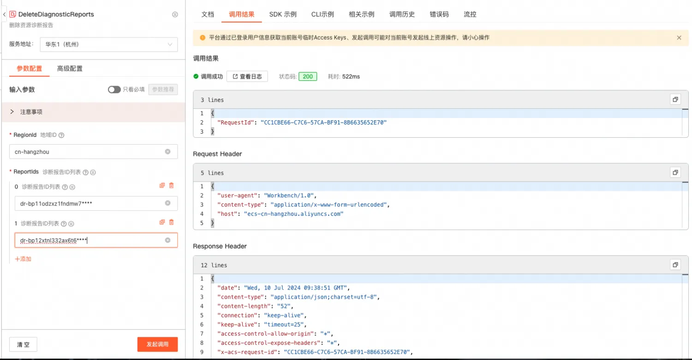

#### 阿里云CLI
1. [官网介绍](https://help.aliyun.com/zh/cli/what-is-alibaba-cloud-cli?spm=a2c4g.11186623.4.6.2d9043dcXaI09o&scm=20140722.H_110244._.ID_110244-OR_rec-V_1)
2. 命令参数介绍：参数参考对应的OpenApi，cols展示的列名，需要与 JSON 数据中的字段相对应。rows指定过滤字段所在的[JMESPath](http://jmespath.org/)路径。

   ```bash
   aliyun <product> <ApiName> [--parameter1 value1 --parameter2 value2 ...] --output cols=col1,col2 rows=rows.row[]
   ```

3. 使用示例
    - 查询诊断指标相关示例
        * 查询诊断指标列表

           ```bash
           aliyun ecs DescribeDiagnosticMetrics --RegionId TheRegionId --output cols=MetricId,MetricName,Description rows=Metrics[]
           +-------------------------------------------------------------------------------------------+
           |  MetricId                  | MetricName                  | Description                    | 
           |  --------                  | ----------                  | -----------                    |
           |  GuestOS.WinUpdatesCheck   | 操作系统对应的补丁状态检查      | 检查操作系统的系统补丁是否存在错误    |
           |  GuestOS.WinRegistryStatus | 操作系统的核心注册表文件状态检查 | 检查操作系统的核心注册表文件是否存在  |
           |  GuestOS.WinSysprep        | 操作系统准备程序执行状态检查     | 检查操作系统准备程序是否正常        |
           +-------------------------------------------------------------------------------------------+
           ```

    - 资源诊断指标集合相关示例
        * 创建资源诊断指标集合

           ```bash
           aliyun ecs CreateDiagnosticMetricSet --RegionId TheRegionId --ResourceType 'instance' --MetricSetName YourMetricSetName --MetricIds.1 'MetricId1' --MetricIds.2 "MetricId2" --output cols=MetricSetId
           +----------------------------+
           |  MetricSetId               |
           |  -----------               |
           |  dms-bp13nfncampz98v43q1j  |
           +----------------------------+
           ```

        * 删除资源诊断指标集合

           ```bash
           aliyun ecs DeleteDiagnosticMetricSets --RegionId TheRegionId --MetricSetIds.1 YourMetricSetId
           ```

        * 修改资源诊断指标集合

           ```bash
           # 修改诊断指标集合的描述
           aliyun ecs ModifyDiagnosticMetricSet --RegionId TheRegionId --MetricSetId YourMetricSetId --Description '测试'
           ```

        * 查询资源诊断集合列表

           ```bash
           aliyun ecs DescribeDiagnosticMetricSets --RegionId TheRegionId --output cols=MetricSetName,Description,MetricSetId,MetricIds rows=MetricSets[]
           +----------------------------------------------------------------------------------------------------------------+
           |  MetricSetName | Description | MetricSetId              | MetricIds                                            |
           |  ------------- | ----------- | -----------              | ---------                                            |
           |  test          | 测试         | dms-bp13sbs6q8kj6v8nhdem | [GuestOS.WinRegistryStatus GuestOS.WinUpdatesCheck]  |
           |  test          | 测试         | dms-bp12upcwo81ua7iajvf4 | [Instance.DiskLoadFailure]                           |
           +----------------------------------------------------------------------------------------------------------------+     
           ```

    - 资源诊断报告相关示例
        * 创建资源诊断报告

           ```bash
           aliyun ecs CreateDiagnosticReport --RegionId TheRegionId --MetricSetId TheMetricId --ResourceId YourResourceId --StartTime '2024-07-01T00:00Z' --EndTime '2024-07-01T01:00Z' --output cols=ReportId
           +---------------------------+
           |  ReportId                 |
           |  --------                 |
           |  dr-bp13sbs6q8kj7d02dw5q  |
           +---------------------------+
           ```

        * 查询资源诊断报告列表

           ```bash
           aliyun ecs DescribeDiagnosticReports --RegionId TheRegionId --ReportIds.1 'dr-bp13sbs6q8kj7d02dw5q' --output cols=MetricSetId,Status,Severity rows=Reports.Report[]
           +---------------------------------------------+
           |  MetricSetId         | Status   | Severity  |
           |  -----------         | ------   | --------  |
           |  dms-instancedefault | Finished | Normal    |
           +---------------------------------------------+
           ```

        * 查询资源诊断详情

           ```bash
           aliyun ecs DescribeDiagnosticReportAttributes --RegionId TheRegionId --ReportId 'dr-bp13sbs6q8kj7d02dw5q' --output cols=MetricId,Status,Severity,MetricCategory rows=MetricResults.MetricResult[]
           +--------------------------------------------------------------------------------------+
           |  MetricId                      | Status   | Severity | MetricCategory                |
           |  --------                      | ------   | -------- | --------------                |
           |  GuestOS.GPUStatus             | Finished | Normal   | ECSService.GuestOS            |
           |  Instance.DiagnoseStatus       | Finished | Normal   | ECSService.ServiceHealth      |
           |  Instance.ExpenseException     | Finished | Normal   | ECSService.AccountBalance     |
           |  Instance.SecurityPunishStatus | Finished | Normal   | ECSService.SecurityGroup      |
           |  Instance.RecentUtilHigh       | Finished | Normal   | ECSService.ServiceHealth      |
           |  Instance.DiskFull             | Finished | Normal   | ECSService.InstanceStorage    |
           |  Instance.SecurityRisk         | Finished | Normal   | ECSService.SecurityGroup      |
           |  Instance.BootScreenshot       | Finished | Normal   | ECSService.InstanceConfigure  |
           |  Instance.NetworkPacketDrop    | Finished | Normal   | ECSService.InstanceNetwork    |
           |  GuestOS.OSOOM                 | Finished | Normal   | ECSService.GuestOS            |
           |  GuestOS.TimeSyncService       | Finished | Normal   | ECSService.GuestOS            |
           |  GuestOS.SSHServiceStatus      | Finished | Normal   | ECSService.GuestOS            |
           |  GuestOS.CloudInitService      | Finished | Normal   | ECSService.GuestOS            |
           +--------------------------------------------------------------------------------------+
           ```

        * 删除资源诊断报告

           ```bash
           aliyun ecs DeleteDiagnosticReports --RegionId TheRegionId --ReportIds.1 'dr-bp13sbs6q8kj7d02dw5q'
           ```
