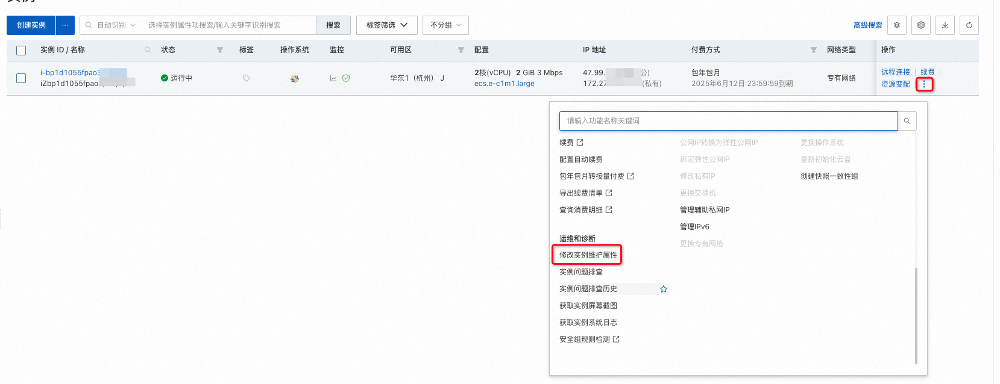
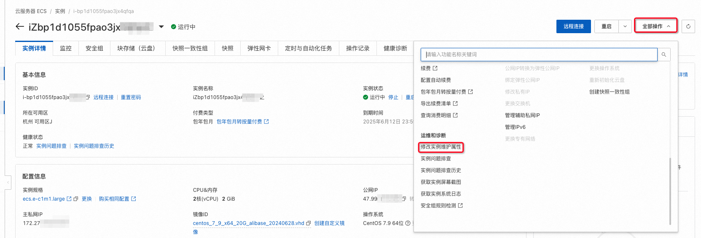
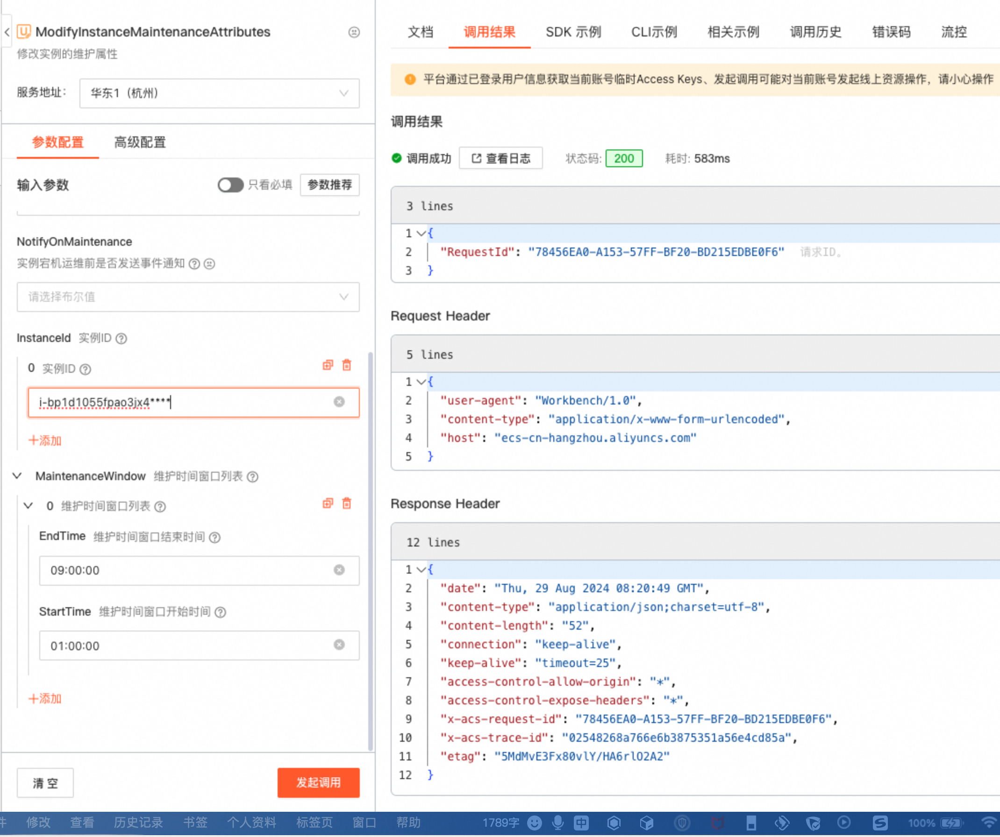

### 功能描述
#### 简介
实例运维属性本质上指定了ECS实例遇到各种非预期和计划内运维事件后的默认行为，您可以修改实例运维属性定义该默认行为，例如遇到非预期运维事件后默认自动重启还是保持停机状态。

#### 基本概念
实例运维属性分为运维动作和运维时间窗口两个维度。

* 运维动作：指定的非预期宕机处理策略，包括Stop、AutoRecover和AutoRedeploy。

* 运维时间窗口：自定义的一段时间范围，运维动作只会在该时间段内进行。


#### 运维动作
| 运维动作 | 相关的系统事件 | 适用实例类型 | 说明 |
| --- | --- | --- | --- |
| 自动重启恢复（默认）AutoRecover | + SystemMaintenance.Reboot+ SystemFailure.Reboot | 所有支持系统事件的实例。 | 实例恢复至执行运维任务之前的状态：+ 如果操作前状态为**运行中**，实例自动重启，继续提供服务。+ 如果操作前状态为**已停止**，实例继续处于**已停止**状态。 |
| 禁止重启恢复   Stop | + SystemMaintenance.Stop+ SystemFailure.Stop | 所有支持系统事件的实例。 | 实例进入**已停止**状态。适用于您已经在应用层实现故障转移、节点切换等灾备机制的情况，避免多个节点同时提供服务而产生冲突。 |
| 自动重新部署    | + SystemMaintenance.Redeploy+ SystemFailure.Redeploy | 仅依赖宿主机硬件的实例，例如挂载本地盘或支持SGX加密计算的实例。 | 实例自动重新部署至其他宿主机，然后继续提供服务。 |


### 实例运维属性使用
#### ECS控制台
**说明：ECS控制台仅支持对运维动作的查询和修改，如果想修改运维时间窗口，请使用SDK或者阿里云CLI。**

1. 登录[ECS管理控制台](https://ecs.console.aliyun.com/home)。
2. 在左侧导航栏，选择实例与镜像 > 实例。
3. 在页面左侧顶部，选择目标资源所在的地域。
4. 找到目标实例，任选一种方式进入设置项。


   - 方式一：在实例操作列中，选择图标 > 运维和诊断 > 修改实例维护属性。




   - 方式二：单击实例ID，进入实例详情页，在页面右上角，选择全部操作 > 运维和诊断 > 修改实例维护属性。




5. 在弹出的修改实例维护属性对话框中，根据您的需求修改，然后单击确定。
    - 如果实例只挂载了云盘，您可以选择以下选项：
        * 自动重启恢复
        * 禁止重启恢复
    - 如果实例挂载了本地盘，您可以选择以下选项：
        * 自动重启恢复
        * 禁止重启恢复
        * 自动重新部署
6. 在实例详情页的其它信息区域，确认变更后的维护属性。


#### OpenAPI与SDK使用说明
1. OpenApi与SDK 相关配置（以Java调用为例）

- pom文件


```xml
<dependencies>
  <dependency>
    <groupId>com.alibaba</groupId>
    <artifactId>fastjson</artifactId>
    <version>1.2.83</version>
  </dependency>
  <dependency>
    <groupId>com.aliyun</groupId>
    <artifactId>aliyun-java-sdk-core</artifactId>
    <version>4.6.1</version>
  </dependency>
  <dependency>
    <groupId>com.aliyun</groupId>
    <artifactId>aliyun-java-sdk-ecs</artifactId>
    <version>5.11.7</version>
  </dependency>
</dependencies>
```


- OpenClient实现


```java
public class OpenClient {

    private IAcsClient client;

    public void initClient() {
        DefaultProfile profile = DefaultProfile.getProfile(
                "your region",          // The region ID
                "your ak",      // The AccessKey ID of the RAM account
                "your sk"); // The AccessKey Secret of the RAM account
        client = new DefaultAcsClient(profile);
    }

    public <R extends AcsResponse> R getResponse(RpcAcsRequest<R> request) {
        try {
            return this.client.getAcsResponse(request);
        } catch (ServerException e) {
            e.printStackTrace();
            return null;
        } catch (ClientException e) {
            e.printStackTrace();
            return null;
        }
    }

}
```

2. [DescribeInstanceMaintenanceAttributes](https://help.aliyun.com/zh/ecs/api-describeinstancemaintenanceattributes?spm=a2c4g.11186623.0.0.5246795bt1lWGJ#doc-api-Ecs-DescribeInstanceMaintenanceAttributes)(查询实例的维护属性)
  - 1. 描述：查询一台或多台ECS实例的运维属性
  - 2. 主要请求参数

| 名称 | 类型 | 必填 | 描述 | 示例值                                                                      |
| --- | --- | --- | --- |--------------------------------------------------------------------------|
| regionId | string | 是 | 实例所属的地域ID | cn-hangzhou                                                              |
| InstanceIds | list<string> | 是 | 查询的实例列表 | ["i-bp67acfmxazb4p****", "i-bp67acfmxazb4p****", "i-bp67acfmxazb4p****"] |


   - 3. 主要返回参数

| 名称 | 类型 | 描述 | 示例值 |
| --- | --- | --- | --- |
| TotalCount | integer | 查询到的维护属性总数。 | 100 |
| MaintenanceAttributesInstanceId+ ActionOnMaintenance    - DefaultValue    - Value+ MaintenanceWindows    - EndTime    - StartTime | array<object>+ string+ object    - string    - string+ array<object>    - string    - string | 运维属性的集合+ 实例ID+ 运维动作对象    - 运维动作默认的值    - 运维动作当前生效的值+ 运维时间窗口数组    - 运维时间窗口结束时间    - 运维时间窗口开始时间 | + i-bp67acfmxazb4p****+      - AutoRecover    - Stop+      - 09:00:00    - 08:00:00 |


   - 4. API调用示例


```java
// 查询实例运维属性
    public void describeEcsMaintenanceAttributes() {
        DescribeInstanceMaintenanceAttributesRequest request = new DescribeInstanceMaintenanceAttributesRequest();
        List<String> instanceIds = new ArrayList<String>();
        // 向实例ID列表中添加一个示例实例ID
        instanceIds.add("i-bp1d1055fpao3jx***");
        request.setInstanceIds(instanceIds);
        DescribeInstanceMaintenanceAttributesResponse resp = getResponse(request);
        for (DescribeInstanceMaintenanceAttributesResponse.MaintenanceAttribute maintenanceAttribute : resp.getMaintenanceAttributes()) {
            System.out.printf("instanceId: %s,  maintenanceAction: %s,  startTime: %s, endTime: %s%n", maintenanceAttribute.getInstanceId(), maintenanceAttribute.getActionOnMaintenance().getValue(), maintenanceAttribute.getMaintenanceWindows().get(0).getStartTime(), maintenanceAttribute.getMaintenanceWindows().get(0).getEndTime());
        }

    }
```

   - 5. [OpenApi Explorer](https://api.aliyun.com/api/Ecs/2014-05-26/DescribeInstanceMaintenanceAttributes)调试示例


3. [ModifyInstanceMaintenanceAttributes](https://help.aliyun.com/zh/ecs/api-modifyinstancemaintenanceattributes?spm=a2c4g.11186623.0.0.5246795bt1lWGJ#doc-api-Ecs-ModifyInstanceMaintenanceAttributes)

- 1. 描述：修改实例的运维属性，包括运维动作和运维时间窗口
- 2. 请求参数


| 名称 | 类型 | 必填 | 描述 | 示例值 |
| --- | --- | --- | --- | --- |
| RegionId | string | 是 | 实例所属的地域 ID。您可以调用 [DescribeRegions](https://help.aliyun.com/zh/ecs/api-regions-describeregions) 查看最新的阿里云地域列表。 | cn-hangzhou |
| InstanceIds | list | 是 | 实例 ID。N 的取值范围为：1~100。 | ["i-bp67acfmxazb4p****", "i-bp67acfmxazb4p****", … "i-bp67acfmxazb4p****"] |
| ActionOnMaintenance | string | 否 | 维护动作。取值范围：+ Stop：停止状态（即宕机）。+ AutoRecover：自动恢复。+ AutoRedeploy：宕机迁移，数据盘有损。 | AutoRecover |
| MaintenanceWindows | array<object> | 否 | 运维时间窗口数组，只支持设置1个时间窗口 | |


MaintenanceWindow

| 名称 | 类型 | 必填 | 描述 | 示例值 |
| --- | --- | --- | --- | --- |
| EndTime | string | 否 | 维护时间窗口结束时间。必须为整小时，不允许设置分、秒。开始时间和结束时间必须同时设置，并且结束时间与开始时间需要间隔 1~23 个整小时。采用 UTC +8 时区，格式为`HH:00:00`。 | 18:00:00 |
| StartTime | string | 否 | 维护时间窗口开始时间。必须为整小时，不允许设置分、秒。开始时间和结束时间必须同时设置，并且结束时间与开始时间需要间隔 1~23 个整小时。采用 UTC +8 时区，格式为`HH:00:00`。 | 02:00:00 |


- 3. 返回参数


| 名称 | 类型 | 描述 | 示例值 |
| --- | --- | --- | --- |
| RequestId | string | 请求 ID。 | 473469C7-AA6F-4DC5-B3DB-A3DC0DE***** |


- 4. API调用示例


```java
// 修改实例运维属性
    public void modifyInstanceMaintenanceAttribute() {
        ModifyInstanceMaintenanceAttributesRequest request = new ModifyInstanceMaintenanceAttributesRequest();

        // 向实例ID列表中添加一个示例实例ID
        List<String> instanceIds = new ArrayList<String>();
        instanceIds.add("i-bp1d1055fpao3jx4***");
        request.setInstanceIds(instanceIds);
        request.setActionOnMaintenance("AutoRecover");

        // 设置运维时间窗口
        List<ModifyInstanceMaintenanceAttributesRequest.MaintenanceWindow> maintenanceWindows = new ArrayList<>();
        ModifyInstanceMaintenanceAttributesRequest.MaintenanceWindow maintenanceWindow = new ModifyInstanceMaintenanceAttributesRequest.MaintenanceWindow();
        maintenanceWindow.setStartTime("00:00:00");
        maintenanceWindow.setEndTime("08:00:00");
        maintenanceWindows.add(maintenanceWindow);
        request.setMaintenanceWindows(maintenanceWindows);

        ModifyInstanceMaintenanceAttributesResponse response = getResponse(request);
        System.out.printf("requestId %s", response.getRequestId());
    }
```

- 5. [OpenApi Explorer](https://api.aliyun.com/api/Ecs/2014-05-26/ModifyInstanceMaintenanceAttributes)调试示例



#### 阿里云CLI
1. [官网介绍](https://help.aliyun.com/zh/cli/what-is-alibaba-cloud-cli?spm=a2c4g.11186623.4.6.2d9043dcXaI09o&scm=20140722.H_110244._.ID_110244-OR_rec-V_1)
2. 命令参数介绍：参数参考对应的OpenApi，cols展示的列名，需要与 JSON 数据中的字段相对应。rows指定过滤字段所在的[JMESPath](http://jmespath.org/)路径。
3. 使用示例
- 查询实例运维属性

```bash
aliyun ecs DescribeInstanceMaintenanceAttributes --RegionId 'The RegionId' --InstanceId.1 'i-bp1d1055fpao3jx4****' --output cols=InstanceId,ActionOnMaintenance.Value,MaintenanceWindows.MaintenanceWindow[0].StartTime,MaintenanceWindows.MaintenanceWindow[0].EndTime rows=MaintenanceAttributes.MaintenanceAttribute[]

+----------------------------------------------------------------------------------------------------------------------------------------------------------+
| InstanceId             | ActionOnMaintenance.Value | MaintenanceWindows.MaintenanceWindow[0].StartTime | MaintenanceWindows.MaintenanceWindow[0].EndTime |
| ----------             | ------------------------- | ------------------------------------------------- | ----------------------------------------------- |
| i-bp1d1055fpao3jx4qfqa | AutoRecover               | 01:00:00                                          | 09:00:00                                        |
+----------------------------------------------------------------------------------------------------------------------------------------------------------+
```

- 修改实例运维属性

```bash
aliyun ecs ModifyInstanceMaintenanceAttributes --region cn-hangzhou --RegionId 'cn-hangzhou' --MaintenanceWindow.1.EndTime '09:00:00' --MaintenanceWindow.1.StartTime '01:00:00' --InstanceId.1 'i-bp1d1055fpao3jx4****'
```

