### 功能介绍
#### 事件类型
客户侧事件主要分为计划内运维事件和非预期运维事件。

+ 计划内运维事件

阿里云为提升底层宿主机的安全性而主动升级宿主机软件，或者主动预测并规避底层宿主机的软硬件故障风险。如果在执行相应运维任务过程中可能影响ECS资源可用性或造成性能受损，阿里云会提前告知您执行时间、对象、影响等信息，您可以在这些系统事件的计划执行时间内，选择业务低谷期自行响应系统事件，避免业务在高峰期受到影响。

+ 非预期运维事件

当底层宿主机出现突发软硬件故障，或者实例发生OOM、内核错误（kernel panic）等情况时，导致实例突发重启、宕机等异常。阿里云会及时发送非预期运维事件，并尽快恢复ECS资源可用性，同时通知您相应系统运维任务的执行情况。

#### 事件等级
按照对实例正常运行的影响程度进行划分，系统事件分为以下几个等级：

+ 严重：影响重大，需要尽快处理，否则可能导致实例无法使用，例如因账号欠费释放资源、因实例错误重新部署实例。
+ 警告：有一定影响，需要您在影响持续期间加以关注，或者选择合适时间处理，例如突发性能实例性能受限时可以运行，但无法超过基准性能。
+ 信息：您自行选择是否关注即可，例如磁盘快照已创建完成。

#### 事件时间
+ 事件上报时间 ：时间通知出去的时间
+ 事件计划执行时间 ：**主动运维**事件的计划执行时间
+ 事件开始时间：事件实际开始的时间，对于**非预期事件，**为探测到异常发生的时间
+ 事件结束时间

#### 事件状态和窗口期
| 状态 | 属性 | 说明 |
| --- | --- | --- |
| Inquiring | 中间状态 | 问询中，需要用户授权或者用户执行，平台不会自动进行下一步处理 |
| Scheduled | 中间状态 | 等待执行，在计划执行时间前，用户可以根据自身业务情况进行操作，到期后平台自动执行 |
| Executing | 中间状态 | 执行中，运维操作执行中 |
| Executed | 稳定（结束）状态 | 已执行 |
| Avoided | | 已避免，客户通过VM迁移等方式，规避了风险 |
| Failed | | 执行失败 |
| Canceled | | 取消，通常是运维被取消 |


典型的事件状态变化示意图如下所示。

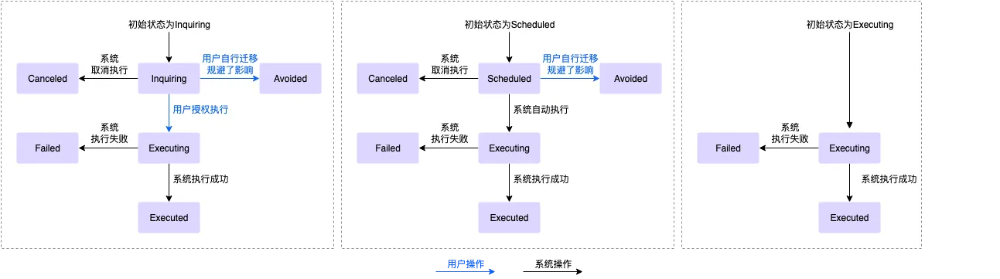

客户侧事件包括的窗口期如下：

+ 用户操作窗口期：从发送系统事件到计划执行时间之间的时间段。您可以在用户操作窗口期内自行操作，或者等待系统自动执行。时长说明如下：
    - 计划内运维事件通常为24~48小时。（处于Inquiring状态的系统事件，没有时长限制，在您授权后才会开始执行运维任务。）
    - 突发故障、违规操作等非计划内因素导致的非预期运维事件，通常没有用户操作窗口期。
+ 事件执行窗口期：开始执行任务到任务执行完成之间的时间段。时长说明如下：
    - 通知修复故障的事件通常在10分钟内完成。
    - 突发故障、违规操作等非计划内因素导致的非预期运维事件，只有短暂的事件执行窗口期。

#### 事件汇总
+ 计划内运维事件

| 事件code | 事件名称 | 事件等级 | 事件状态 | 处理建议 |
| --- | --- | --- | --- | --- |
| SystemMaintenance.Reboot | 因系统维护实例重启 | 严重 | <ul><li>Inquieing</li> <li> Scheduled</li> <li> Executing</li> <li> Executed</li> <li> Avoided</li> <li> Failed</li> <li> Canceled</li></ul> | <ul><li>[修改预约重启时间](https://help.aliyun.com/zh/ecs/user-guide/modify-the-scheduled-restart-time#task-2071112)。</li> <li> [自行重启实例](https://help.aliyun.com/zh/ecs/user-guide/restart-instances#concept-yxw-dwm-xdb)。</li> <li> 等待系统自动重启实例。</li></ul> |
| SystemMaintenance.Stop | 因系统维护实例停止 | 严重 | <ul><li>Scheduled</li> <li> Executing</li> <li> Executed</li> <li> Avoided</li> <li> Failed</li> <li> Canceled</li></ul> | <ul><li>[自行重新部署实例](https://help.aliyun.com/zh/ecs/user-guide/redeploy-an-instance-equipped-with-local-disks#task-2039256)。</li> <li> 等待系统自动停止实例，然后自行执行后续动作，例如重新部署实例、根据需要选择其他方式等。</li></ul> |
| SystemMaintenance.Redeploy | 因系统维护实例重新部署 | 严重 | <ul><li>Inquiring</li> <li> Scheduled</li> <li> Executing</li> <li> Executed</li> <li> Avoided</li> <li> Canceled</li></ul> | 建议您完成准备工作，包括修改/etc/fstab配置文件、备份数据等，然后根据需要选择一种响应方式：<ul><li>[自行重新部署实例](https://help.aliyun.com/zh/ecs/user-guide/redeploy-an-instance-equipped-with-local-disks#task-2039256)。</li> <li> 等待系统自动重新部署实例。</li></ul> |
| SystemMaintenance.IsolateErrorDisk | 因系统维护隔离坏盘 | 严重 | <ul><li>Inquieing</li> <li> Executing</li> <li> Executed</li> <li> Avoided</li> <li> Failed</li> <li> Canceled</li></ul> | 建议您完成准备工作，包括修改/etc/fstab配置文件、备份数据等，然后选择合适的时间授权隔离坏盘（在线隔离，无需重启实例）。 |
| SystemMaintenance.ReInitErrorDisk | 因系统维护重新初始化坏盘 | 严重 | <ul><li>Inquieing</li> <li> Executing</li> <li> Executed</li> <li> Avoided</li> <li> Failed</li> <li> Canceled</li></ul> | 建议您选择合适的时间授权恢复本地盘（在线恢复，无需重启实例）。 |
| SystemMaintenance.RebootAndIsolateErrorDisk | 因系统维护重启实例并隔离坏盘 | 严重 | <ul><li>Inquieing</li> <li> Executing</li> <li> Executed</li> <li> Avoided</li> <li> Canceled</li></ul> | 建议您选择合适的时间授权隔离坏盘，并自行重启实例（离线隔离，需要重启实例）。 |
| SystemMaintenance.RebootAndReInitErrorDisk | 因系统维护重启实例并重新初始化坏盘 | 严重 | <ul><li>Inquieing</li> <li> Executing</li> <li> Executed</li> <li> Avoided</li> <li> Canceled</li></ul> | 建议您选择合适的时间授权恢复本地盘，并自行重启实例（离线恢复，需要重启实例）。 |
| SystemMaintenance.StopAndRepair | 本地盘实例原地维修事件 | 严重 | <ul><li>Inquieing</li> <li> Scheduled</li> <li> Executing</li> <li> Executed</li> <li> Avoided</li></ul> | 建议您选择合适的时间授权维修本地盘实例或重新部署本地盘实例。 |
| SystemMaintenance.CleanReleasedDisks | EBS热插拔失败后的清理事件 | 警告 | <ul><li>Inquieing</li> <li> Executing</li> <li> Executed</li> <li> Failed</li></ul> | 建议您选择合适的时间，授权阿里云清理已释放云盘的配置信息。 |


+ 非预期运维事件

| 事件Code | 事件名称 | 事件等级 | 事件状态 | 处理建议 |
| --- | --- | --- | --- | --- |
| SystemFailure.Reboot | 因系统错误实例重启 | 严重 | <ul><li>Executing</li> <li> Executed</li> <li> Failed</li></ul> | 建议您等待实例自动重启完成，然后检查实例和应用是否正常。 |
| InstanceFailure.Reboot | 实例因操作系统错误需重启 | 严重 | <ul><li>Scheduled</li> <li> Executing</li> <li> Executed</li> <li> Avoided</li></ul> | 建议您等待实例自动重启完成，然后检查实例和应用是否正常。 |
| SystemFailure.Stop | 因系统错误实例停止 | 严重 | <ul><li>Executing</li> <li> Executed</li></ul> | 建议您等待实例自动停止完成，然后启动实例。 |
| SystemFailure.Redeploy | 因系统错误实例重新部署 | 严重 | <ul><li>Inquiring</li> <li> Scheduled</li> <li> Executing</li> <li> Executed</li> <li> Avoided</li> <li> Canceled</li></ul> | 建议您完成准备工作，包括修改/etc/fstab配置文件、备份数据等，然后根据需要选择一种响应方式：<ul><li>[自行重新部署实例](https://help.aliyun.com/zh/ecs/user-guide/redeploy-an-instance-equipped-with-local-disks#task-2039256)。</li> <li> 等待系统自动重新部署实例。</li></ul> |
| SystemFailure.Delete | 因实例创建失败账单自动取消 | 严重 | <ul><li>Executing</li> <li> Executed</li> <li> Avoided</li></ul> | 建议您等待系统自动释放实例，通常在创建失败五分钟内自动释放。 |
| ErrorDetected | 本地磁盘出现损坏告警 | 严重 | <ul><li>Executing</li> <li> Executed</li></ul> | 建议您完成准备工作，包括修改/etc/fstab配置文件、备份数据等，然后选择合适的时间操作隔离坏盘并恢复本地盘。根据实例规格的不同，支持的操作也不同，具体说明如下：<ul><li>d1、d1ne、d2s、d2c：支持在线隔离、离线隔离、在线维修、重新部署</li> <li> d3c、d3s、d2c、i2、i2g、i2ne、i2gne、i3、i3g、i4、i4g、i4r、i4p：支持在线隔离、离线隔离、重新部署</li> <li> i1：支持重新部署</li> <li> ebmi2g：支持授权维修、重新部署</li></ul> |
| Stalled | 磁盘性能受到严重影响 | 严重 | <ul><li>Executing</li> <li> Executed</li></ul> | 建议您在应用层隔离对该云盘的读写操作，或从负载均衡实例中暂时移除该实例。 |


### 查询和响应事件
#### ECS控制台
1. 登录[ECS管理控制台](https://ecs.console.aliyun.com/?spm=a2c4g.11186623.0.0.35f043eftxXCOe)。
2. 在左侧导航栏，单击**事件。**
3. 查询待处理的事件。

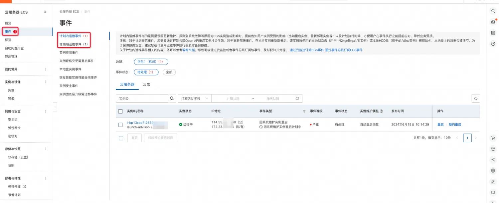

4. 如果响应事件时，需要重启实例或重新部署实例，您必须通过控制台或OpenAPI重启实例，此操作才能生效。

#### OpenApi与SDK使用说明
1. OpenApi与SDK 相关配置（以Java调用为例）
    - pom文件

        ```xml
        <dependencies>
          <dependency>
            <groupId>com.alibaba</groupId>
            <artifactId>fastjson</artifactId>
            <version>1.2.83</version>
          </dependency>
          <dependency>
            <groupId>com.aliyun</groupId>
            <artifactId>aliyun-java-sdk-core</artifactId>
            <version>4.6.1</version>
          </dependency>
          <dependency>
            <groupId>com.aliyun</groupId>
            <artifactId>aliyun-java-sdk-ecs</artifactId>
            <version>5.11.7</version>
          </dependency>
        </dependencies>
        ```

    - OpenClient实现

        ```java
        public class OpenClient {

            private IAcsClient client;

            public void initClient() {
                DefaultProfile profile = DefaultProfile.getProfile(
                        "your region",          // The region ID
                        "your ak",      // The AccessKey ID of the RAM account
                        "your sk"); // The AccessKey Secret of the RAM account
                client = new DefaultAcsClient(profile);
            }

            public <R extends AcsResponse> R getResponse(RpcAcsRequest<R> request) {
                try {
                    return this.client.getAcsResponse(request);
                } catch (ServerException e) {
                    e.printStackTrace();
                    return null;
                } catch (ClientException e) {
                    e.printStackTrace();
                    return null;
                }
            }

        }
        ```

2. [DescribeInstanceHistoryEvents](https://help.aliyun.com/zh/ecs/developer-reference/api-describeinstancehistoryevents#doc-api-Ecs-DescribeInstanceHistoryEvents)
    1. 描述：查询指定实例系统事件信息，默认查询处于已完结状态的历史系统事件。
    2. 主要请求参数

        | **名称** | **类型** | **必填** | **描述** | **示例值** |
        | --- | --- | --- | --- | --- |
        | RegionId | string | 是 | 资源所在的地域 ID。您可以调用 [DescribeRegions](https://help.aliyun.com/zh/ecs/developer-reference/api-regions-describeregions) 查看最新的阿里云地域列表。 | cn-hangzhou |
        | InstanceId | string | 否 | 实例 ID。不指定实例 ID 时，表示查询您指定地域下所有实例的系统事件信息。 | i-uf678mass4zvr9n1**** |
        | EventCycleStatus | string | 否 | 系统事件的生命周期状态。EventCycleStatus 只在未指定 InstanceEventCycleStatus.N 参数时有效。取值范围：<ul><li>Scheduled：等待执行事件。</li> <li> Avoided：事件已避免。</li> <li> Executing：事件执行中。</li> <li> Executed：事件已完成执行。</li> <li> Canceled：事件已取消。</li> <li> Failed：事件执行失败。</li> <li> Inquiring：事件问询中。</li></ul> | Executed |
        | InstanceEventCycleStatus | list<string> | 否 | 一个或者多个系统事件的生命周期状态。N 的取值范围：1~7，多个取值使用重复列表的形式。默认查询已完结的历史系统事件，取值范围：<ul><li>Scheduled：等待执行事件。</li> <li> Avoided：事件已避免。</li> <li> Executing：事件执行中。</li> <li> Executed：事件已完成执行。</li> <li> Canceled：事件已取消。</li> <li> Failed：事件执行失败。</li> <li> Inquiring：事件问询中。</li></ul> | ['Scheduled,Avoided'] |
        | EventType | string | 否 | 系统事件的类型。EventType 参数只在未指定 InstanceEventType.N 参数时有效。取值范围：<ul><li>SystemMaintenance.Reboot：因系统维护实例重启。</li> <li> SystemMaintenance.Redeploy：因系统维护实例重新部署。</li> <li> SystemFailure.Reboot：因系统错误实例重启。</li> <li> SystemFailure.Redeploy：因系统错误实例重新部署。</li> <li> SystemFailure.Delete：因实例创建失败实例释放。</li> <li> InstanceFailure.Reboot：因实例错误实例重启。</li> <li> InstanceExpiration.Stop：因包年包月期限到期，实例停止。</li> <li> InstanceExpiration.Delete：因包年包月期限到期，实例释放。</li> <li> AccountUnbalanced.Stop：因账号欠费，按量付费实例停止。</li> <li> AccountUnbalanced.Delete：因账号欠费，按量付费实例释放。</li></ul> | SystemMaintenance.Reboot |
        | InstanceEventType | list<string> | 否 | 一个或者多个系统事件的类型。N 的取值范围：1~30，多个取值使用重复列表的形式。取值范围：<ul><li>SystemMaintenance.Reboot：因系统维护实例重启。</li> <li> SystemMaintenance.Redeploy：因系统维护实例重新部署。</li> <li> SystemFailure.Reboot：因系统错误实例重启。</li> <li> SystemFailure.Redeploy：因系统错误实例重新部署。</li> <li> SystemFailure.Delete：因实例创建失败实例释放。</li> <li> InstanceFailure.Reboot：因实例错误实例重启。</li> <li> InstanceExpiration.Stop：因包年包月期限到期，实例停止。</li> <li> InstanceExpiration.Delete：因包年包月期限到期，实例释放。</li> <li> AccountUnbalanced.Stop：因账号欠费，按量付费实例停止。</li> <li> AccountUnbalanced.Delete：因账号欠费，按量付费实例释放。</li></ul> | ['SystemMaintenance.Reboot'] |
        | NotBefore.Start | string | 否 | 查询系统事件计划执行时间的开始时间。按照[ISO 8601](https://help.aliyun.com/zh/ecs/developer-reference/iso-8601-time-format)标准表示，并需要使用 UTC <ul><li>0 时间，格式为 yyyy-MM-ddTHH:mm:ssZ。</li></ul> | 2017-11-30T06:32:31Z |
        | NotBefore.End | string | 否 | 查询系统事件计划执行时间的结束时间。按照[ISO 8601](https://help.aliyun.com/zh/ecs/developer-reference/iso-8601-time-format)标准表示，并需要使用 UTC <ul><li>0 时间，格式为 yyyy-MM-ddTHH:mm:ssZ。</li></ul> | 2017-12-01T06:32:31Z |
        | EventPublishTime.Start | string | 否 | 查询系统事件发布时间的开始时间。按照[ISO 8601](https://help.aliyun.com/zh/ecs/developer-reference/iso-8601-time-format)标准表示，并需要使用 UTC <ul><li>0 时间，格式为 yyyy-MM-ddTHH:mm:ssZ。</li></ul> | 2017-11-30T06:32:31Z |
        | EventPublishTime.End | string | 否 | 查询系统事件发布时间的结束时间。按照[ISO 8601](https://help.aliyun.com/zh/ecs/developer-reference/iso-8601-time-format)标准表示，并需要使用 UTC <ul><li>0 时间，格式为 yyyy-MM-ddTHH:mm:ssZ。</li></ul> | 2017-12-01T06:32:31Z |

    3. 主要返回参数

        | **名称** | **类型** | **描述** | **示例值** |
        | --- | --- | --- | --- |
        | TotalCount | integer | 实例总个数。 | 10 |
        | Reason | string | 系统事件的计划原因。 | System maintenance is scheduled due to ***. |
        | InstanceSystemEventSet | list<object> | 实例历史系统事件数组。 |  |


        InstanceSystemEvent

        | **名称** | **类型** | **描述** | **示例值** |
        | --- | --- | --- | --- |
        | EventId | string | 系统事件 ID。 | e-uf64yvznlao4jl2c**** |
        | InstanceId | string | 实例 ID。 | i-uf678mass4zvr9n1**** |
        | EventType | object | 系统事件类型。 |  |
        | EventCycleStatus | object | 系统事件的生命周期状态。 |  |


        EventType

        | **名称** | **类型** | **描述** | **示例值** |
        | --- | --- | --- | --- |
        | Name | string | 系统事件类型名称。 | Executed |
        | Code | integer | 系统事件类型代码。 | 0 |


        EventCycleStatus

        | **名称** | **类型** | **描述** | **示例值** |
        | --- | --- | --- | --- |
        | Name | string | 系统事件状态名称。 | Executed |
        | Code | integer | 系统事件状态代码。 | 0 |

    4. api调用示例

        ```java
        // 查询指定实例系统事件信息，默认查询处于非活跃状态的历史系统事件
            public void describeInstanceHistoryEvents() {
                DescribeInstanceHistoryEventsRequest request = new DescribeInstanceHistoryEventsRequest();
                // 添加指定的实例，默认查指定地域下的所有实例
                String instanceId = "your instanceId";
                // request.setInstanceId(instanceId);

                // 添加指定的事件状态，默认查询已完结的历史系统事件
                List<String> instanceEventCycleStatus = new ArrayList<String>();
                instanceEventCycleStatus.add("Scheduled");
                instanceEventCycleStatus.add("Canceled");
                request.setInstanceEventCycleStatuss(instanceEventCycleStatus);

                request.setPageSize(100);
                DescribeInstanceHistoryEventsResponse response = getResponse(request);
                for (DescribeInstanceHistoryEventsResponse.InstanceSystemEventType instanceSystemEventType : response.getInstanceSystemEventSet()) {
                    System.out.printf("instanceId: %s, eventId:%s, eventType: %s, eventCycleStatus: %s%n", instanceSystemEventType.getInstanceId(), instanceSystemEventType.getEventId(), instanceSystemEventType.getEventType().getName(), instanceSystemEventType.getEventCycleStatus().getName());
                }
            }
        ```

    5. [OpenAPI Explorer](https://api.aliyun.com/api/Ecs/2014-05-26/DescribeInstanceHistoryEvents?spm=a2c4g.11186623.0.0.659d5e88kmy0s3&sdkStyle=old&tab=DEBUG&params={%22RegionId%22:%22cn-hangzhou%22})调试示例

        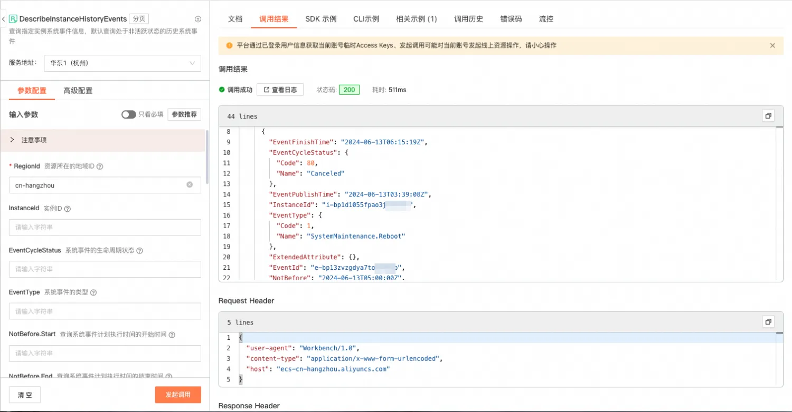

2. [AcceptInquiredSystemEvent](https://help.aliyun.com/zh/ecs/developer-reference/api-ecs-2014-05-26-acceptinquiredsystemevent)
    1. 描述：调用AcceptInquiredSystemEvent接受并授权执行系统事件操作。对问询中（Inquiring）状态的系统事件，接受系统事件的默认操作，授权系统执行默认操作。
    2. 请求参数

        | 名称 | 类型 | 必填 | 描述 | 示例值 |
        | --- | --- | --- | --- | --- |
        | RegionId | string | 是 | 系统事件所在的地域 ID。您可以调用 [DescribeRegions](https://help.aliyun.com/zh/ecs/developer-reference/api-regions-describeregions) 查看最新的阿里云地域列表。 | cn-hangzhou |
        | EventId | string | 是 | 系统事件 ID。 | e-2zeielxl1qzq8slb**** |

    3. 返回参数

        | 名称 | 类型 | 描述 | 示例值 |
        | --- | --- | --- | --- |
        | RequestId | string | 请求ID | 4DD56CA6-6D75-4D33-BE34-E4A44EBE1C3D |

    4. api调用示例

        ```java
        public void acceptInquiredSystemEvent() {
                AcceptInquiredSystemEventRequest request = new AcceptInquiredSystemEventRequest();
                request.setEventId("your eventId");
                AcceptInquiredSystemEventResponse response = getResponse(request);
                System.out.printf("requestId %s", response.getRequestId());
            }
        ```

    5. [OpenAPI Explorer](https://api.aliyun.com/api/Ecs/2014-05-26/AcceptInquiredSystemEvent?spm=a2c4g.11186623.0.0.1bac68aa01H7cX&sdkStyle=old&params={%22RegionId%22:%22cn-hangzhou%22,%22EventId%22:%22e-bp13zvzgdya7w4wv****%22}&tab=DEBUG)调试示例

        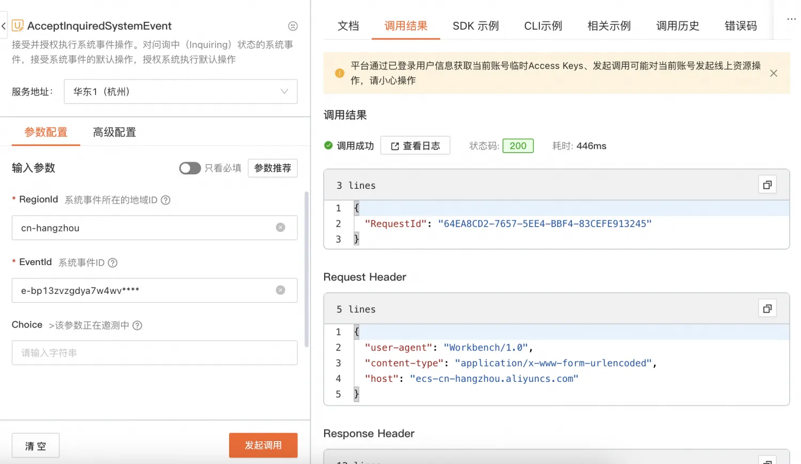

3. [RebootInstance](https://help.aliyun.com/zh/ecs/developer-reference/api-ecs-2014-05-26-rebootinstance)
    1. 描述：重启一台处于运行中（Running）状态的ECS实例
    2. 请求参数

        | 名称 | 类型 | 必填 | 描述 | 示例值 |
        | --- | --- | --- | --- | --- |
        | InstanceId | string | 是 | 指定实例的 ID。 | i-bp67acfmxazb4ph**** |
        | ForceStop | boolean | 否 | 重启 ECS 实例前，是否强制关机。取值范围：<ul><li>true：强制关机。相当于典型的断电操作，所有未写入存储设备的缓存数据会丢失。</li> <li> false（默认）：正常关机。</li></ul> | false |
        | DryRun | boolean | 否 | 是否只预检此次请求。取值范围：<ul><li>true：发送检查请求，不会重启实例。检查项包括是否填写了必选参数、请求格式、业务限制和 ECS 库存。如果检查不通过，则返回对应错误。如果检查通过，则返回错误码DryRunOperation。</li> <li> false：发送正常请求，通过检查后直接重启实例。默认值：false</li></ul> | false |

    3. 返回参数

        | 名称 | 类型 | 描述 | 示例值 |
        | --- | --- | --- | --- |
        | RequestId | string | 请求ID | 4DD56CA6-6D75-4D33-BE34-E4A44EBE1C3D |

    4. api调用示例

        ```java
        public void rebootInstance() {
                RebootInstanceRequest request = new RebootInstanceRequest();
                // 添加需要重启的实例
                request.setInstanceId("your instanceId");
                RebootInstanceResponse response = getResponse(request);
                System.out.printf("requestId %s", response.getRequestId());
            }
        ```

    5. [OpenAPI Explorer](https://api.aliyun.com/api/Ecs/2014-05-26/RebootInstance?sdkStyle=old)调试示例

        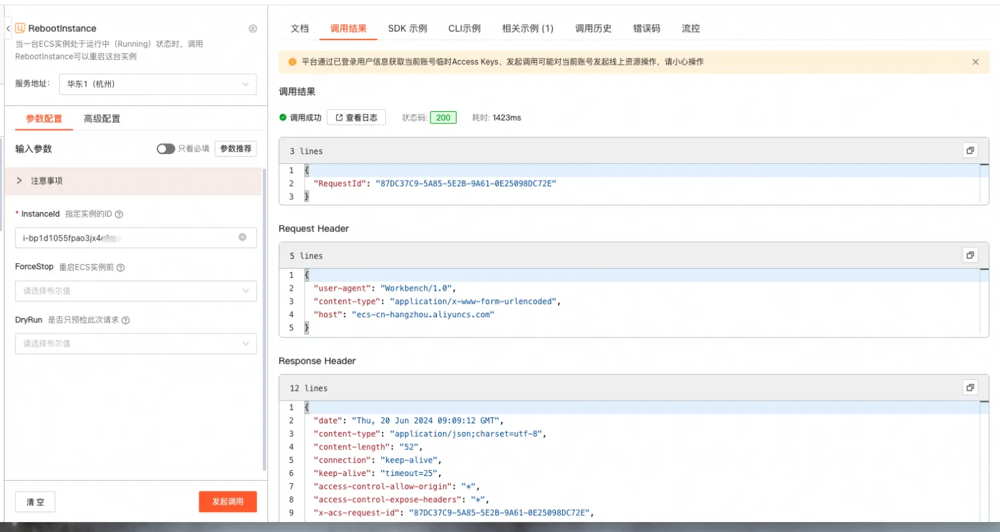

4. [RebootInstances](https://help.aliyun.com/zh/ecs/developer-reference/api-ecs-2014-05-26-rebootinstances?spm=a2c4g.11186623.0.i3)
    1. 描述：重启一台或多台处于运行中（Running）状态的ECS实例
    2. 请求参数

        | 名称 | 类型 | 必填 | 描述 | 示例值 |
        | --- | --- | --- | --- | --- |
        | InstanceId | list<string> | 是 | 实例ID列表，最多100个实例ID。 | i-bp67acfmxazb4ph**** |
        | ForceStop | boolean | 否 | 重启 ECS 实例前，是否强制关机。取值范围：<ul><li>true：强制关机。相当于典型的断电操作，所有未写入存储设备的缓存数据会丢失。</li> <li> false（默认）：正常关机。</li></ul> | false |
        | DryRun | boolean | 否 | 是否只预检此次请求。取值范围：<ul><li>true：发送检查请求，不会重启实例。检查项包括是否填写了必选参数、请求格式、业务限制和 ECS 库存。如果检查不通过，则返回对应错误。如果检查通过，则返回DRYRUN.SUCCESS。</li> <li> false：发送正常请求，通过检查后直接重启实例。默认值：false</li></ul> | false |
        | BatchOptimization | string | 否 | 设置批量操作模式。取值范围：<ul><li>AllTogether：该模式下，如果实例全部重启成功，则返回成功信息；如果任意一个实例校验不通过，则所有实例重启失败，并返回失败信息。</li> <li> SuccessFirst：该模式下，分别重启每个实例，返回结果包含每个实例的操作结果信息。默认值：AllTogether。</li></ul> | AllTogether |
        | RegionId | string | 是 | 实例所在的地域。您可以调用 [DescribeRegions](https://help.aliyun.com/zh/ecs/developer-reference/api-regions-describeregions) 查看最新的阿里云地域列表。 | cn-hangzhou |

    3. 主要返回参数

        | 名称 | 类型 | 描述 | 示例值 |
        | --- | --- | --- | --- |
        | RequestId | string | 请求ID | 4DD56CA6-6D75-4D33-BE34-E4A44EBE1C3D |
        | InstanceResponses | InstanceResponse[] | 由 InstanceResponse 组成的数组格式，返回每个实例操作的前后状态及操作结果。 |  |


        InstanceResponse

        | 名称 | 类型 | 描述 | 示例值 |
        | --- | --- | --- | --- |
        | Code | string | 实例操作结果错误码。 | 200 |
        | Message | string | 实例操作返回错误信息。 | success |
        | InstanceId | string | 实例 ID。 | i-bp1g6zv0ce8oghu7**** |
        | CurrentStatus | string | 实例当前状态。 | Stopping |
        | PreviousStatus | string | 实例操作前状态。 | Running |


    4. api调用示例

        ```java
        public void rebootInstances() {
                RebootInstancesRequest request = new RebootInstancesRequest();

                // 添加需要重启的实例
                List<String> instanceIds = new ArrayList<String>();
                instanceIds.add("your instanceId1");
                instanceIds.add("your instanceId2");
                request.setInstanceIds(instanceIds);

                RebootInstancesResponse response = getResponse(request);
                for (RebootInstancesResponse.InstanceResponse instanceResponse : response.getInstanceResponses()) {
                    System.out.printf("instanceId %s, message: %s", instanceResponse.getInstanceId(), instanceResponse.getMessage());
                }
            }
        ```

    5. [OpenAPI Explorer](https://api.aliyun.com/api/Ecs/2014-05-26/RebootInstances?sdkStyle=old&params={%22RegionId%22:%22cn-hangzhou%22})调试示例

        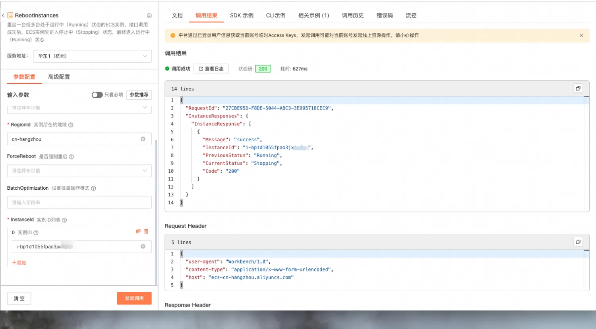

5. [RedeployInstance](https://help.aliyun.com/zh/ecs/developer-reference/api-ecs-2014-05-26-redeployinstance)
    1. 描述：RedeployInstance 为异步调用接口，会重启并迁移实例。重新部署成功后，实例进入运行中（Running）状态。重新部署失败时，实例返回原有的物理服务器，并恢复到重新部署前的状态。
    2. 请求参数

        | 名称 | 类型 | 必填 | 描述 | 示例值 |
        | --- | --- | --- | --- | --- |
        | InstanceId | string | 是 | 处于运行中或者已停止状态的实例 ID。 | i-bp1azkttqpldxgted**** |
        | ForceStop | boolean | 否 | 是否强制停止运行中（Running）的实例。默认值：false | false |

    3. 返回参数

        | 名称 | 类型 | 描述 | 示例值 |
        | --- | --- | --- | --- |
        | TaskId | string | 重新部署的任务 ID。您可以使用 [DescribeTasks](https://help.aliyun.com/zh/ecs/developer-reference/api-describetasks) 接口查询迁移结果。 | t-bp10e8orkp8x**** |
        | RequestId | string | 请求 ID。 | 473469C7-AA6F-4DC5-B3DB-A3DC0DE3C83E |


    4. api调用示例

        ```java
        public void redeployInstance() {
                RedeployInstanceRequest request = new RedeployInstanceRequest();

                // 添加需要重新部署的ECS实例
                request.setInstanceId("your instanceId");

                RedeployInstanceResponse response = getResponse(request);
                System.out.printf("requestId %s", response.getRequestId());
            }
        ```

    5. [OpenAPI Explorer](https://api.aliyun.com/api/Ecs/2014-05-26/RedeployInstance?sdkStyle=old)调试示例

    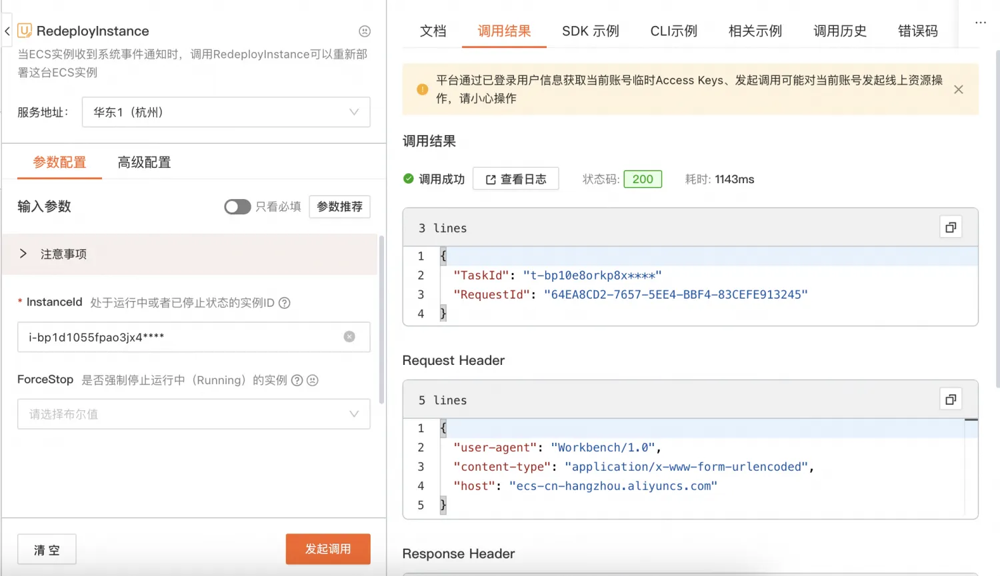

#### 阿里云CLI
1. [官网介绍](https://help.aliyun.com/zh/cli/what-is-alibaba-cloud-cli?spm=a2c4g.11186623.4.6.2d9043dcXaI09o&scm=20140722.H_110244._.ID_110244-OR_rec-V_1)
2. 命令参数介绍：参数参考对应的openApi，cols展示的列名，需要与 JSON 数据中的字段相对应。rows指定过滤字段所在的[JMESPath](http://jmespath.org/)路径。

    ```bash
    aliyun <product> <ApiName> [--parameter1 value1 --parameter2 value2 ...] --output cols=col1,col2 rows=rows.row[]
    ```

3. 使用示例
    1. DescribeInstanceHistoryEvents

        ```bash
        # 查询已计划（Scheduled）状态的系统事件：
        aliyun ecs DescribeInstanceHistoryEvents --RegionId <TheRegionId> --InstanceId <YourInstanceId> --InstanceEventCycleStatus.1 Scheduled --output cols=EventId,EventType.Name,EventCycleStatus.Name,Reason rows=InstanceSystemEventSet.InstanceSystemEventType[]
        +-------------------------------------------------------------------------------------------------+
        |  EventId                | EventType.Name           | EventCycleStatus.Name | Reason             |
        |  -------                | --------------           | --------------------- | -------------------|
        |  e-bp1836zl6fztjqne**** | SystemMaintenance.Reboot | Scheduled             | A simulated event  |
        +-------------------------------------------------------------------------------------------------+

        # 查询全部（Scheduled、Inquiring、Executing、Executed、Avoided、Canceled、Failed）状态的系统事件：
        aliyun ecs DescribeInstanceHistoryEvents --RegionId <TheRegionId> --InstanceId <YourInstanceId> --InstanceEventCycleStatus.1 Scheduled --InstanceEventCycleStatus.2 Inquiring  --InstanceEventCycleStatus.3 Executing  --InstanceEventCycleStatus.4 Executed  --InstanceEventCycleStatus.5 Canceled  --InstanceEventCycleStatus.6 Avoided --InstanceEventCycleStatus.7 Failed --output cols=EventId,EventType.Name,EventCycleStatus.Name,Reason rows=InstanceSystemEventSet.InstanceSystemEventType[]
        +-------------------------------------------------------------------------------------------------+
        |  EventId                | EventType.Name           | EventCycleStatus.Name | Reason             |
        |  -------                | --------------           | --------------------- | -------------------|
        |  e-bp1836zl6fztjqne**** | SystemMaintenance.Reboot | Scheduled             | A simulated event  |
        |  e-bp1836zl6fztjqne**** | SystemMaintenance.Reboot | Excuted               | A simulated event  |
        +-------------------------------------------------------------------------------------------------+
        ```

    2. AcceptInquiredSystemEvent

        ```bash
        aliyun ecs AcceptInquiredSystemEvent --RegionId <TheRegionId> --EventId <YourEventId> --output cols=RequestId
        +----------------------------------------+
        |  RequestId                             |
        |  ---------                             |
        |  4DD56CA6-6D75-4D33-BE34-E4A44EBE1C3D  |
        +----------------------------------------+
        ```

    3. RebootInstance

        ```bash
        aliyun ecs RebootInstance --InstanceId <YourInstanceId> --output cols=RequestId
        +----------------------------------------+
        |  RequestId                             |
        |  ---------                             |
        |  4DD56CA6-6D75-4D33-BE34-E4A44EBE1C3D  |
        +----------------------------------------+
        ```

    4. RebootInstances

        ```bash
        aliyun ecs RebootInstances --InstanceId.1 <YourInstanceId1> --InstanceId.2 <YourInstanceId2> --output cols=message,instanceId rows=InstanceResponses.InstanceResponse[]
        +------------------------------------+
        |  Message | InstanceId              |
        |  ------- | ----------              |
        |  success | i-bp1d1055fpao3jx4****  |
        |  success | i-bp1d1056fpao3jx4****  |
        +------------------------------------+
        ```

    5. RedeployInstance

        ```bash
        aliyun ecs RedeployInstance --InstanceId <YourInstanceId> --output cols=TaskId, RequestId
        +--------------------------------------------------------------+
        |  TaskId              | RequestId                             |
        |  ------              | ---------                             |
        |  t-bp10e8orkp8x****  | 473469C7-AA6F-4DC5-B3DB-A3DC0DE3C83E  |
        +--------------------------------------------------------------+
        ```

### 客户侧事件订阅
[云监控](https://help.aliyun.com/zh/cms/?spm=5176.28426678.J_HeJR_wZokYt378dwP-lLl.1.2bc35181U8HYk9&scm=20140722.S_help@@%E6%96%87%E6%A1%A3@@28572.S_BB1@bl+RQW@ag0+BB2@ag0+hot+os0.ID_28572-RL_%E4%BA%91%E7%9B%91%E6%8E%A7-LOC_search~UND~helpdoc~UND~item-OR_ser-V_3-P0_0)（CloudMonitor）是一项针对阿里云资源和互联网应用进行监控的服务。云监控服务可用于收集获取阿里云资源的监控指标，探测互联网服务可用性，以及针对指标设置警报。

#### 创建订阅策略
若您的账户已经创建了报警联系人，且已经加入到报警联系组中，请跳过第二步。（点击[链接](https://cloudmonitor.console.aliyun.com/alert/contact)查看您的报警联系人）
若您的账户已经存在通知配置策略，请跳过第三步。（点击[链接](https://cloudmonitor.console.aliyun.com/notify-strategy/upgrade)查看您的通知配置策略）

1. 登录[云监控控制台](https://cloudmonitornext.console.aliyun.com/)。

2. 依次点击**报警服务 > 报警联系人 > 创建联系人****。**


    

    

    

3. 依次点击**事件中心 > 通知配置 > 创建策略**。

    

4. 依次点击**事件中心 > 事件订阅 > 创建订阅策略**。

    

    + 订阅范围

        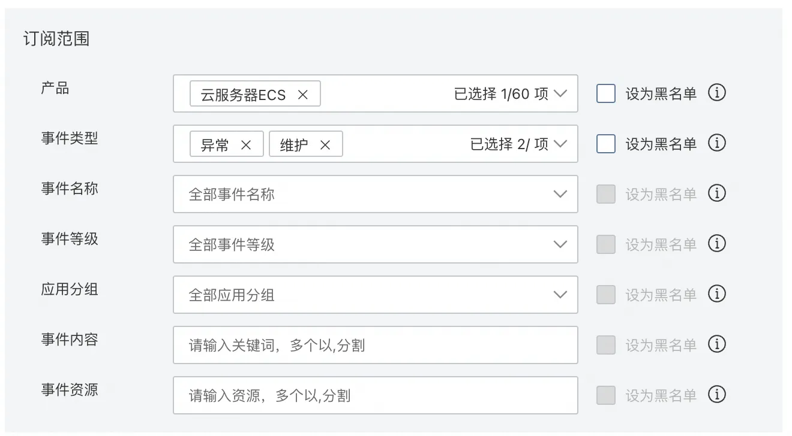

        - 产品选择 ECS
        - 事件类型：可以按照 异常/维护 大类来进行批量的事件类型订阅
    + 事件名称，在选择了事件类型后，也可以进一步指定具体的事件名称，来进行订阅
        - 事件名称展示的定义，对应的是后台事件的 事件code+事件状态组合进行命名的

            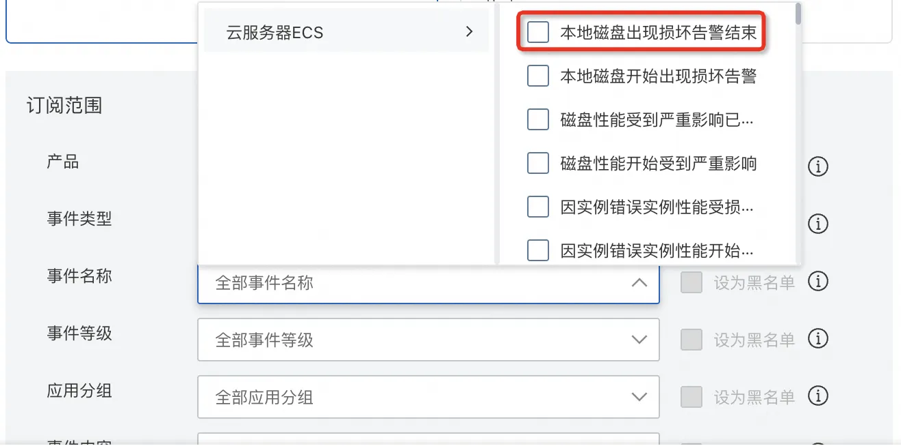

    + 通知
        - 可以选择之前添加的报警联系人

            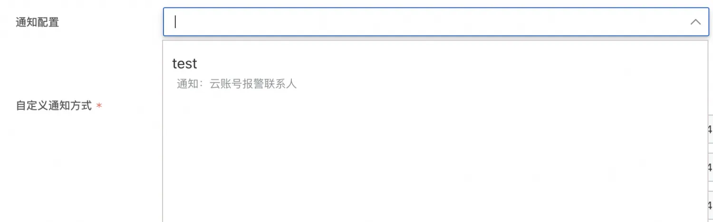

    + 推送渠道

        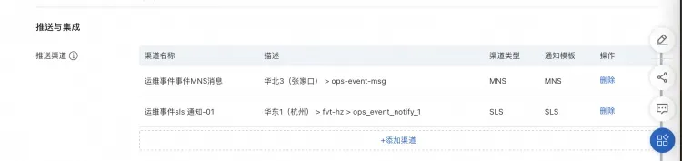

        - sls日志对接
            * 新建一个日志渠道(提前创建好响应的sls logStore)

                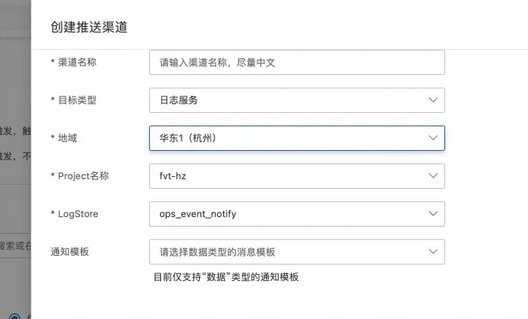

            * 当有事件产生以后，就会将事件信息推送到对应的sls 日志内

                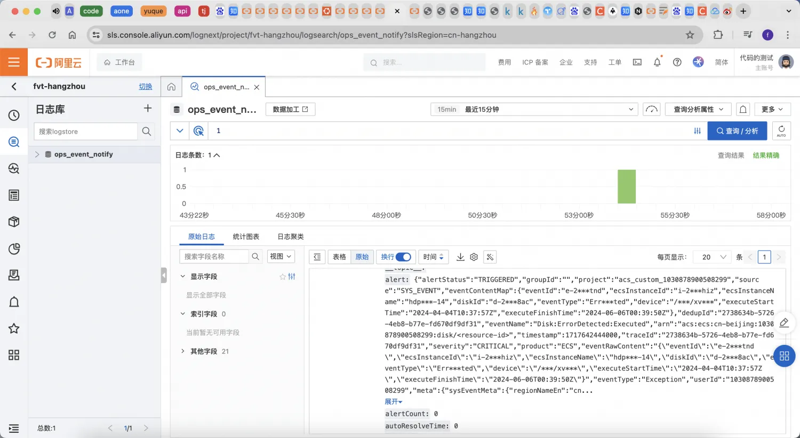

        - 消息队列订阅
            * MNS 消息订阅，服务类型选择 **队列**，然后选择提前创建好的MNS实例

                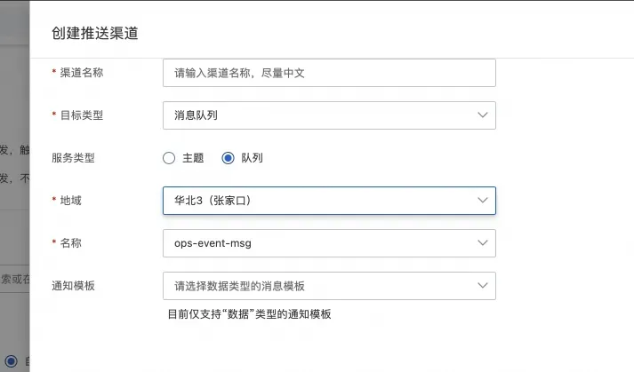

            * 在MNS实例的[控制台](https://mns.console.aliyun.com/region/cn-zhangjiakou/queues)，就可以看到事件发生后，推送的消息情况

                

            * 收到消息的内容和sls日志内容基本一致

                ```plain
                {"userInfo":{"aliyunId":"heboxin_test","userIdSec":"107563***43162","aliyunIdSec":"hebo***test","nickName":"heboxin_test","nickNameSec":"hebo***test","userName":"heboxin_test","userId":"1075639319543162","userNameSec":"hebo***test"},"relatedAlertIds":["dba1f8b1-238a-456a-90e6-58393c0e964b"],"groupingId":"6010670329014e3e98fa460ce6421add","project":"acs_custom_1075639319543162","retriggerTime":0,"subscription":{"subscriptionUuid":"f3dd795964634aa6a28c11316838f265","conditions":[{"field":"source","op":"EQ","value":"SYS_EVENT"},{"field":"product","op":"IN","value":"ECS"},{"field":"eventType","op":"IN","value":"Exception,Maintenance"}],"relation":"AND"},"batchId":"6c87354f03c0436db263bc373e0fdcdb","alert":{"alertStatus":"TRIGGERED","groupId":"","project":"acs_custom_1075639319543162","source":"SYS_EVENT","eventContentMap":{"eventId":"e-2zei9vq78vfu8k1obhlf","publishTime":"2024-01-14T18:26:17Z","instanceId":"i-2ze6s8ag58vqzeeezxsx","publicIpAddress":[],"eventStatus":"Executed","eventType":"SystemFailure.Reboot","notBefore":"2024-01-14T18:26:17Z","privateIpAddress":["192.168.65.190"],"executeStartTime":"2024-01-14T18:26:17Z","executeFinishTime":"2024-01-14T18:27:15Z"},"dedupId":"dba1f8b1-238a-456a-90e6-58393c0e964b","eventName":"Instance:SystemFailure.Reboot:Executed","arn":"acs:ecs:cn-beijing:1075639319543162:instance/i-2ze6s8ag58vqzeeezxsx","timestamp":1705256836000,"traceId":"dba1f8b1-238a-456a-90e6-58393c0e964b","severity":"CRITICAL","product":"ECS","eventRawContent":"{"eventId":"e-2zei9vq78vfu8k1obhlf","instanceId":"i-2ze6s8ag58vqzeeezxsx","eventType":"SystemFailure.Reboot","eventStatus":"Executed","publishTime":"2024-01-14T18:26:17Z","notBefore":"2024-01-14T18:26:17Z","executeStartTime":"2024-01-14T18:26:17Z","executeFinishTime":"2024-01-14T18:27:15Z","privateIpAddress":["192.168.65.190"],"publicIpAddress":[]}","eventType":"Exception","userId":"1075639319543162","meta":{"sysEventMeta":{"regionNameEn":"cn-beijing","resourceId":"acs:ecs:cn-beijing:1075639319543162:instance/i-2ze6s8ag58vqzeeezxsx","product":"ECS","eventNameEn":"Instance:SystemFailure.Reboot:Executed","instanceName":"iZ2ze6s8ag58vqzeeezxsxZ","level":"CRITICAL","resource":"","regionNameZh":"华北2(北京)","groupId":"","serviceTypeEn":"ECS","eventType":"Exception","serviceTypeZh":"云服务器ECS","regionId":"cn-beijing","eventTime":"20240115T022716.000+0800","name":"Instance:SystemFailure.Reboot:Executed","id":"dba1f8b1-238a-456a-90e6-58393c0e964b","status":"Executed","eventNameZh":"因系统错误实例重启结束"}}},"nextEscalateTime":0,"startTime":1705256836000,"autoResolveTime":0,"severity":"CRITICAL","strategyName":"自定义云监控系统事件推送-01","userId":"1075639319543162","escalationLevel":0,"alertCount":0,"time":1705256836000}
                ```

#### 客户侧事件查询
1. 登录[云监控控制台](https://cloudmonitornext.console.aliyun.com/)。
2. 点击左侧目录的系统事件
    - 如下图红框标记所示，选择您感兴趣的事件查询
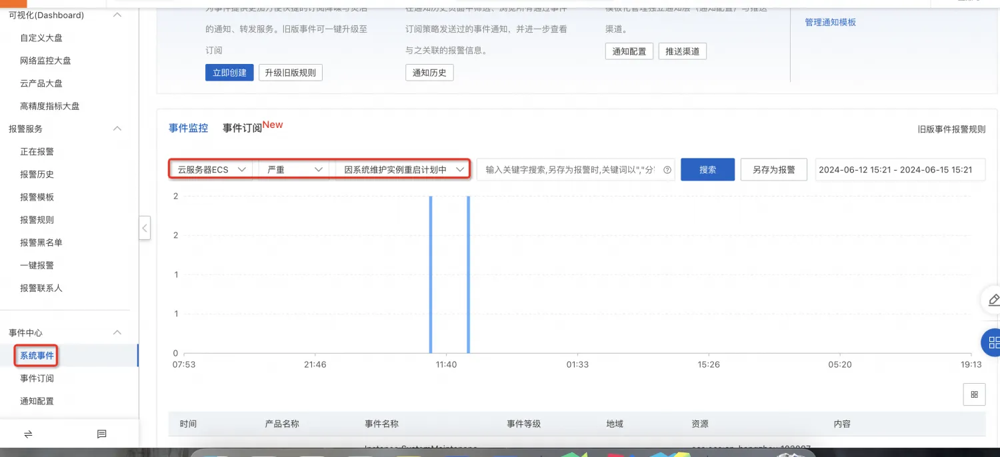